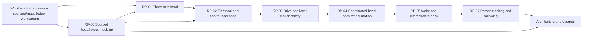

# Makad V1 Risk-Prototype Plan

| Field | Value |
|---|---|
| Status | Approved |
| Version | 1.9 |
| Owner | Project builder |
| Created | 2026-08-14 |
| Last reviewed | 2026-09-02 |
| Depends on | Approved `docs/00-foundation/constraints.md` v1.2, other foundation documents, `system-design-brief.md` v1.2, and `dimensional-baseline.md` v1.8 |
| Decision authority | Project builder |

The prototypes are decision instruments, not partial versions of the final droid. They may use open frames, ballast, external measurement equipment, temporary controllers, and bench power where those choices produce better evidence. A polished appearance is not a pass condition. The approved bench setup and powered-test readiness gate live in `workbench.md`; powered scored testing remains blocked until that gate is satisfied for the active rig and test.

## Roadmap

| Stage | Work | Exit condition |
|---:|---|---|
| 0 | Review and establish the workbench/test-readiness setup + sourcing survey + mass/envelope ledger | Approved readiness gate satisfied, required tools available, stop/isolation verified, and first candidate matrix and cost range exist |
| 1 | RP-06 phase A (sourced envelopes) feeding RP-01 head prototype | RP01 gates pass → provisional ADR-02/ADR-03 |
| 2 | RP-02 electrical/control backbone | RP02 gates pass → provisional ADR-06/ADR-12, power/thermal budgets measured |
| 3 | RP-03 drive and motion safety | RP03 gates pass → provisional ADR-04/ADR-07 |
| 4 | RP-04 coordination, then RP-05 interaction (may overlap) | RP04/RP05 gates pass → provisional ADR-05/ADR-10/ADR-11 |
| 5 | RP-06 final closure + RP-07 following | RP06/RP07 gates pass → provisional ADR-01/ADR-08/ADR-09; spatial-hearing ADR-13 decision |
| 6 | `system-architecture.md` + `engineering-budgets.md` + `physical-architecture.md` + `subsystem-interfaces.md` from evidence | All 13 ADRs closed from cited evidence |
| 7 | Final component selection → BOM → integrated CAD → build → integration → validation | Core demonstration passes before 5 Dec 2026 |

## Prototype sequence and evidence flow

RP-06 is numbered sixth to preserve the approved portfolio, but its sourcing and envelope work begins with the sourcing workstream and runs alongside RP-01. Its final integrated layout gate closes after representative head, electrical, and acoustic evidence exists.

## Gate and evidence policy

### Gate outcomes

| Outcome | Meaning | Next action |
|---|---|---|
| Pass | All safety, evidence, and decision criteria pass under the registered test conditions. | Adopt the supported decision provisionally and update affected budgets/ADRs. |
| Iterate | The evidence identifies a bounded correction. | Record the failed run, change one named variable set, and repeat. |
| Reject | A candidate cannot meet a Core need or creates unacceptable integration risk. | Remove that candidate and test the next viable option. |
| Defer | Evidence is insufficient for an optional capability and Core does not depend on it. | Remove it from the V1 execution path. This outcome is not available for any Core outcome (e.g. roll/pitch/yaw, come/follow). |

Repeated iteration on the same gate requires a review of the schedule effect and evidence that the remaining problem is localized; iteration without that review is not a valid outcome.

### Threshold registration

Already approved limits cannot be weakened by this plan: the final representative runtime is at least 20 minutes; following is no faster than 0.5 m/s; the initial route is at most approximately 3 m in one household room; come begins at approximately 1–2 m and stops approximately 0.6–0.9 m from the person; tabletop operation is stationary by default.

Where the foundation contains an `SC-TBD-*` or `CON-TBD-*`, the prototype owner must complete a gate-registration record before the first scored run:

| Required field | Content |
|---|---|
| Gate ID | Stable ID such as `RP01-G04` |
| Metric | Quantity, unit, computation, and direction of improvement |
| Threshold | Pass value or allowed range |
| Rationale | Scenario, hazard, storyboard, calculation, datasheet limit, or pilot evidence that produced it |
| Conditions | Load, geometry, supply, floor, lighting, distance, software version, and other controlled conditions |
| Repetitions | Trial count and aggregation method |
| Instrument | Sensor/tool, sampling rate, calibration/check method, and uncertainty where relevant |
| Freeze record | Date and project-builder approval before scored data is inspected |

Pilot runs may be used to make fixtures work and estimate variance. They must be labelled `pilot`, excluded from the scored result, and retained. Scored thresholds cannot be relaxed after results are seen; a change creates a new gate version and requires a documented engineering reason plus a fresh test set.

### Minimum evidence packet

Every prototype produces:

1. test-plan snapshot and gate-registration record;
2. candidate/configuration and sourced-part revision;
3. rig diagram, photographs, ballast and geometry record;
4. firmware/software/configuration revision identifiers;
5. instrument list and calibration/check record;
6. raw timestamped data, event log, and unedited video where motion or perceived timing matters;
7. calculated metrics and trial-by-trial results;
8. faults, anomalies, unsafe observations, and deviations;
9. pass/iterate/reject conclusion;
10. resulting ADR, budget, requirement-threshold, and follow-up changes.

Prototype results should be stored under a later `docs/02-prototypes/RP-XX/` evidence folder. Large raw data and video may live outside Git, but the record must contain stable paths, hashes, or asset identifiers so the conclusion remains auditable.

## Continuous sourcing and data workstream

The approved `workbench.md` collects candidate tools, hazard notes, stop/isolation guidance, a scored-test readiness gate, and a battery gate. The following engineering deliverables begin before RP-01 and stay live through all seven prototypes:

- **Candidate sourcing matrix** — verified specifications, supplier, availability, lead time, substitutes, quantity, landed cost, replacement risk, required tools, and fabrication dependency. Aggregate rows into the first complete project cost range (CON-TBD-13) before major procurement.
- **Mass/envelope ledger** — head, body, battery, drive, electronics, wiring, fasteners, and margin. Unknowns are ranges, not zero. This ledger is the head-CAD blocker and feeds RP-01/RP-06 directly.
- **Monotonic event-time strategy** — one clock reference for commands, observations, feedback, health, and external video synchronization.
- **Configuration and run-ID convention** — `run-record-convention.md` prevents data from different builds being mixed; every scored run carries firmware/software/configuration/rig revision identifiers and an immutable evidence manifest.

## RP-01 — Three-axis head mechanism and motion firmware

### Decision question

Can a manufacturable powered roll/pitch/yaw mechanism carry a representative Makad head while producing safe, repeatable, quiet-enough and characterful motion with acceptable range, reversal, settling, camera behaviour, wiring movement, calibration, and controller failure handling?

### Traceability

- Architecture: ADR-01, ADR-02, ADR-03, ADR-08 and ADR-12.
- Success: SC-03, SC-04, SC-05, SC-15, SC-16 and SC-17.
- Thresholds: SC-TBD-03, SC-TBD-04 and SC-TBD-12.
- Constraints: CON-04 through CON-08, CON-14, CON-17, CON-P01, CON-P02 and CON-P05.

### Inputs and candidates

- At least two plausible joint-order/support/actuation concepts unless sourcing or calculation eliminates one before fabrication.
- Concept A is the elevated ear-pivot serial gimbal documented in `../02-prototypes/RP-01-head/concepts/`; it remains a candidate until compared with Concept B and scored evidence.
- Current **~490 g pre-M008 lower bound at 1.2 mm PLA plus the required C2 controller**, per-axis downstream mass tree, centre of mass and CAD/as-built inertia, approximately **95 H × 150 W × 115 D mm nominal** envelope validated within **90–100 H × 145–155 W × 110–120 D mm**, camera/display/light envelopes, 60 mm neck allocation, cable bundle, service clearances, and structural margin from `dimensional-baseline.md`, the mass/envelope ledger, and RP-06. The former 250 g, ~0.001 kg·m² and ~0.2 N·m values are inadmissible for RP-01 sizing. Microphones and speaker are body-mounted, not moving-head ballast.
- Selected C2 control boundary: a dedicated ESP32-S3 executes synchronized head trajectories and owns the smart-servo bus, limits, watchdog and command expiry; the display ESP32-S3 renders the face. Exact C2 module, servo protocol/update rate, feedback strategy, homing/calibration method and actuators remain open.
- Preliminary motion storyboard listing the attention, wake, bob, tilt, reversal, tracking-correction, settle, and safe-rest moves the mechanism must support.

### Rig and instrumentation

Use a rigid guarded bench fixture with adjustable ballast at the representative head centre of mass. Record commanded and measured joint state on a monotonic clock. Provide independent video with a visible timing cue and a safe physical stop. Measure or derive joint angle, current, supply voltage, temperature, sound level at a fixed position, structural deflection, and camera image movement. Record cable behaviour throughout the usable workspace.

### Procedure

1. Check static support, fasteners, stops, clearances, cable path, and unpowered movement.
2. Characterize each axis separately at low energy through its proposed range and both directions; for near-CoM candidates, compare the preregistered axis/ballast points without changing fixture stiffness.
3. At fixed commands, measure complete-output load–position hysteresis under a registered bidirectional load sweep and hunting/current during representative hold dwells; then run a distinct impact/tap modal test on the same fixture rather than treating reversal behaviour and resonance as one measurement.
4. Run step, ramp, smooth trajectory, tracking-correction, and settle profiles with representative ballast.
5. Exercise coordinated two- and three-axis wake/attention trajectories, including reversals and interruptions.
6. Repeat tests at relevant head orientations so gravity, cross-axis loading and cable restoring torque vary.
7. Inject command timeout, controller restart, feedback loss, and high-level link loss without defeating the physical stop.
8. Run a preregistered busy-minute RMS/current/thermal sequence before actuator freeze, then a repeated-motion/endurance block and remeasure loaded hysteresis/hold hunting, fastener state, temperature, cable condition, and calibration drift.

### Measurements

- usable roll/pitch/yaw range and forbidden/collision region;
- static torque/load estimate, torque/current at the simultaneous required speed, and busy-minute RMS current by trajectory; keep transient and continuous/thermal screens separate;
- command-to-motion latency and control update timing;
- absolute/tracking error, repeatability, small-motion resolution, complete-output loaded hysteresis, reversal delay, hold hunting/current, overshoot, settling time, and cross-axis coupling;
- structural deflection, vibration, acoustic level/character, and camera image disturbance;
- temperature rise, calibration drift, angle-dependent cable restoring torque, cable twist/flex, connector movement, and fastener retention;
- stationary RP-01 uses servo encoders for joint angle; a bench IMU may measure backlash/resonance but is not installed head hardware. When locomotion is in scope, record a base-frame IMU separately from commanded neck motion;
- stop, timeout, limit, feedback-loss, and restart behaviour.

### Pass gates

- **RP01-G01 Safety:** every injected stop, timeout, invalid command, feedback-loss, or restart case reaches the registered bounded state without uncontrolled continuation, hard-stop impact, cable damage, or fixture instability.
- **RP01-G02 Three-axis Core:** powered roll, pitch, and yaw each execute their registered authored-motion cases under representative load; no axis is treated as cosmetic or manually positioned.
- **RP01-G03 Motion quality:** registered range, tracking, repeatability, reversal, overshoot, settling, noise, vibration, and cross-axis metrics pass across the scored pose/trajectory matrix.
- **RP01-G04 Integration:** the camera remains calibratable and usable over the registered motion set; wiring clears the workspace and survives the endurance block; the head can reach a safe unpowered or inhibited state.
- **RP01-G05 Buildability:** at least one concept has a credible fabrication, assembly, calibration, service, sourcing, and replacement path with a complete cost range.
- **RP01-G06 Evidence:** commands, measured state, current/voltage, faults and video can be correlated for every scored run.

### Exit decision

Select the provisional head concept and controller requirements for ADR-02/ADR-03, or reject all candidates and repeat RP-01 with a revised concept. A failed Core three-axis gate cannot be converted into a two-axis fallback without reopening approved V1 scope.

## RP-02 — Electrical/control backbone and integrated peak-power rig

### Decision question

Can the proposed compute/controller split, internal links, power rails, protection, watchdogs and energy source operate representative head, drive, display, camera, audio and compute loads concurrently without unsafe motion, resets, voltage collapse, data staleness or unacceptable heat, and can the representative duty cycle sustain at least 20 minutes?

### Traceability

- Architecture: ADR-01, ADR-03, ADR-06, ADR-10, ADR-11 and ADR-12.
- Success: SC-14, SC-15, SC-16 and SC-18.
- Thresholds: SC-TBD-10, SC-TBD-11, SC-TBD-12 and SC-TBD-14.
- Constraints: CON-03, CON-07, CON-10, CON-11, CON-P02, CON-P04 and CON-P05.

### Scope note

Battery validation may be staged after bench-supply characterization, but the runtime gate remains open until representative onboard energy hardware is tested safely.

### Rig and procedure

Build a fused/current-limited distribution rig with separately observable load groups for compute, controllers, three head axes, drive, display/light, camera/sensors, microphone and speaker. Use real loads where available and characterized electronic/dynamic substitutes only where their equivalence is recorded.

Test cold start, idle, wake/head movement, base acceleration/reversal, audio peaks, display/camera/perception load, representative maximum safe concurrency, low-energy operation, orderly shutdown, and the mixed-duty scenario. Inject high-level process loss, internal-link loss/corruption or staleness, controller restart, sensor absence, network loss, and one allowed subsystem brownout at a time. Do not deliberately short or abuse an unprotected battery.

### Measurements

- rail voltage/current and transient minimum/maximum by state;
- source current, energy, conversion loss, regulator/driver/wire/connector temperature;
- compute and controller restart, throttling, missed deadline, queue depth and link-error events;
- stop latency and watchdog/inhibit behaviour independent of high-level compute and network;
- idle, representative average, concurrent peak, reserve, low-energy and 20-minute mixed-duty results;
- startup order, shutdown order, stale-command rejection, reconnection and obsolete-work behaviour.

### Pass gates

- **RP02-G01 Protection:** the rig has reviewed isolation, fusing/current limiting, conductor/connector sizing assumptions, and no exposed unbounded hazardous energy path.
- **RP02-G02 Peak coexistence:** every registered concurrent state completes without unintended reset, unsafe motion, rail excursion outside component limits, data corruption, or thermal-limit violation.
- **RP02-G03 Runtime:** the representative onboard energy configuration completes at least 20 minutes of the registered mixed-duty cycle with the approved reserve and low-energy behaviour.
- **RP02-G04 Fault containment:** loss/restart/staleness tests inhibit affected hazardous outputs, reject obsolete commands, expose health state, and recover only from current authorized intent.
- **RP02-G05 Control feasibility:** measured loop/link/timestamp performance supports the RP-01 and projected base-control needs with registered margin.
- **RP02-G06 Serviceability:** isolation, charging connection, battery removal, measurement points, and high-risk module access have credible physical paths.

### Exit decision

Provisionally select the control/power topology and close the first version of ADR-03, ADR-06 and ADR-12. Update power, energy, thermal, compute and communication budgets with measured envelopes.

## RP-03 — Drive and local motion-safety rig

### Decision question

Can a candidate wheeled base with representative total mass move expressively at low speed, reverse, turn, spin and stop stably while local obstacle/edge sensing and controller limits prevent harmful or uncontrolled motion in the approved floor and tabletop permissions?

### Traceability

- Architecture: ADR-01, ADR-04, ADR-06 and ADR-07.
- Success: SC-11, SC-12, SC-13, SC-15, SC-16 and SC-25.
- Thresholds: SC-TBD-07, SC-TBD-08, SC-TBD-09 and CON-TBD-14.
- Constraints: CON-09, CON-14, CON-19, CON-P02 and CON-P05.

### Rig and procedure

Use a low open chassis with adjustable ballast matching the current mass range and the baseline `x_CoM=+25 mm`, `h_CoM=124 mm`. Represent the 110 mm forward caster contact and the rear skid at ~70 mm behind the axle and ≤14 mm above the floor. Test on named representative indoor surfaces inside a marked test area. Tabletop edge trials require a physical catch platform or tether that prevents an actual fall without masking sensor/controller behaviour.

Characterize wheel/support geometry, traction, odometry/control feedback, minimum controllable motion, straight travel, reversal, turns, excited-spin candidates, stopping and settling. Repeat at mass/centre-of-mass extremes. Test representative person/furniture/box/cable-like obstacles at each registered approach speed. Verify floor/tabletop permission selection, default inhibition, sensor loss and controller/high-level timeout.

### Measurements

- minimum repeatable speed, speed error, straight-line drift, turn/spin geometry and reversal response;
- stopping time/distance, overshoot/rollback, slip, support chatter, vibration and acoustic noise;
- body pitch/roll or lift indication, wheel/support load behaviour, measured caster-lift acceleration, skid-contact angle/acceleration, and stability margin versus the preliminary `a_tip≈2.0 m/s²` model;
- obstacle/edge detection coverage, latency, stopping clearance, blind region and false inhibit rate;
- current/energy/temperature by maneuver;
- mode-selection, inhibit, timeout, sensor-loss, restart and hard-stop behaviour.

### Pass gates

- **RP03-G01 Floor control:** the registered forward, reverse, turn, stop and settle maneuvers pass across the floor/load matrix without uncontrolled motion or instability; commanded forward acceleration remains below the registered caster-lift threshold with margin.
- **RP03-G02 Speed boundary:** the base can regulate the approved slow envelope and cannot exceed the registered test limit; follow trials remain at or below 0.5 m/s.
- **RP03-G03 Obstacle safety:** every scored representative obstacle case meets its preregistered detection/stopping/contact policy with no harmful contact.
- **RP03-G04 Tabletop safety:** ordinary autonomous locomotion, come/follow and excited spin are inhibited by default in tabletop mode; every permitted low-speed edge trial stops within the registered footprint and no trial leaves the caught surface.
- **RP03-G05 Fault containment:** stale commands, lost sensors, lost links, controller restart and hard stop produce the registered bounded state without automatic stale-motion resumption.
- **RP03-G06 Expressive feasibility:** at least one stable turn/spin/reversal profile has sufficiently smooth onset and settling to proceed to coordination testing.

### Exit decision

Provisionally select drive/support geometry and local sensing arrangement for ADR-04 and ADR-07, or reject the candidate. Update mass, motion, stopping, stability, power, acoustic and tabletop-footprint budgets.

## RP-04 — Head–body–wheel coordinated-motion rig

### Decision question

Can measured head and base controllers be composed, synchronized, interrupted, counter-moved and settled as one readable performance rather than as independent actuator commands?

### Traceability

- Architecture: ADR-03, ADR-05 and ADR-12.
- Success: SC-01 through SC-05, SC-09, SC-10 and SC-25.
- Thresholds: SC-TBD-01, SC-TBD-02 and SC-TBD-04.

### Inputs and procedure

Use the measured RP-01 head and RP-03 base models/controllers. Define at least three short semantic performances: wake/attend, acknowledge or curious reaction, and excited turn/spin/settle. For each, create an intentionally independent-channel baseline and one or more composed variants using explicit onset, anticipation, follow-through, counter-motion, interruption and settle rules.

Run each performance from registered start poses, at representative loads and in both uninterrupted and cancelled/interrupted cases. Include controller delay variation and denial/inhibition of one eligible channel. Record semantic intent, scheduled cues, controller commands, measured onset/state, completion/failure and synchronized external video.

### Measurements

- intended versus actual onset and phase offset by channel;
- trajectory tracking, completion alignment, interruption latency and settle duration;
- command freshness, schedule jitter and controller feedback age;
- final pose/velocity and absence of residual unwanted movement;
- blinded observer judgement of attention direction, coherence, intention and preference over the independent baseline;
- degraded performance when one expressive channel is unavailable or base motion is inhibited.

### Pass gates

- **RP04-G01 Timing:** registered onset, phase, interruption and settle metrics pass for all three scored performances.
- **RP04-G02 Bounded interruption:** stop, new higher-priority intent, mode inhibition and controller denial cancel or reshape the performance without stale cues or unsafe continuation.
- **RP04-G03 Coherence:** the preregistered observer protocol rates each composed performance as readable and coherent and demonstrates the required improvement over the independent-channel baseline.
- **RP04-G04 Degradation:** loss/inhibition of one channel produces an honest bounded variant rather than a false-success state or blocked whole system.
- **RP04-G05 Reproducibility:** each performance passes the registered consecutive-run requirement from documented startup/configuration.

### Exit decision

Select the provisional expression/motion composition and scheduling model for ADR-05, and export measured timing requirements to `subsystem-interfaces.md` and `engineering-budgets.md`.

## RP-05 — Wake and interaction latency path

### Decision question

Can all approved invocation forms and Core semantic requests travel through representative microphone, network/cloud, behaviour and expression paths with acceptable reliability and perceived timing, explicit ambiguity/cancellation, and bounded service failure?

### Traceability

- Architecture: ADR-10, ADR-11 and ADR-12.
- Success: SC-02, SC-05 through SC-07, SC-18, SC-21 through SC-24.
- Thresholds: SC-TBD-05, SC-TBD-13 through SC-TBD-17 and SC-TBD-19.
- Constraints: CON-11 through CON-13 and CON-P03 through CON-P04.

### Scope note

Detailed vocabulary and face/audio polish remain later implementation work.

### Test matrix and procedure

Create a versioned utterance set covering `M4`, `M4K4`, `Makad`, greeting/social response, time, timer, alarm, Spotify, come, follow, stop/cancel, ambiguous wording and unsupported requests. Use registered speakers, distances within approximately 0.3–2.0 m, normal household lighting/noise cases, head/base mechanism noise, M4 audio playback where relevant, and both healthy and deliberately unavailable/slow external service states.

Timestamp audio availability, invocation detection, transcript/semantic result, behaviour acceptance/rejection, first visible/audible acknowledgement, external request lifecycle, physical onset and completion/failure. Test cancellation during pending and active work, reconnection, late response, duplicate response, authentication loss and network loss.

### Measurements

- wake false reject/false wake and semantic accuracy by phrase/environment;
- audio-to-detection, detection-to-intent, intent-to-acknowledgement, external-call and total visible-response latency distributions;
- ambiguity/clarification correctness, cancellation latency and duplicate/late-result suppression;
- microphone contamination from speaker and mechanisms;
- timeout, authentication, network and provider-failure state transitions;
- alignment of wake sound, eyes, status light and head onset.

### Pass gates

- **RP05-G01 Invocation:** each approved name form passes the preregistered trial count, success rate, false-wake and response-latency gates across the registered acoustic matrix.
- **RP05-G02 Core semantics:** the registered natural-language phrase set meets its accuracy/latency gates without collapsing to a rigid one-phrase command grammar.
- **RP05-G03 Lifecycle:** pending, active, cancelling, completed and failed states are observable; late/duplicate results cannot replay obsolete expression or motion.
- **RP05-G04 Failure:** network, authentication, Spotify and cloud timeout cases produce bounded in-character failure feedback and never bypass local motion safety.
- **RP05-G05 Composition:** the visible wake response satisfies the registered cross-channel onset and coherence gates.

### Exit decision

Select the invocation/language/network lifecycle architecture for ADR-10 and the provisional audio/playback path for ADR-11. Close external-network and interaction-latency budget ranges.

## RP-06 — Sourced head-face-camera-audio layout mock-up

### Decision question

Can actually obtainable components fit a serviceable head/body layout that preserves M4's visual identity, display legibility, camera coverage, status-light behaviour, audio function, head dynamics, cable movement, cooling, fabrication and replacement paths?

### Traceability

- Architecture: ADR-01, ADR-02, ADR-06, ADR-08 and ADR-11.
- Success: SC-03, SC-07, SC-08, SC-14, SC-16, SC-17, SC-21 and SC-23.
- Thresholds: SC-TBD-03, SC-TBD-06, SC-TBD-12, SC-TBD-13, SC-TBD-17 and SC-TBD-19.

### Scope note

Sourcing/envelope updates continue during RP-01 through RP-05. Final closure occurs only after their relevant measured inputs exist.

### Mock-up and procedure

Build an adjustable physical mock-up or envelope rig using sourced dimensions and realistic mass dummies inside `dimensional-baseline.md`. Include the selected no-touch Waveshare ESP32-S3-LCD-4.3 (SKU 30493), its window/mount/connectors, the selected visible-light Raspberry Pi Camera Module 3 Wide (SC0874), its mount/connector/moving interconnect, status light/optics, ~250 g moving-head target, head structure/joints and remaining moving cable bends/connectors. In the body, include the four-microphone PDM array, speaker/enclosure, low and forward battery placement, primary electronics/compute, cooling paths, fasteners and service-removal paths.

Evaluate display/face legibility over registered angles/distances/lighting; camera field of view and occlusion throughout head motion; LED visibility, light leakage and camera interference; speaker output and enclosure vibration; microphone contamination; heat-source spacing; cable motion; assembly order; and removal of named high-risk modules.

### Measurements

- mass, centre of mass, inertia proxy and physical envelope with uncertainty/margin;
- display viewing geometry, brightness/contrast and camera/display optical interaction;
- camera coverage/occlusion/calibration stability over head range;
- status-light visibility and image interference;
- acoustic output, vibration and capture contamination at registered conditions;
- temperature/airflow assumptions and service access time/tool list;
- verified availability, lead time, substitute, landed cost and fabrication/tool needs.

### Pass gates

- **RP06-G01 Physical viability:** at least one layout fits all Core head functions with registered assembly, motion, connector, cooling and service clearances plus explicit design margin.
- **RP06-G02 Perception/display:** face legibility and camera coverage pass the registered environment/geometry matrix throughout the required head workspace.
- **RP06-G03 Optical/acoustic compatibility:** status light and display do not unacceptably corrupt camera evidence; speaker/mechanism output and microphone capture meet the registered prototype bars.
- **RP06-G04 Dynamic compatibility:** measured/estimated mass and centre of mass remain inside the RP-01 validated envelope, or RP-01 is rerun with the revised load.
- **RP06-G05 Sourcing:** each architecture-critical component has a verified source, complete landed cost and at least one acceptable substitute or an explicitly accepted single-source risk.
- **RP06-G06 Serviceability:** the named high-risk module replacement can be demonstrated without destructive disassembly or removal of unrelated structural assemblies.

### Exit decision

Select the provisional head sensory/audio layout and sourcing strategy around the already locked display for ADR-01, ADR-08 and ADR-11. Export binding envelopes and margins to `physical-architecture.md` and the next head-CAD iteration. Reopen the display selection only through the recorded hard-failure change-control rule in `display-candidate-study.md`.

## RP-07 — Person tracking and short household following loop

### Decision question

Can Makad acquire, select, retain, lose, reacquire, approach and follow one person within the approved household envelope while respecting observation freshness, camera/head motion, stopping distance, obstacles, mode permissions and local safety?

### Traceability

- Architecture: ADR-03, ADR-05, ADR-07, ADR-09 and ADR-12.
- Success: SC-08, SC-11, SC-12, SC-15 and SC-24.
- Thresholds: SC-TBD-06, SC-TBD-07, SC-TBD-08 and SC-TBD-18.
- Constraints: CON-09, CON-12, CON-19, CON-P02 and CON-P04.

### Route and cases

Mark a level indoor route no longer than approximately 3 m with one gentle turn. Test come from approximately 1–2 m and the approved 0.6–0.9 m stop band. Following speed must not exceed 0.5 m/s. Register household lighting cases, person poses/clothing, approach angles, representative box/furniture/person obstacles, temporary occlusion, target exit/re-entry, distractor person, stale/frozen detections, camera/head movement, sensor loss, controller-link loss and tabletop-mode denial.

Direct spatial-audio localization is not required. Initial search may begin from invocation followed by a bounded visual search.

### Procedure and measurements

Timestamp camera frames, detections, selected-track state, confidence/validity, head pose, target geometry, behaviour intent, base command, local-safety clamp, measured motion and final outcome. Measure acquisition/reacquisition time, track continuity, identity switches, observation/control age, distance/bearing error, approach/follow distance, route completion, speed, stopping, obstacle response and loss-to-stop behaviour.

Run cases in increasing authority: perception replay with no motion; head-only attention; base on guarded floor at minimum speed; come; follow; loss/reacquisition; obstacle and distractor; fault injection. Tabletop denial is tested without authorizing come/follow.

### Pass gates

- **RP07-G01 Acquisition:** the selected approach passes the preregistered acquisition, geometry, lighting and pose matrix within its time/reliability gates.
- **RP07-G02 Continuity:** temporary loss and reacquisition meet the registered policy; M4 never silently switches to a distractor person.
- **RP07-G03 Come:** scored trials begin within approximately 1–2 m, approach without harmful contact, and settle within the approved 0.6–0.9 m band at the registered pass rate.
- **RP07-G04 Follow:** scored trials complete the route at no more than 0.5 m/s while meeting registered distance, continuity, obstacle and stability gates.
- **RP07-G05 Stale/fault safety:** stale, frozen, unavailable or implausible target evidence and lost required sensing/communication cause bounded stop/search/failure behaviour rather than blind continuation.
- **RP07-G06 Permissions:** tabletop mode denies come/follow; local obstacle/edge/stop authority overrides the following controller in every scored conflict case.
- **RP07-G07 Evidence:** perception, semantic intent, control, safety intervention, measured motion and video share enough timing information to explain every success and failure.

### Exit decision

Select the person acquisition/tracking/following approach and compute placement for ADR-09. Close perception freshness, search, loss/reacquisition, distance-control and end-to-end timing budgets for the initial household envelope.

## Spatial-hearing Candidate gate

Spatial hearing remains outside the seven Core risk prototypes. It may receive a separately approved, removal-safe effort only after RP-01 through RP-04 establish a credible mechanical/control path and the Core wake/visual-search/following design does not depend on acoustic direction.

The experiment must compare the approved visual-search baseline against the directional-audio variant on a named Core interaction. Inclusion requires a material, preregistered improvement large enough to justify microphone geometry, synchronized capture, compute, acoustic contamination, cost, packaging and schedule. Otherwise ADR-13 closes with spatial hearing deferred from V1.

## Schedule and concurrency rules

| Work | Earliest start | Dependency/parallelism rule |
|---|---|---|
| Workbench and sourcing | Immediately | Continuous; powered scored work is blocked until the approved `workbench.md` readiness gate is satisfied. |
| RP-06 phase A layout/sourcing | With RP-01 planning | Supplies representative head mass/envelopes; it is not postponed until sixth in calendar time. |
| RP-01 head | After the workbench scored-test gate | First powered mechanical/control prototype. |
| RP-02 electrical/control | After representative RP-01 loads exist | May use bench power before battery validation. |
| RP-03 drive/safety | After bounded controller/power path exists | Uses representative total-mass range; must not share an unvalidated power rig with simultaneous head tests. |
| RP-04 coordination | After RP-01 and RP-03 controllers pass their safety gates | Uses measured response rather than idealized actuator timing. |
| RP-05 interaction | After the observable lifecycle/timebase exists | May overlap late RP-04 work if it cannot command unvalidated motion directly. |
| RP-06 final closure | After relevant RP-01/RP-02/RP-05 evidence | Layout must reflect measured mass, power, heat and acoustic evidence. |
| RP-07 following | After RP-03 safety and required RP-04 coordination gates | Begins with replay/head-only stages before floor authority. |

Parallel work is allowed only when it does not consume the same unsafe rig, depend on an unresolved upstream assumption, or hide the project's mechanical/firmware priority beneath familiar software work.

## Portfolio stop and escalation rules

Stop the active test immediately for unexpected unbounded motion, fixture movement, threatened fall, damaged insulation/cable, smoke/odour/swelling, component temperature beyond the registered limit, repeated unexplained reset, failed physical isolation, or any condition outside the reviewed hazard envelope.

A Core prototype that misses its gate produces an iteration, alternative candidate, architecture change, or explicit foundation review—not a quiet scope reduction. A Candidate may be deferred. Major procurement, final component selection and integrated CAD freeze remain blocked until their contributing prototypes, budgets and ADRs have passed.

## Decision closeout

After each prototype:

1. publish and review its minimum evidence packet;
2. record gate results without deleting failed attempts;
3. update the affected engineering-budget rows with measured value, uncertainty and margin;
4. append or update the relevant ADR decision record with options, trade-offs, evidence and revisit trigger;
5. update requirement thresholds only where the approved foundation delegates them;
6. update sourcing/cost and physical-envelope ledgers;
7. identify which downstream prototype assumptions changed;
8. decide pass, bounded iteration, candidate rejection, or optional deferral.

The architecture phase may begin with provisional option studies while prototypes run. `system-architecture.md` becomes an approved selection only when its safety-critical, mechanically coupled and packaging-critical choices cite the relevant passed evidence.

## Open inputs before RP-01 scored testing

- [x] Approve `workbench.md` as the Stage 0 sourcing and powered-test-readiness baseline.
- [ ] Establish access to the required tools and fit/verify the selected stop/isolation method.
- [ ] Select at least two credible head-mechanism concepts or document why only one survives calculation/sourcing.
- [x] Create the first sourced head component/envelope and representative mass target. (`dimensional-baseline.md` v1.2 + `mass-envelope-ledger.md` v0.4 + `candidate-sourcing-matrix.md` v0.4)
- [ ] Draft the motion storyboard and register the required roll/pitch/yaw cases.
- [ ] Complete RP-01 numeric gates for range, reversal, repeatability, tracking, settling, noise, temperature, endurance and fault response.
- [ ] Clamp the RP-01 fixture and verify its E-stop and limits per the `workbench.md` scored-test gate.
- [x] Define the run-ID, configuration identity and evidence-storage convention. (`run-record-convention.md` v1.0 + `docs/02-prototypes/_templates/run-record.md`)
- [ ] Define and implement the machine-readable logging schema and pre-run write check.
- [ ] Define and validate the monotonic timebase and external-video synchronization method.

## Approval note

Approved by the project builder on 2026-08-17. Approval adopts the seven-prototype portfolio, roadmap, dependency order, threshold-registration policy, evidence-packet requirements, pass/iterate/reject/defer model, Core-failure rule, and decision-closeout process as the V1 risk-reduction baseline. Version 1.2 (2026-08-22) removes the per-prototype planning time boxes; iteration control is exercised through the gate-outcome review rule rather than calendar estimates. Version 1.3 (2026-08-25) consumes the selected dimensional/drive baseline and adds its CoM, caster-lift, skid, and forward-acceleration validation inputs to RP-03. Version 1.4 (2026-08-27) records the first credible RP-01 mechanism candidate and tightens the axis/CoM, backlash-versus-modal, harness-restoring-torque, busy-minute thermal, and head/body IMU evidence methods; it selects no mechanism or actuator and freezes no numeric gate. Version 1.5 (2026-08-28) adds per-axis mass accounting, makes the roll-support/display section a Concept-A blocker, and replaces an endpoint “lost motion” proxy with loaded hysteresis plus hold-hunting evidence. Version 1.6 (2026-08-29) consumes the project builder's locked no-touch Waveshare ESP32-S3-LCD-4.3, SKU 30493, and makes RP-06 validate the layout around that exact module rather than rerun display selection.

Version 1.7 (2026-08-29) consumes the project builder's locked visible-light Raspberry Pi Camera Module 3 Wide, order code SC0874, and makes RP-01/RP-06/RP-07 validate that exact camera while keeping the supplier, body SBC and production moving interconnect open. Version 1.8 (2026-08-30) propagates the selected-component-derived 95 × 150 × 115 mm nominal head envelope and its 90–100 × 145–155 × 110–120 mm validation band into RP-01/RP-06 inputs. Version 1.9 (2026-09-02) closes the RP-01 C1/C2 fork in favour of a separate ESP32-S3 C2 motion controller, fixes the display-versus-trajectory ownership boundary, and replaces the obsolete 250 g load input with the ~490 g pre-M008 lower bound plus C2.

Except for the later-adopted dimensional/drive topology baseline, the selected no-touch Waveshare display SKU 30493 and the selected visible-light Raspberry Pi Camera Module 3 Wide SC0874, plan approval does not approve another exact component, supplier, mechanism implementation, production camera interconnect, or numeric `SC-TBD-*` or `CON-TBD-*` gate threshold. `workbench.md` was approved separately on 2026-08-17 and incorporated as the Stage 0 baseline in version 1.1 of this plan. Numeric prototype gates remain subject to preregistration before scored runs, and powered scored testing remains blocked until the approved readiness gate's safety, instrumentation, configuration, and logging requirements are satisfied.
