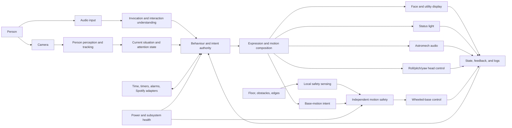

# Makad V1 System Design Brief

| Field | Value |
|---|---|
| Status | Approved |
| Version | 1.2 |
| Owner | Project builder |
| Created | 2026-08-14 |
| Last reviewed | 2026-08-27 |
| Authority | Derived from the approved `docs/00-foundation/` documents |

This brief defines the engineering problem Makad's system architecture must solve. It sits between the approved foundation and the later architecture, prototypes, subsystem specifications, component choices, and CAD. It does not repeat Core capabilities as "shall" requirements — the foundation owns those. At its original approval it did not select a drive type or physical dimensions; `dimensional-baseline.md` now supplies those downstream decisions. It still does not select exact motors, processors, cameras, actuators, batteries, frameworks, or suppliers.

## 1. System boundary

Makad V1 includes the physical droid, its onboard software and firmware, and the adapters through which it uses approved external services. The human, room, network, cloud providers, Spotify service, charging source, and development equipment are outside the system boundary.

| Area | Inside the Makad system | Outside, but interacting with Makad | Why the distinction matters |
|---|---|---|---|
| Physical robot | Structure, head, wheeled base, battery, power distribution, display, camera, microphone, speaker, status light, sensors, wiring, stop mechanism | Floor, tabletop, obstacles, people, lighting, ambient sound | External conditions must be represented in tests rather than assumed controllable. |
| Control and behaviour | Onboard sensing, control, health monitoring, behaviour selection, expression coordination, utilities, logging | User actions and spoken requests | The robot owns its response and safe behaviour even when input is ambiguous. |
| Connected capabilities | Makad-side network clients, timeouts, authentication state handling, cancellation, recovery, and user feedback | Speech/language providers, time service, Spotify, internet connection | External services may fail; Makad still owns timeout, failure indication, and motion safety. |
| Development | Onboard diagnostic interfaces and reproducible startup configuration | Development computer, test fixtures, programmer, external log viewer | Final demonstrations cannot secretly depend on manual intervention from development tools. |

### Boundary decision to review

Cloud and Spotify services are dependencies, not trusted internal components. Their success can enable Core interactions, but their failure must become explicit system state and must never leave hazardous motion active.

## 2. Whole-system shape

The following is a **logical responsibility map**, not a decision about boards, processes, programming languages, or communication protocols.

### What this diagram says

- Perception reports what appears to be happening; it does not decide to approach someone.
- Behaviour decides the semantic action: acknowledge, look, approach, follow, stop, clarify, or fail.
- The composer turns one semantic intent into coordinated eyes, light, sound, head, and permitted base contributions.
- Base safety has independent authority to clamp, reject, or stop motion.
- Controllers return actual state and faults; command dispatch is not treated as proof that an action happened.
- Connected utilities are asynchronous capabilities used by behaviour, not the centre of the robot.

### What this diagram does not decide

- whether responsibilities run on one computer or several;
- whether a microcontroller is needed;
- the drive geometry;
- which perception or speech model is used;
- whether communication uses messages, shared memory, serial links, or another mechanism;
- which behaviour framework or state-machine library is used.

## 3. Architecture drivers

Architecture drivers are the small set of facts that materially shape several subsystems at once.

| ID | Driver | Engineering consequence | Why it belongs here |
|---|---|---|---|
| AD-01 | **M4 must feel like one character.** | Display, light, sound, head, and base need one coordination path, shared timing, interruption rules, and feedback. | Independent subsystem demos can all work while the combined result still feels incoherent. |
| AD-02 | **The head is a powered three-axis mechanism.** | Roll, pitch, and yaw all need structural support, actuation, sensing/control, wiring, limits, calibration, and expressive trajectories around a realistic moving load. | Three-axis head motion is Core and the first mechanical/firmware risk, not an optional roll add-on. |
| AD-03 | **Natural motion spans head, body, and wheels.** | Motion composition, trajectory generation, feedback, interruption, counter-motion, onset timing, and settling must work across head axes and the base. | Natural coordinated movement is the primary character and robotics challenge identified by the builder. |
| AD-04 | **Safety and bounded control must survive high-level failure.** | Joint/base limits, obstacle/edge stops, controller timeout, watchdogs, and hard stop cannot rely only on cloud responses or a healthy behaviour process. | Firmware and control faults must not leave an axis or the base moving. |
| AD-05 | **Person tracking and following are Core.** | Vision, target continuity, moving-camera geometry, distance estimation, behaviour, obstacle sensing, low-speed control, and loss handling must eventually work as one loop. | It remains a coupled Core validation path even though its software work follows the primary mechanical/firmware prototypes. |
| AD-06 | **The camera moves with the head.** | Three-axis head pose, camera calibration, tracking, field of view, cable routing, status-light placement, and physical limits affect one another. | Perception and head mechanics cannot be designed independently. |
| AD-07 | **Floor and tabletop operation grant different permissions.** | Operating-mode state must be explicit; ordinary locomotion is inhibited on a tabletop, while edge protection remains effective during permitted circular-footprint test motion. | An ambiguous mode would create a direct fall hazard. |
| AD-08 | **Peak loads occur concurrently.** | Battery, regulators, wiring, thermal design, firmware, and compute must tolerate motors, three-axis head motion, audio, display, camera, and processing operating together. | Sizing every subsystem from its average load would hide brownout and heat risk. |
| AD-09 | **Cloud dependence is acceptable but must be bounded.** | No duplicate offline language/utility implementation is required, but external calls still need deadlines, cancellation, failure behaviour, and recovery. Local motion safety cannot wait on them. | Network availability is assumed for Core connected features; network safety is not. |
| AD-10 | **The final robot is battery-powered and serviceable.** | Packaging must consider battery access, isolation, connectors, cooling, replacement paths, wiring movement, and module removal before CAD freeze. | Enclosure-first CAD would lock in rework and unsafe service procedures. |
| AD-11 | **Failures must be diagnosable.** | Observations, intents, commands, actual state, health, and visible onset need timestamps and correlation in logs. | Without this, firmware, scheduling, latency, and physical-motion failures cannot be separated. |
| AD-12 | **Sourcing is an architecture constraint.** | Candidate parts need verified specifications, cost, availability, lead time, alternatives, replacement risk, tools, and fabrication path before commitment. | A theoretically ideal design is useless if critical parts are unavailable, unaffordable after full costing, or impossible to replace. |
| AD-13 | **The Candidate feature must remain removable.** | Spatial hearing needs a clean interface boundary and evidence gate; Core cannot depend on it. | Optional ambition must not create a late redesign or broken Core fallback. |

## 4. Logical responsibilities

These responsibilities must exist in the final architecture. They may later be combined or split across hardware and software after compute, timing, and safety analysis.

| Responsibility | What it owns | What it must not own | Why the boundary matters |
|---|---|---|---|
| Audio input | Microphone capture and usable audio stream/health | Deciding whole-robot behaviour | Capture failure and interpretation failure need to remain distinguishable. |
| Invocation and interaction | Wake aliases, request understanding, ambiguity, cancellation, completion/failure semantics | Direct motor or display-pixel control | Language output should be semantic rather than coupled to hardware. |
| Person perception and tracking | Detections, selected-track evidence, geometry, confidence, freshness, loss/reacquisition evidence | Authorizing approach or follow | Seeing a person is not permission to move toward them. |
| Situation and attention state | Current person candidates, selected person, relevant interaction context, validity | Fabricating missing or stale evidence | Behaviour needs one truthful input view, including uncertainty. |
| Behaviour authority | Chooses compatible semantic intents and handles interruption/recovery | Raw motor PWM, raw joint commands, or renderer pixels | High-level logic should express intent while specialized controllers enforce physics. |
| Expression composer | Coordinates display, light, audio, head, and eligible base contributions in perceived time | Overriding safety or physical controller limits | One performance must not create conflicting subsystem actions. |
| Head control | Powered roll/pitch/yaw joint limits, coordinated trajectories, measured/estimated pose, calibration, and faults | Choosing whom M4 should attend to | Attention choice and three-axis mechanical execution remain separable. |
| Mobile-base control and safety | Validated motion envelope, wheel execution, obstacles, edges, stop/inhibit, controller timeout | Social target selection | Safety remains authoritative even when behaviour is wrong or unavailable. |
| Display and light | Animated face, utility-view lifecycle, status-light output, actual state/fault feedback | Owning interaction state | Display handoff must return cleanly to the face under completion, cancellation, or failure. |
| Astromech audio output | Playback/synthesis, level control, interruption, actual state/fault feedback | Deciding the meaning of a response | The authored language and the hardware output path can evolve separately. |
| Utilities and integrations | Time, timers, alarms, Spotify authentication/control, external-service lifecycle | Blocking urgent interaction or motion-safety work | Slow or failed services must not freeze the droid. |
| Platform health and power | Battery, rails, temperatures, compute/controller availability, low-power state | Hiding faults as ordinary behaviour | Degradation decisions require explicit health evidence. |
| Observability | Common timebase, event correlation, bounded logs, diagnostic export | Becoming a runtime dependency for safety | Debugging evidence must not be required for the robot to stop safely. |

## 5. Information contracts

The later `subsystem-interfaces.md` will define exact fields and transports. At this stage, the architecture must preserve five different kinds of information.

| Information kind | Minimum meaning | Why it must remain distinct |
|---|---|---|
| Observation | What a sensor or external service reported, with observation time, receipt time when relevant, confidence/validity, and source | Old or uncertain evidence must not look like current truth. |
| Situation state | The system's current best view of selected person, operating mode, interaction context, and subsystem availability | Behaviour needs a coherent snapshot without reading every device directly. |
| Semantic intent | The outcome requested—such as attend, acknowledge, approach, follow, stop, display time, or play a response—with validity and cancellation semantics | Intent should survive changes to actuators, renderer, or drive implementation. |
| Command | A bounded controller-level request derived from an authorized intent | Physical controllers need precise inputs while retaining limits and safety authority. |
| Feedback and health | What actually executed, current measured/estimated state, completion, denial, inhibition, fault, temperature, power, and availability | Dispatch success is not execution success; behaviour must react to reality. |

### Contract rules to review

1. Every time-sensitive observation or intent needs a common monotonic time reference or a defined conversion to one.
2. Unknown, stale, ambiguous, and unavailable must be representable; they cannot be silently converted to false certainty.
3. Long-running actions such as following, timers, alarms, and Spotify playback need explicit lifecycle, cancellation, and completion/failure feedback.
4. A restart or reconnection must not replay obsolete motion or expression commands.
5. Queues and retries must be bounded so a recovered subsystem does not execute an old burst of work.

## 6. Operating and failure model

Makad should not be implemented as one enormous `current_state` enum. Several dimensions can coexist and should remain separately inspectable.

| State dimension | Example values | Why separate |
|---|---|---|
| Physical permission | Floor, tabletop, motion inhibited, hard stop | A social interaction can continue while base motion is forbidden. |
| Interaction phase | Asleep/quiet idle, waking, attentive, handling request, returning to idle | Interaction state should not redefine hardware health. |
| Person continuity | No candidate, candidate, selected, temporarily lost, reacquiring, lost | Tracking loss needs explicit behaviour without pretending the whole robot is “failed.” |
| Action lifecycle | Proposed, accepted, active, cancelling, completed, failed | Timers, Spotify, performances, and following need observable completion semantics. |
| Subsystem health | Available, degraded, unavailable, unsafe | One unavailable channel should degrade the performance without hiding the fault. |
| Energy state | Normal, low, critical, charging | Energy policy can inhibit movement while retaining a visible/audible response. |

### Failure priorities

1. Prevent harmful or uncontrolled motion.
2. Stop or inhibit the affected action.
3. Preserve legal expressive channels where practical.
4. Communicate the failure in character without claiming success.
5. Record enough evidence to diagnose the cause.
6. Recover only from current state; never blindly resume stale action.

## 7. Engineering budgets to close

These budgets couple architecture and packaging. Initial estimates can be ranges; they become binding only after review and representative evidence.

| Budget | Must include | Why it is coupled | Closure gate |
|---|---|---|---|
| Mass and centre of mass | Head, body, base, battery, wheels/supports, wiring, moving poses | Affects neck torque, stability, spin, stopping, handling, and actuator size | Preliminary architecture and layout study |
| Physical volume | Component envelopes, connectors, cable bends, airflow, moving clearances, service paths | Determines proportions and whether CAD can remain serviceable | Before major CAD freeze |
| Mechanical motion | Per-axis range, load/torque, inertia, speed, acceleration, jerk, backlash/lost motion, repeatability, stiffness, vibration, acoustic noise, reversal, settling, base minimum speed, stopping, and stability | These quantities determine whether roll/pitch/yaw and head–body–wheel movement look natural rather than merely move | Representative head, drive, and coordinated-motion prototypes |
| Sensing and perception | Camera field of view/range/lighting, frame timing, target geometry and freshness, tracking loss/reacquisition, obstacle/edge coverage, and sensor-failure visibility | Head geometry, motion, compute, safety, and the household following envelope all depend on usable sensing coverage | Camera/layout, motion-safety, and following prototypes |
| Acoustic | Microphone capture, ambient/mechanical noise, speaker level/quality, echo/playback contamination, simultaneous capture/playback, and audible motion noise | Head/base mechanisms, enclosure, cooling, speaker placement, audio software, and listening latency affect one another | Sourced layout and representative moving/audio prototype |
| Power and energy | Peak/average load by state, motor stall/transients, audio peaks, compute, display, sensors, conversion loss, reserve | Determines battery, regulators, wiring, runtime, brownout risk, and heat | Before power/component selection |
| Thermal | Compute, regulators, battery, motors, drivers, charging, enclosure surfaces, duty cycle | Heat affects reliability, safety, throttling, noise, and enclosure design | Before enclosure freeze |
| Compute | Perception, tracking, display, audio, language, behaviour, logging, integrations, startup/recovery | Determines compute split, responsiveness, thermal load, and battery demand | Representative coexistence prototype |
| Timing and latency | Wake, visual acquisition, speech, cloud calls, composition, display/audio onset, head/base response, stop path | Both perceived aliveness and safety depend on end-to-end timing | Measured prototype timelines |
| Internal communication | Onboard buses/links, update rates, payloads, loss behaviour, time synchronization, watchdogs, and restart semantics | Separates high-level compute, firmware controllers, sensors, and actuators without creating stale or unsafe motion | Before subsystem-interface baseline |
| External network | Wi-Fi/internet assumption, cloud latency and availability, authentication, bandwidth, deadlines, cancellation, failure indication, and recovery | Connected Core features may require the network, while physical safety must remain independent of it | Before interaction/integration baseline |
| Reliability and endurance | Joint cycles, cable flex, connector retention, wheel/support wear, thermal duty, controller restarts, service operations, and repeated demonstrations | A mechanism that works once may still fail during integration or repeated use | Representative endurance and service tests before CAD/final build freeze |
| Sourcing and availability | Verified specifications, candidate vendors, local/import availability, lead time, substitutes, minimum order, replacement risk, required tools, and fabrication access | Component feasibility can force architecture changes before price or performance comparisons even matter | Before prototype and final-part commitments |
| Cost | Candidate ranges, prototype quantities, replacements, final parts, tools, shipping, fabrication, taxes/duties, and contingency | There is no fixed ceiling; the complete cost picture is needed before substitutions or scope cuts can be judged | Before major procurement and procurement BOM approval |
| Schedule | research, sourcing, learning, prototype iterations, CAD, fabrication, integration, validation, contingency | Every optional mechanism consumes time needed by Core following and integration | Architecture and milestone review |

## 8. Architecture decision register

These are the decisions the architecture phase must make. The brief records the decision questions, not their answers.

| ID | Decision | Evidence needed before commitment | Main trade-off |
|---|---|---|---|
| ADR-01 | Component sourcing and selection strategy | Candidate matrix with verified specifications, availability, lead time, alternatives, tools, full landed cost, and replacement risk | Early commitment and convenience versus evidence, flexibility, and integration risk |
| ADR-02 | Powered roll/pitch/yaw actuation, joint order, support, transmission, sensing, wiring, and limits | Representative head mass/inertia and three-axis motion-quality prototype | Torque and stiffness versus backlash, noise, cost, complexity, and packaging |
| ADR-03 | Firmware/control backbone and high-/low-level compute split | Loop/timing needs, safety paths, interfaces, instrumentation, recovery/watchdog tests, and workload estimate | Simplicity versus deterministic control, diagnosability, and fault isolation |
| ADR-04 | Wheeled-drive and passive-support geometry | Low-speed, reversal, turning, spin, stopping, stability, noise, floor tests | Expressive quality and control versus mechanical complexity |
| ADR-05 | Head–body–wheel coordination and scheduling architecture | Measured axis/base response, feedback, onset, interruption, counter-motion, and settling experiments | Natural composition and extensibility versus timing/control complexity |
| ADR-06 | Battery, rails, charging, isolation, and low-energy policy | Concurrent peak-load measurements, 20-minute runtime test, available cells/chargers, and thermal evidence | Runtime and power margin versus mass, space, and safety burden |
| ADR-07 | Obstacle and tabletop-edge sensing arrangement | Hazard geometry, stopping tests, circular-footprint coverage, and failure trials | Coverage and independence versus cost and integration burden |
| ADR-08 | Display, face window, status light, camera, and physical head layout | Legibility prototype, viewing angles, light leakage, camera interference, head mass/inertia, and sourced envelopes | Visual identity versus perception, head mechanics, and packaging |
| ADR-09 | Person acquisition/tracking/following approach and compute placement | Camera prototype, approved short household route, loss/reacquisition cases, and compute profiling | Robustness versus compute, sensing, and schedule complexity |
| ADR-10 | Invocation/language path and external-network behaviour | Alias tests, cloud latency, timeout/failure behaviour, supported intent set, and authentication needs | Natural interaction quality versus dependency and latency |
| ADR-11 | Astromech audio and Spotify playback path | Acoustic prototype, routing needs, simultaneous capture/playback behaviour, and network/service failure tests | Sound quality and loudness versus power, vibration, and microphone contamination |
| ADR-12 | Internal communication and common timebase | Data-rate estimate, controller split, timestamp accuracy, restart/watchdog tests, and wiring constraints | Implementation simplicity versus coordination, observability, and robustness |
| ADR-13 | Spatial-hearing Candidate inclusion | Separate time-boxed prototype evidence after the Core mechanical/control path is credible | Interaction benefit versus hardware, compute, acoustics, sourcing, and schedule cost |

## 9. Risk prototypes required before major commitments

This is the prototype portfolio the later `risk-prototype-plan.md` must turn into procedures, materials, measurements, and pass/cut gates.

| Priority | Prototype | Question it must answer | Decisions it unlocks |
|---:|---|---|---|
| 1 | Three-axis head mechanism and motion firmware | Can powered roll, pitch, and yaw support a realistic head with useful ranges, natural trajectories, acceptable reversal/settling/noise, safe limits, manageable cable behaviour, and stable camera geometry? | ADR-02, ADR-03, ADR-08, head mass/physical/timing budgets |
| 2 | Electrical/control backbone and integrated peak-power rig | Can controller, stop/watchdog, power rails, representative head/base loads, compute, camera, display, and audio coexist without unsafe motion, reset, voltage collapse, overheating, or failure to reach the initial 20-minute runtime? | ADR-03, ADR-06, power/thermal/internal-communication budgets |
| 3 | Drive and local motion-safety rig | Can the candidate architecture move slowly, reverse, turn, spin, stop, detect representative obstacles/edges, remain stable with realistic mass, and stay within the tabletop test footprint? | ADR-04, ADR-07, mass/power/timing budgets |
| 4 | Head–body–wheel coordinated-motion rig | Can measured head axes and base motion be composed, interrupted, counter-moved, and settled so the result reads as one natural performance rather than independent controllers? | ADR-05, timing/internal-communication/firmware decisions |
| 5 | Wake and interaction latency path | Do all aliases work through representative microphones and cloud language services with acceptable ambiguity, cancellation, timeout, failure indication, and visible response timing? | ADR-10, external-network/timing budgets |
| 6 | Sourced head-face-camera-audio layout mock-up | Are credible available parts compatible in mass, volume, cost, lead time, face legibility, camera view, status-light interference, speaker output, service access, and fabrication? | ADR-01, ADR-08, ADR-11, preliminary physical architecture and cost range |
| 7 | Person tracking and short household following loop | Can M4 acquire, retain, lose, reacquire, approach, and follow a selected person over the approved short same-room envelope with bounded stale-data and stop behaviour? | ADR-07, ADR-09, compute/perception/timing budgets |

### Prototype policy

- A prototype exists to answer a decision question, not to look like a partial final robot.
- Representative mass, geometry, concurrency, lighting, floors, and failure cases matter more than cosmetic finish.
- A failed prototype is useful evidence when its setup, measurements, and decision consequence are recorded.
- Exact exit thresholds are set before each prototype is run where current evidence permits; thresholds may not be rewritten afterward merely to pass the chosen design.
- Component sourcing, alternatives, landed cost, and required-tool checks run before and during every physical prototype rather than being postponed to the final BOM.
- Spatial hearing receives time only after the Core mechanical/control path is credible. Powered roll is already part of Core prototype 1.

## 10. Planning inputs and remaining unknowns

| Item | Current planning position | Why it cannot remain open indefinitely |
|---|---|---|
| Electrical tools | Access not yet established | Safe power, motor, battery, and signal work requires an acquisition/borrowing plan before physical prototypes. |
| Cost policy | No fixed ceiling; build the complete sourced cost range first, then review substitutions or scope cuts before major procurement | Affordability cannot be judged from isolated component prices. |
| Untethered runtime | Initial requirement is at least 20 minutes of representative mixed-duty operation; revisit increases after measured power/mass evidence | Provides a real starting point without oversizing the first battery architecture from guesswork. |
| Tabletop permissions | Stationary by default; only explicitly enabled low-speed test/calibration motion inside a marked validated circular footprint; no come/follow or excited spin | Edge sensing, mode control, and stopping tests can now use a bounded permission model. |
| Interaction and following envelope | Single household room; interaction approximately 0.3–2.0 m, come from approximately 1–2 m and stop approximately 0.6–0.9 m away, follow up to approximately 3 m at no more than approximately 0.5 m/s on a level floor with one gentle turn and representative obstacles | Provides a small representative case for perception, drive, camera, and validation work. |
| Network expectation | Reliable network/cloud may be assumed for connected Core features; no duplicate offline implementation is required | Failure still needs a bounded visible response, while physical stop and motion safety remain local. |
| Physical size and mass | Current geometry, moving-head target, and integrated CoM target are governed by `dimensional-baseline.md`; total mass remains derived rather than minimized | Head torque, stability, battery, transport, and fabrication require validation before parts/CAD freeze. |

## 11. What is intentionally deferred

The brief does not select:

- processors, microcontrollers, operating systems, middleware, or programming languages;
- exact motors, transmissions, wheel/caster/skid parts, drivers, or encoder implementations within the selected two-wheel differential-drive/support topology;
- camera, display, microphone, speaker, light, sensors, or battery;
- the exact actuators, transmissions, bearings, encoders, joint order, ranges, and implementation of the required roll/pitch/yaw head;
- vision, speech, language, behaviour, animation, or control libraries;
- detailed APIs, message schemas, update rates, or process boundaries;
- manufacturing tolerances, detailed shell geometry, material selection, or CAD layout within the current dimensional baseline;
- final numeric acceptance thresholds.

These decisions require the budgets, trade studies, and prototype evidence above. Existing `specsheets/` may suggest candidates, but nothing in them is adopted automatically.

## 12. Downstream documents

This brief feeds the following documents:

1. Approved `risk-prototype-plan.md` defines the seven experiments, measurements, and pass/cut gates in the approved mechanical/firmware-first order.
2. `system-architecture.md` will compare viable architecture options and select the logical/physical design using prototype evidence.
3. `engineering-budgets.md` will allocate mass, physical space, mechanical motion, sensing/perception, acoustics, power, energy, heat, compute, timing, internal communication, external network, reliability, sourcing, cost, and schedule margins.
4. `physical-architecture.md` will define envelopes, placement, centre of mass, moving clearances, wiring, cooling, and service paths.
5. `subsystem-interfaces.md` will define observations, state, semantic intents, bounded commands, feedback, health, timebase, and fault behaviour.

Approved 2026-08-14: the system boundary, architecture drivers, responsibility model, decision register, budget categories, prototype portfolio, and mechanical/firmware-first order are the V1 baseline. That approval did not select components, mechanisms, deployment technology, or numeric thresholds. Version 1.1 recorded the later dimensional/drive selections. Version 1.2 consumes `dimensional-baseline.md` v1.2 and its ear-pod mechanical-access clarification without selecting Concept A, an actuator, or an unvalidated prototype limit.
