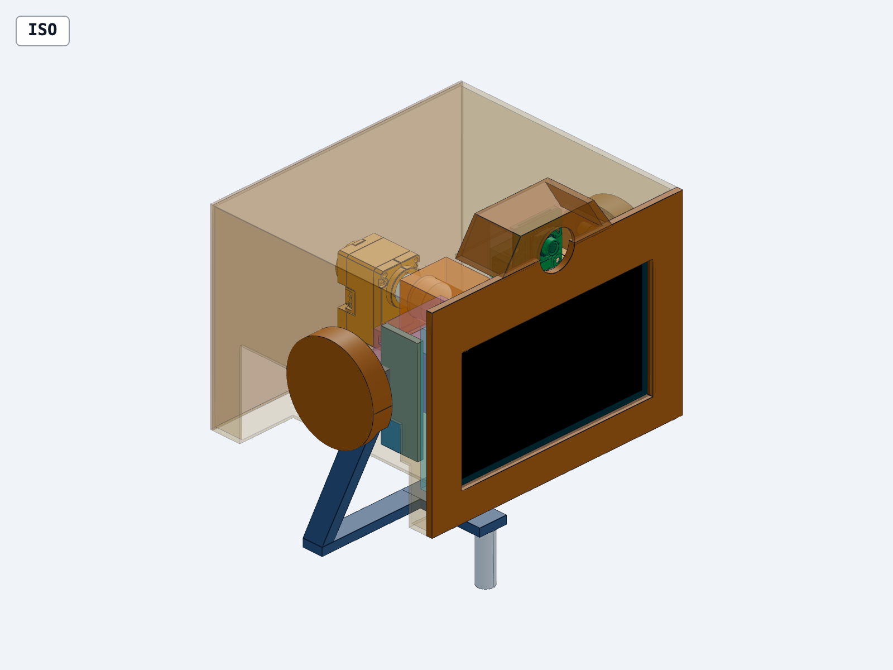

# Layout 01 — proposed head arrangement

Reviewed **2026-09-08**. This is a dimensioned packaging study, not a fabrication release. The rectangular skins, frame members and mounting volumes indicate available space; final rounded styling, ribs, locating features, screws and structural load paths still need detailing.

[Open the head in CAD Viewer](http://127.0.0.1:3245/Users/avinier/robotics/makad/docs/02-prototypes/RP-01-head/cad?file=head/layout-01/head-layout.step.py)

## Proposed arrangement

| Region | Layout 01 proposal |
|---|---|
| Face | Display at Z=9…77 mm; hardware and connection reserve extend 18 mm behind the front plane. |
| Camera | Board above the display at Z=81…105 mm conservative envelope; lens axis Z=95.4 mm; 18 mm trial opening. Crown is 58 mm wide at its base, 38 mm at its top, 24 mm deep and reaches Z=109 mm. |
| C2 | Removable 35 × 25 × 15 mm installed-assembly pocket behind the display, beside the roll mechanism. The current decision register selects the headerless **Waveshare ESP32-S3-Zero, 23.5 × 18 mm**. CAD shows the pocket, not a detailed Zero model or proven connector fit. |
| Roll | Central flange and supported spindle behind the display; bearing centres at X=−43 and −65 mm; coupling and XC330 reference behind them. The servo model's full 29 mm outline ends at X=−106.5, leaving 7.3 mm to the rear cover's inside plane. |
| Pitch | XC330 reference on one side, its body turned toward the rear. Yoke legs sit inward at Y=±55 mm and bend rearward below the pivot to avoid the display during upward pitch. |
| Ears | Hollow rolling covers, 45 mm diameter and 10 mm lateral contribution each. Inner reliefs clear the stationary yoke; the outer round faces remain intact. Their attachments and final curved styling are not modeled. |

The **neutral head is 150 W × 115 D × 109 H mm**, including ears and crown. The main body remains 130 W × 115 D × 95 H. Crown height adds **14 mm** to the old 95 mm nominal and exceeds its old 90–100 mm complete-head band. This is a proposed revision to review, not a silent baseline change. The model also contains 60 mm below the head for the neck interface, making the entire study's Z span 169 mm; do not confuse this with head height.

Colours: brown shell/ears, blue yoke, orange pitch mechanism and servo references, teal display, green camera, purple C2 reserve. Transparent volumes are reservations or skins used to expose the interior.

## Balance and mass

[Spatial ledger and sensitivity](mass-placement.json) derives A0 from provisional positions and D/E mass allocations. Coordinates use front-bottom centre as origin, +X forward, +Y robot-left, +Z up.

With a **20 g installed C2 scenario**, pitch's estimated carried mass is 462 g and its CoM gives **X=−37.3 mm, Z=47.5 mm** for the pitch axis. Roll's estimated carried mass is 402 g, giving **Y=−0.7 mm, Z=48.7 mm** for its axis. These are starting datums, not measured balance or machining tolerances. Roll-axis X is a line, not a single pivot point; its flange and bearing positions are separate.

The complete yaw-carried inventory is **533 g in that scenario**: original 490 g, replacing the old 35 g actuator allowance with 46 g of reference servo housings plus 6 g of moving horn/hub allowance, then adding 20 g C2 and 6 g crown allowance. This avoids adding the mechanism twice. C2 scenarios of 10–35 g produce 523–548 g totals. These are sensitivity assumptions, not a mass confidence interval or weigh-in. Detailed shell reliefs, mounts, finish and hardware can change both mass and CoM. The 6 g crown increment remains an explicit allowance, not a computed final printed mass.

No inertia, dynamic torque, thermal suitability or final servo assignment is claimed. The downloaded shared XL/XC330 model supplies shape; the XC330 23 g reference supplies the mass assumption. Servo output hardware ownership is approximated in the ledger and needs reconciliation against the purchased assembly.

## Checks and their limits

- [56-pose check](fit-checks.json): 21 selected moving/fixed component pairs at each pose, covering roll −18…+18° and pitch −22…+40°, including intermediate poses not used to construct the reliefs. **No positive-volume intersections** in those 1,176 pair checks. This is a sampled envelope test, not continuous collision certification or a full assembly interference pass.
- The first straight, outboard yoke failed: ear/yoke, shell/yoke and extreme display/support contacts are captured in [the initial check](fit-checks-before-relief.json). Moving the supports inward, adding a rearward knee, turning the pitch-servo body and introducing hidden reliefs resolved the checked contacts.
- Both outer ear faces retain area **1,590.43 mm²**, matching a complete 45 mm circle. Inner edge notches may still be visible from some directions and need appearance review with the final rounded shell.
- Lowest sampled rolling-head point is Z=−42.27 mm. Relative to a provisional horizontal body-top plane at Z=−60, that leaves 17.73 mm. The actual body, yaw rotation, torso fittings and cables were **not** included, so this is not a body-clearance pass.
- CAD measurement confirms **22 mm bearing-centre separation**, with equal Y/Z centres. The front stack has a 4 mm display-to-camera board gap; C2's pocket starts 2 mm behind the display connection reserve. Plug shape, insertion sweep and tool access still need exact parts.
- [Authored geometry validation](review/authored-parts-validity.json): all 35 selected generated occurrences pass topology, closure, positive-volume and self-intersection checks.
- [Whole assembly check](review/all-parts-validity.json), run without the expensive self-intersection test on imported parts, reports **13 open/non-solid imported occurrences**: one camera detail and twelve repeated servo details. Their original files are preserved. Therefore the complete STEP is a reference assembly with imported surface details, not an all-solid manufacturing-ready assembly.
- [Geometry facts](review/geometry-facts.json) record the envelope. Reviewed [front](review/front_20260907T194334Z.png), [side](review/side_20260907T194334Z.png), [top](review/top_20260907T194334Z.png), [opposite isometric](review/opposite_20260907T194334Z.png) and the isometric above. These are transparent assembly views, not a true section or production drawing.

## Service and wiring proposal

1. Provide rear-cover fasteners accessible from behind. With power off, remove the cover first to expose C2, the roll adapter and cable restraints.
2. Put C2 on a separately removable tray. Preserve direct USB-C and BOOT/RESET access for the selected Zero; the 13 mm rear withdrawal reserve is only a starting space allocation. Check cable insertion and tool paths against the actual board before detailing the tray.
3. Route the camera CSI down from the rear of its board through the reserved upper-front corridor, then around—not through—the spindle. Keep a controlled flex section at roll, pitch and yaw. The camera connector location is represented; no flex loop or qualified bend radius is modeled yet.
4. Keep ear screws on accessible inner/rear faces. Release local harness connectors/clamps before withdrawing the face carrier. The bearing cartridge and servo adapters should remain independently removable; screw patterns and actual withdrawal trajectories remain open.
5. Retain the selected solid yaw spindle and external rear neck cable loop. The body-fixed yaw servo is outside this head study and is not rendered or counted as a fully moving servo.

The next detailed CAD work is the located face/backplate connection, ear mounts and relief styling, roll-servo adapter and cartridge supports, actual C2 tray/connectors, cable guides and mechanical stops. Those details must turn the presently indicative frame into a connected load path, then update mass properties and support servo sizing. No new user decision is needed to investigate them within the selected architecture; this study does not lock its trial dimensions.

## Reproduce and inspect

Source: [head-layout.step.py](head-layout.step.py); export: [head-layout.step](head-layout.step); [brief](brief.md); [component provenance](parts/README.md). With the CAD runtime Python, run `layout_data.py`, then `check_layout.py`. Generate the STEP using the installed CAD skill's `scripts/gen head-layout.step.py --write`, validate using `scripts/inspect`, and render `snapshots.json` from the repository root.

Reference parts in the same viewer workspace: [Camera Module 3 Wide](http://127.0.0.1:3245/Users/avinier/robotics/makad/docs/02-prototypes/RP-01-head/cad?file=head/layout-01/parts/camera-module-3-wide.step), [XC330](http://127.0.0.1:3245/Users/avinier/robotics/makad/docs/02-prototypes/RP-01-head/cad?file=head/layout-01/parts/xc330.stp).
