# RP-01 Layout 03 — Bulletproof Math Working Guide

| Field | Value |
|---|---|
| Status | Conceptual checklist and **external rigid-body** Layout-03 demand/sensitivity calculation complete. Closure audit recorded 2026-09-13; structural dynamics, actuator-internal inertia and confirmed CAD/hardware issues keep the paper screen OPEN. |
| Scope | Explain, calculate and audit the Layout-03 external head-load model, then state exactly which physical effects remain outside it. |
| Does not claim | Complete electromechanical actuator demand, structural adequacy, servo-SKU selection, registered-gate passage, measured mass, fabrication release or RP-01 closure. |
| Primary sources | [physics.md](physics.md), [storyboard.md](storyboard.md), [Layout-03 mass tree](../RP-06-cad/head/layout-03/mass-placement.json), [Layout-03 dimensions](../RP-06-cad/head/layout-03/dimensions.md), [rig.md](rig.md), [gates.md](gates.md), [decision.md](decision.md) |

## 1. What has and has not been completed

The conceptual teaching checklist is complete: the builder has confirmed the meaning of frames, distal mass membership, CoM, axis distance, gravity torque, inertia, combined load, peak versus RMS torque and torque-speed limits.

That completion is not the same as completing the Layout-03 calculation or closing RP-01.

```mermaid
flowchart LR
    A["Conceptual understanding<br/>complete"] --> B["External rigid-body demand model<br/>complete"]
    B --> C["Closure audit<br/>missing physics and CAD blockers recorded"]
    C --> D["Correct structure / hardware<br/>and bound actuator internal demand"]
    D --> E["Register physical gates<br/>before scored testing"]
    E --> F["Ugly rig with measured W masses"]
    F --> G["Scored RP01-G01 through G06 runs"]
    G --> H["decision.md<br/>pass / iterate / reject"]
    H --> I["RP-01 closed"]
```



There are three distinct levels of completion:

1. **Conceptual completion:** the builder understands and can audit the equations and assumptions. This is complete.
2. **External rigid-body paper completion:** the reproducible model has calculated the Layout-03 payload trajectories, balance cases, external parasitic-load probes and busy-minute output RMS loads. This is complete for that stated boundary. It excludes actuator rotor/gear acceleration and does not prove structural rigidity. The first named candidate screen is therefore preliminary, not a complete paper-physics pass.
3. **RP-01 closure:** registered gates have passed using physical evidence from the representative rig. This remains later work.

The builder does not need to perform hundreds of repeated arithmetic operations manually. A spreadsheet or script should sample trajectories, apply formulas, preserve units and produce plots. The builder's responsibility is to understand and approve the inputs, source grades, cases, assumptions and pass/fail rules.

## 2. Evidence grades and honesty rules

Every input must retain its evidence grade:

| Grade | Meaning in this analysis |
|---|---|
| `W` | Weighed or physically measured evidence from the actual part, assembly or test configuration. |
| `D` | Manufacturer/documentation value applied to the identified item and configuration. |
| `E` | Engineering estimate derived from CAD geometry, density, bounding boxes or an explicit allowance. |
| `U` | Unknown or deliberately unverified assumption carried as a sensitivity variable. |

Rules:

- Never present a D/E mass tree as measured hardware.
- Never silently set an unknown friction or cable term to zero.
- Never add every torque magnitude blindly; calculate signed terms at the same instant.
- Never compare a moving trajectory point with stall torque at zero speed.
- Never describe payload-side `Jα` as complete actuator acceleration demand unless motor/gear inertia has been included or empirically bounded.
- Never infer structural adequacy from a rigid-body torque calculation.
- Never treat a passing paper calculation as a frozen actuator SKU.
- Never move a gate after seeing scored results; issue a new version and a fresh test set.

## 3. Coordinate frames and carried membership

Layout-03 uses:

- `+X`: forward;
- `+Y`: robot-left;
- `+Z`: upward.

The mechanism order is body-fixed yaw, then pitch, then head-fixed roll. The moving sets are nested:

```text
R ⊂ RP ⊂ RPY
```

Therefore:

| Axis calculation | Physical mass carried |
|---|---|
| Roll | `R`: rolling face/cradle and its payload only. |
| Pitch | `R + P`: everything that rolls plus pitch-carried structure, bearings and the roll-actuator housing. |
| Yaw | `R + P + Y`: the complete moving head, including the pitch-actuator housing and yaw-carried structure. |

Important Layout-03 ownership traps:

- The roll-actuator output drives roll, but its housing is in frame `P`; it contributes to pitch and yaw, not roll.
- The pitch-actuator output drives pitch, but its housing is in frame `Y`; it contributes to yaw, not pitch or roll.
- Envelopes and installed allowances are not added twice when a mass owner already includes them.

## 4. Current Layout-03 paper inputs

The current nominal mass tree uses a 20 g `E` allowance for the installed C2 assembly. C2 remains physically unweighed. The current paper values are:

| Axis | Carried mass | Estimated inertia about output axis |
|---|---:|---:|
| Roll | approximately 362 g | approximately 0.000656 kg·m² |
| Pitch | approximately 436 g | approximately 0.000728 kg·m² |
| Yaw | approximately 509 g | approximately 0.001080 kg·m² |

These are D/E screening values. The inertia is an estimated axis inertia assembled from CAD/box intrinsic inertia and parallel-axis terms; it is not a measured tensor.

**Layout 04 update, 2026-09-23, revised 2026-09-25 — rerun required.** After the 2026-09-25 structure revision (stiffened pitch frame, torsion box, trim seats, official servo mass properties) the active tree is ~370/464/588 g with estimated inertias 0.000675 / 0.000779 / 0.001282 kg·m² (roll/pitch/yaw): +3 / +7 / +19 % against the values below. The ~2% contributed by the body-side driven spur is not yet in the head tree. This document still uses Layout 03's values; `actuator-screen-01.md` scales each axis by its ratio until the workbook is rerun.

The controlling authored motion values are:

| Axis | Peak-speed case | Peak speed | Peak-acceleration case | Peak acceleration |
|---|---|---:|---|---:|
| Pitch | Yes, 26°/0.220 s `MJ5` | 222°/s | Laugh, 7°/0.100 s `MJ5` | 70.5 rad/s² |
| Yaw | No, 44°/0.233 s `MJ5` | 354°/s | No settle/reversal | 82.2 rad/s² |
| Roll | Wobble, 24°/0.267 s `MJ5` | 169°/s | Wobble reversal | 34.1 rad/s² |

The peak-speed and peak-acceleration cases can differ. The final model must sample each trajectory; it cannot combine unrelated maxima into one fictitious operating point.

## 5. Step 1 — Dynamic torque

Dynamic torque is the torque required solely to accelerate the carried inertia:

$$
\tau_{dynamic}=J\alpha
$$

Applying the current estimated axis inertias to the controlling accelerations gives:

| Axis | Calculation | Dynamic-only peak estimate |
|---|---|---:|
| Roll | `0.000656 × 34.1` | approximately **0.022 N·m** |
| Pitch | `0.000728 × 70.5` | approximately **0.051 N·m** |
| Yaw | `0.001080 × 82.2` | approximately **0.089 N·m** |

For pitch:

$$
0.000728\ \mathrm{kg\,m^2} \times 70.5\ \mathrm{rad/s^2}
=0.0513\ \mathrm{N\,m}
$$

Interpretation: under the current D/E inertia estimate, about 0.051 N·m is required for the laugh's maximum pitch acceleration before gravity, external friction, cables, cross-axis coupling, uncertainty and selection margin are included.

Confirmed conclusions:

- These are only the `Jα` terms, not final actuator requirements.
- Mass alone does not determine dynamic torque; its distribution about the axis determines `J`.
- A large stall-torque number cannot validate these requirements because the trajectory is moving.

## 6. Step 2 — Gravity torque

Gravity torque is the gravitational force multiplied by perpendicular distance from the axis:

$$
\tau_g=mgd_\perp
$$

For pitch, with forward CoM offset `x`, upward offset `z` and pitch angle `θ`:

$$
\tau_{g,p}=mg(x\cos\theta+z\sin\theta)
$$

The sign must be preserved. Gravity can add to or oppose dynamic torque depending on pose and direction.

### 6.1 Nominal A0

Layout-03 iterated its estimated roll and pitch CoMs onto their corresponding axes. For ideal A0:

$$
x\approx0,\qquad z\approx0,\qquad \tau_g\approx0
$$

This means only that the estimated CAD mass model is balanced. It does not prove that the printed and populated head will be balanced. Actual display hardware, infill, finish, fasteners, wiring, C2 assembly and actuator masses can move the CoM.

### 6.2 A1: 5 mm forward pitch error

Using the current pitch-carried mass of approximately 0.436 kg:

$$
x=0.005\ \mathrm{m},\qquad z=0
$$

At neutral:

$$
\tau_g=0.436\times9.81\times0.005
\approx0.0214\ \mathrm{N\,m}
$$

| Pitch angle | Approximate gravity torque |
|---:|---:|
| -22° | 0.020 N·m |
| 0° | 0.021 N·m |
| +40° | 0.016 N·m |

A 5 mm forward error produces a neutral gravity load equal to roughly 42% of the current 0.051 N·m pitch dynamic estimate.

### 6.3 A2: 5 mm forward and 10 mm upward pitch error

For:

$$
x=0.005\ \mathrm{m},\qquad z=0.010\ \mathrm{m}
$$

| Pitch angle | Approximate gravity torque |
|---:|---:|
| -22° | 0.004 N·m |
| 0° | 0.021 N·m |
| +40° | **0.044 N·m** |

The +40° gravity term is nearly as large as the pitch dynamic term. It must not simply be added to the maximum `Jα` number because the two maxima may occur at different times or have opposite signs. The later `τ(t)` calculation combines all signed terms at the same trajectory sample.

### 6.4 Roll and yaw interpretation

- Roll uses its own lateral and vertical CoM errors. Combined pitch/roll poses change the projection of gravity onto those errors.
- Yaw is approximately vertical, so gravity produces no first-order yaw torque. Yaw still requires dynamic, external-friction, cable and coupling torque.

Confirmed conclusion: A0 makes gravity approximately zero only for the nominal estimated model. Signed sensitivity cases are mandatory.

## 7. Step 2B — Layout-specific balance sensitivity

Sensitivity cases should follow Layout-03's actual asymmetries rather than applying an arbitrary identical offset to every axis.

### 7.1 Pitch: front-to-back vulnerability

Pitch balance is created by opposing masses around the pitch axis near `X=-38 mm`:

- display and retention: 133 g near `X=-10 mm`;
- roll-actuator reference: 23 g near `X=-92 mm`;
- rear cover, finish, harness and coupling behind the axis;
- camera and front structures forward of the axis.

The largest immediate pitch-balance risk is replacing the 23 g roll-actuator placeholder with a real candidate. A 50 g candidate adds 27 g near `X=-92 mm` and can move the pitch CoM about 3 mm rearward unless another mass or the axis location changes.

Pitch therefore needs both positive and negative fore-aft cases, not only the existing forward A1 point.

### 7.2 Roll: left-to-right vulnerability

The large shell, display and ears are mostly symmetric. Important lateral asymmetries include:

| Item | Nominal mass | Nominal Y position |
|---|---:|---:|
| C2 installed allowance | 20 g `E` | -29 mm |
| CSI cable and strain relief | 8 g `E` | +10 mm |
| Other rolling harness | 8 g `E` | +8 mm |
| Addressable LED assembly | 5 g `E` | +15.2 mm |

Changing C2 from its nominal 20 g estimate to the retained 10/35 g sensitivity endpoints moves the roll CoM by approximately +0.8/-1.1 mm relative to the nominal-axis solution. A 5 g left/right finish difference at an ear approximately 70 mm from centre can contribute another roughly 1 mm shift.

A 2 mm lateral roll error creates approximately:

$$
0.362\times9.81\times0.002
\approx0.0071\ \mathrm{N\,m}
$$

That is around one-third of the current 0.022 N·m roll dynamic estimate.

### 7.3 Vertical vulnerability

Likely vertical disturbances come from:

- camera and LED near the crown;
- display below the roll/pitch axis;
- roll servo and pitch frame below/behind the axis;
- uneven finish;
- real harness routing.

The ordinary sensitivity grid should use modest vertical errors, while the existing +10 mm A2 case remains a deliberately harsh stress condition.

### 7.4 Yaw vulnerability

Yaw does not need a first-order gravity-offset grid, but it is sensitive to inertia and bearing load:

- the pitch actuator is mounted one-sided at about `Y=+32 mm`;
- most head mass is roughly 100 mm above the yaw interface (Layout 03; about 82 mm in Layout 04, lowering the overturning moment on the yaw bearing by about 18%);
- a heavier pitch actuator can materially increase yaw inertia;
- C2 and harness asymmetries affect bearing reactions and coupling.

Yaw inertia must therefore be recomputed for every actual pitch-actuator candidate.

### 7.5 Confirmed sensitivity plan

| Axis | Balance/inertia cases retained for paper modelling |
|---|---|
| Pitch | `x = -5, 0, +5 mm`; `z = -3, 0, +3 mm`; plus `x=+5, z=+10 mm` stress case. |
| Roll | `y = -2, 0, +2 mm`; `z = -3, 0, +3 mm`. |
| Yaw | No first-order gravity grid; recompute inertia for every candidate actuator mass and geometry. |
| Components | C2 at 10/20/35 g; actual candidate-servo masses; display/retention variation; finish asymmetry; harness placement. |
| Physical rig | Replace generic residuals with measured masses and measured CoM while retaining justified guard cases. |

Two complementary methods are required:

1. **Component perturbations** explain why the CoM moves.
2. **Residual CoM grids** protect against errors omitted from the component model.

This distinction and the sensitivity plan above are confirmed.

## 8. Step 3 — External friction, cable torque and coupling

The current workbook's external-load model is:

$$
\tau_{required}(t)=
J\alpha(t)+
\tau_g(t)+
\tau_{external\ friction}(t)+
\tau_{cable}(q)+
\tau_{coupling}(t)
$$

This is the torque demanded **at the joint output by the external head mechanism**. A complete actuator-side transient screen also needs the torque/current required to accelerate the actuator's own rotor and gear train. At output coordinates, represent that missing contribution as an equivalent inertia term:

$$
\tau_{actuator\ internal}(t)=J_{internal,eq}\alpha(t)
$$

$$
\tau_{actuator,total}(t)=\tau_{required}(t)+\tau_{actuator\ internal}(t)
$$

For a simple reduction `N`, a first-order rotor contribution reflected to the output is `J_rotor N²`; equivalent comparisons may instead refer the payload to the motor as `J_load/N²`. Use one side consistently. The present workbook does **not** include this term because XC330 rotor and gear inertias are not available in the retained evidence. Its torque peaks must therefore be labelled external/output-load demand, not total motor demand. Manufacturer steady-state torque-speed curves include internal losses at steady speed but do not prove the extra current needed to accelerate the internal rotating train.

For the M288 nominal ratio `N=288` and current pitch payload inertia `J_load=0.000728 kg·m²`, equality occurs at approximately `J_rotor=8.78×10⁻⁹ kg·m² = 0.0878 g·cm²`. This is a sensitivity threshold, not a claim about the actual actuator. Until an official inertia value or a defensible unloaded-acceleration current test exists, internal acceleration demand remains `U` and the magnitude multiplier is unknown.

**Update 2026-09-25.** No official value exists, so the term is now bounded as an `E` estimate from comparable coreless motors: 0.11–0.25 g·cm² motor-side, i.e. 0.92–2.08 × 10⁻³ kg·m² at the M288 output (1.3–3.2× the carried pitch or roll inertia) and 0.36–0.82 × 10⁻³ kg·m² at the M181 yaw output. Every axis still clears the moving curve. The derivation and checks are in [actuator-screen-01.md §Paper-closure pass](actuator-screen-01.md#paper-closure-pass--v03-2026-09-25). Bench test B1 replaces the bound.

CAD cannot accurately predict bearing preload, printed-part rubbing, misalignment, cable bending stiffness, torsion, connector forces or strain-relief forces.

The manufacturer's output torque-speed curve normally already reflects the actuator's internal motor and gearbox losses. Do not add actuator-internal friction again when comparing required output torque with that curve. The separate friction term represents external mechanism losses.

### 8.1 Direction and sign

A simple external Coulomb-friction approximation is:

$$
\tau_f=-\tau_c\operatorname{sign}(\omega)
$$

Friction reverses when the movement reverses. Cable torque is primarily pose/routing dependent:

$$
\tau_{cable}=\tau_{cable}(q)
$$

A cable can resist one direction, assist the opposite direction, apply a continuous holding bias and follow different loading/unloading paths.

### 8.2 Provisional U-grade screening levels

Until physical measurements exist, the paper model may probe combined external parasitic-torque magnitudes such as:

```text
0, 0.005, 0.010 and 0.020 N·m
```

These values are broad robustness probes, not predictions or registered limits. They are useful because 0.005/0.010/0.020 N·m are approximately 23%/45%/90% of the current roll dynamic estimate. A candidate that passes only when parasitic torque is zero is not a robust rig candidate.

The signed model must evaluate assisting and opposing directions rather than adding the same positive penalty everywhere.

## 9. Step 4 — Combined-axis load

A combined movement does not send the sum of roll, pitch and yaw torque into one actuator. Each actuator supplies torque around its own joint axis. The axes nevertheless interact through carried mass, changed gravity projection, structural reactions, cables and the shared electrical supply.

### 9.1 Held versus moving axes

For Curious Yes, roll holds at +12 degrees while pitch nods. Pitch is moving:

$$
\tau_P(t)=J_P\alpha_P(t)+\tau_{g,P}(t)+\tau_{friction,P}(t)+\tau_{cable,P}(t)+\tau_{coupling,P}(t)
$$

Roll has zero commanded acceleration but can still be loaded:

$$
\alpha_R=0
$$

$$
\tau_R(t)=\tau_{g,R}(t)+\tau_{cable,R}(t)+\tau_{coupling,R}(t)
$$

Zero motion is not zero force. A held axis may resist imbalance, cable spring and reactions from the moving axis. Do not credit beneficial static friction in the paper model unless it has been measured; stiction changes with assembly, wear and temperature.

### 9.2 Curious Yes example

The best-case pitch sequence is:

```text
hold R+12 degrees
P-4 -> P+12 -> P-7 -> P+8 -> P-4 degrees
total 0.90 s
```

The first pitch segment moves 16 degrees in 0.180 s using `MJ5`. Its peak acceleration is approximately:

$$
\alpha_{peak}=5.7735\frac{16\pi/180}{0.18^2}\approx49.8\ \mathrm{rad/s^2}
$$

With the current pitch inertia:

$$
\tau_{dynamic,P}=0.000728\times49.8\approx0.036\ \mathrm{N\,m}
$$

This is below the standalone laugh dynamic peak, but it occurs while roll must preserve a tilted hold.

For an illustrative confirmed roll sensitivity corner of `y=+2 mm`, `z=-3 mm` and `R=+12 degrees`, the effective gravity lever is approximately:

$$
d_{effective}\approx y\cos R-z\sin R\approx0.00258\ \mathrm{m}
$$

With the 0.362 kg roll-carried mass:

$$
\tau_{g,R}\approx0.362\times9.81\times0.00258\approx0.0092\ \mathrm{N\,m}
$$

This is more than 40% of roll's current 0.022 N·m dynamic peak even though roll is holding still. Signed cable load and cross-axis reaction remain additional terms.

### 9.3 Curious No example

The best-case compound case is:

```text
hold R+12 degrees and P-4 degrees
Y0 -> Y-18 -> Y+18 -> Y-12 -> Y0 degrees
total 0.95 s
```

The 36-degree yaw reversal over 0.250 s produces approximately 58.0 rad/s² peak acceleration. With the current yaw inertia:

$$
\tau_{dynamic,Y}\approx0.001080\times58.0\approx0.063\ \mathrm{N\,m}
$$

This is below the standalone No peak, but roll and pitch are holding, the complete tilted head is moving around yaw and all three actuators can draw current together.

### 9.4 Startle and shared electrical load

The simultaneous startle's dynamic-only estimates are:

| Axis | Startle acceleration | Dynamic torque |
|---|---:|---:|
| Roll | 18.7 rad/s² | approximately 0.012 N·m |
| Pitch | 46.7 rad/s² | approximately 0.034 N·m |
| Yaw | 24.9 rad/s² | approximately 0.027 N·m |

None is the standalone axis maximum. Startle can still control concurrent current, voltage sag, controller timing, cross-axis disturbance, camera shake and freeze quality.

### 9.5 Cheap three-axis paper method

Full Newton-Euler dynamics are not required for this screening stage. For each authored compound movement:

1. Place the other axes at their authored poses.
2. Recalculate or conservatively bound the tested axis's effective CoM lever and inertia.
3. Calculate signed `Jα` and gravity torque at each trajectory sample.
4. Add signed external-friction and cable sensitivity.
5. Keep cross-axis reaction as an explicit estimated/unknown term where the D/E model cannot justify it.
6. Record the worst result across the trajectory and sensitivity cases.

Do not:

- add three joint torques into one actuator requirement;
- assume a held axis has no load;
- combine unrelated standalone maxima;
- assume simultaneous movement must control individual-axis peak torque.

Confirmed conclusion: a compound movement can be critical because one axis holds while another accelerates, or because multiple actuators draw current together, even when no joint reaches its standalone peak torque.

## 10. Proposed real-evidence method

This section records the confirmed measurement method. It is conceptually accepted but is not yet a registered scored procedure; the exact instruments, repetitions and thresholds must still be frozen before scored testing.

### 10.1 Common measurement lever

Attach a rigid lever at the tested head output:

$$
r=50.0\ \mathrm{mm}=0.050\ \mathrm{m}
$$

Apply a tangential force with a bidirectional force gauge:

$$
\tau=Fr
$$

| Tangential force at 50 mm | Output torque |
|---:|---:|
| 0.10 N | 0.005 N·m |
| 0.20 N | 0.010 N·m |
| 0.40 N | 0.020 N·m |

The force gauge must have sufficient resolution and a recorded calibration/check method for this range. Force must be applied tangentially; an angular pull introduces a cosine error.

### 10.2 Bare-mechanism friction sweep

With the moving harness removed/disconnected and the actuator mechanically decoupled where practical:

1. Set the tested axis to a registered angle.
2. Pull very slowly in the positive direction.
3. Record breakaway force and slow-running force.
4. Repeat in the negative direction at the same angle.
5. Precondition before collecting repeated measured cycles.
6. Repeat across neutral, authored holds, endpoints and routing transitions.

At a matched angle, the half-width between signed positive- and negative-motion curves estimates direction-dependent friction. Their midline exposes pose-dependent bias such as gravity imbalance.

### 10.3 Complete-harness sweep

Install the representative complete harness with identified cables, connectors, clamps, guide coordinates, free lengths, bend radii and strain relief. Repeat the same angles, directions, preconditioning and repetitions.

At each matched angle and direction:

$$
\tau_{cable}
\approx
\tau_{with\ harness}
-
\tau_{bare\ mechanism}
$$

Retain separate loading and unloading curves; cable hysteresis is evidence rather than noise to average away.

### 10.4 Proposed first position grid

| Axis | Initial positions |
|---|---|
| Roll | -18°, -12°, 0°, +12°, +18° |
| Pitch | -22°, -4°, 0°, +12°, +40° |
| Yaw | -55°, -18°, 0°, +18°, +55° |

Also exercise the authored combined cases:

- hold roll at +12° while stepping through Curious Yes pitch positions;
- hold roll at +12° and pitch at -4° while stepping through Curious No yaw positions;
- test opposite signs where the physical harness is asymmetric.

The final scored grid, repetitions and thresholds must be frozen in [gates.md](gates.md) before scored results are inspected.

### 10.5 Powered hold validation

With a candidate actuator installed:

1. Command a fixed joint position.
2. Apply the representative gravity/cable load.
3. Measure independent external angle as well as servo-reported angle.
4. Log current, rail voltage and actuator temperature.
5. Hold for a preregistered duration to reveal hunting, chatter, drift and heating.
6. Repeat at neutral and the worst combined pose.

This validates whether sufficient theoretical torque becomes stable, quiet output behaviour.

### 10.6 Dynamic validation

Run the actual authored trajectories and record on one monotonic timebase:

- commanded joint angle;
- servo-reported joint angle;
- independent external angle/orientation;
- derived speed and acceleration;
- current and rail voltage;
- actuator temperature;
- camera motion;
- harness movement and live-signal faults.

The key combined case holds roll at +12° while pitch executes Curious Yes. Roll must not sag or hunt while pitch accelerates.

### 10.7 Busy-minute and thermal evidence

A single busy minute defines a duty cycle; it does not by itself establish long-duration thermal safety.

1. Register the exact busiest realistic one-minute sequence.
2. Run it once to compare measured current/RMS behaviour with the paper model.
3. Repeat the same minute until a preregistered duration or thermal steady state.
4. Record every actuator's current, voltage and temperature.
5. Stop at the preregistered safety limit.

The paper RMS result screens candidates. Repeated physical execution establishes actual heating under the selected voltage, enclosure and load.

### 10.8 Evidence admissibility

A physical observation becomes admissible RP-01 evidence only when it includes:

- a gate version frozen before scored data is inspected;
- run ID and exact test configuration;
- physical masses, CoM/ballast and harness revision;
- instrument identity, resolution and calibration/check;
- lever radius, force direction and uncertainty;
- repeated forward and reverse sweeps;
- raw timestamped readings with units;
- synchronized photos/video where required;
- retained failed runs;
- reproducible calculations from raw measurements.

The evidence chain is:

```text
U sensitivity sweep
        ↓
bare-mechanism measurement
        ↓
complete-harness measurement
        ↓
with-harness minus bare = cable torque curve
        ↓
powered hold and trajectory validation
        ↓
accepted physical evidence
```

## 11. Paper model and plots

The following plots and calculations were produced for the external rigid-body model. They remain subject to the scope exclusions above.

### 11.1 Time-domain trajectory plots

For every controlling motion and combined case, plot against time:

- angle `θ(t)`;
- speed `ω(t)`;
- acceleration `α(t)`;
- `Jα` dynamic torque;
- gravity torque;
- external friction/cable/coupling cases;
- signed total required torque `τ(t)`.

Purpose: identify the actual instant and physical cause of every peak.

#### Confirmed worked segment: pitch laugh reversal

For the `MJ5` segment `P+5 degrees -> P-2 degrees` over 0.100 s:

$$
s=\frac{t}{T}
$$

$$
\theta(s)=\theta_0+\Delta\theta(10s^3-15s^4+6s^5)
$$

The sampled dynamic-only result using `J_pitch = 0.000728 kg m^2` is:

| Time | Speed | Acceleration | Dynamic torque |
|---:|---:|---:|---:|
| 0 ms | 0 degrees/s | 0 rad/s² | 0 N·m |
| 21.1 ms | -58 degrees/s | -70.5 rad/s² | -0.051 N·m |
| 50.0 ms | -131 degrees/s | 0 rad/s² | 0 N·m |
| 78.9 ms | -58 degrees/s | +70.5 rad/s² | +0.051 N·m |
| 100 ms | 0 degrees/s | 0 rad/s² | 0 N·m |

With an illustrative constant signed bias of +0.010 N·m, the two total-torque extrema become approximately -0.041 and +0.061 N·m. The bias reduces one lobe and increases the other.

Confirmed conclusions:

- maximum speed and maximum acceleration do not occur simultaneously;
- the dynamic-torque peak occurs while the output is moving near 58 degrees/s, not at stall;
- the pitch-wide maximum speed of 222 degrees/s belongs to another gesture and cannot be combined with the laugh torque peak;
- the complete trajectory must be sampled before producing torque-speed operating points.

The first time-domain component plot was reviewed using an illustrative +0.010 N·m bias. In this context, bias means a steady or slowly pose-varying physical torque from sources such as CoM imbalance or cable spring. It is not a safety factor. The illustrative positive bias reduces the negative acceleration lobe and increases the positive braking lobe, making the latter the controlling total-torque direction.

### 11.2 Torque-speed operating plot

Convert every trajectory sample into a simultaneous operating point such as `(|ω(t)|, |τ(t)|)` when only a first-quadrant manufacturer curve is available, or preserve all four quadrants when full motor data exists. Overlay:

- candidate peak/intermittent envelope;
- candidate continuous/thermal envelope;
- curves at the actual intended and sagged voltages;
- the sampled trajectory operating cloud.

Purpose: prove that a moving peak lies under the moving torque curve. Stall torque at zero speed is not admissible proof.

#### Confirmed first candidate-curve reading

For the worked pitch-laugh reversal, the illustrative controlling sample is approximately:

- output speed: `58 degrees/s = 9.7 rpm`;
- total required torque: `0.061 N·m`, including the illustrative `+0.010 N·m` physical bias.

This point must be compared with the candidate curve at `9.7 rpm`, not with the actuator's stall-torque number at `0 rpm`. The reviewed XC330-M288 manufacturer performance graph remains far above this illustrative point while moving, so this one pitch-laugh transient is a credible likely pass for that candidate class.

That observation is not actuator approval because:

- the illustrative bias is not yet measured Layout-03 hardware evidence;
- the reviewed graph is a general performance graph, not a declared continuous thermal envelope;
- the exact graph test conditions and permissible duration are not sufficient to prove the intended system duty cycle;
- backlash, ringing, harness load, rail sag and enclosure heating remain unmeasured.

Confirmed conclusion: **a transient operating point lying under a moving torque-speed curve means that motion is plausible for paper screening; it does not prove continuous thermal safety or freeze the actuator SKU.**

### 11.3 Busy-minute RMS result

For the registered one-minute duty sequence:

$$
\tau_{RMS}=\sqrt{\frac{1}{T}\int_0^T\tau(t)^2dt}
$$

Purpose: screen continuous/thermal feasibility separately from transient peak feasibility.

Confirmed interpretation:

- the busy minute is a realistic authored duty cycle, not a new worst-case gesture;
- positive and negative torque both contribute to heating because torque is squared;
- off-neutral holds contribute whenever gravity or cable bias requires actuator effort;
- RMS is calculated separately for roll, pitch and yaw;
- the paper result screens thermal plausibility, while repeated physical runs with current, voltage and temperature logging provide thermal evidence.

#### Confirmed Busy Minute v0.1 scene skeleton

| Time | Behaviour |
|---:|---|
| 0–5 s | Wake, acquire and track |
| 5–10 s | Two Yes phrases |
| 10–15 s | Two No phrases |
| 15–20 s | Two Laugh phrases |
| 20–25 s | Search sweep and reacquire |
| 25–30 s | Two Indian head wobbles |
| 30–35 s | Curious Yes followed by Curious No |
| 35–40 s | Active tracking corrections |
| 40–45 s | Yes, No and Startle |
| 45–50 s | Enter the Sleep pose |
| 50–60 s | Hold the off-neutral Sleep pose |

This sequence is accepted for the paper model as an unusually active but realistic Makad minute. Every named phrase inherits its exact versioned storyboard keyframes and motion law. This does not become a scored physical-test registration until copied into a frozen gate record. All remaining interval time must be exported as explicit `HOLD`, `TRACK` or transition time rather than treated as zero torque. The final off-neutral hold exposes static gravity/cable heating, but separate sustained holds remain necessary for other controlling poses such as Curious `P-4° R+12°`.

#### Exact BC-60 timeline — best-case authored motion

The minute begins at the best-case Sleep pose `P+35° Y0° R+4°` and ends at the same pose, so consecutive validation minutes can repeat without an unmodeled reset. Named phrases inherit their internal keyframes and profiles from `storyboard.md` v0.2.

| Start | End | Commanded segment |
|---:|---:|---|
| 0.00 | 0.85 | `HM-03` best-case Wake from Sleep to neutral |
| 0.85 | 1.30 | Acquire with `MJ5`: `P0 Y0 R0 -> P-4 Y+18 R0` |
| 1.30 | 1.80 | Hold acquired target |
| 1.80 | 2.05 | Tracking proxy `MJ5`: `Y+18 -> Y+14` |
| 2.05 | 2.70 | Hold |
| 2.70 | 2.95 | Tracking proxy `MJ5`: `Y+14 -> Y+18` |
| 2.95 | 3.55 | Hold |
| 3.55 | 4.15 | Return with `MJ5`: `P-4 Y+18 -> P0 Y0` |
| 4.15 | 5.00 | Neutral hold |
| 5.00 | 5.90 | `HM-06` best-case Yes |
| 5.90 | 7.00 | Neutral hold |
| 7.00 | 7.90 | `HM-06` best-case Yes |
| 7.90 | 10.00 | Neutral hold |
| 10.00 | 10.95 | `HM-07` best-case No |
| 10.95 | 12.00 | Neutral hold |
| 12.00 | 12.95 | `HM-07` best-case No |
| 12.95 | 15.00 | Neutral hold |
| 15.00 | 15.85 | `HM-08` best-case Laugh, including terminal settle/hold |
| 15.85 | 17.00 | Neutral hold |
| 17.00 | 17.85 | `HM-08` best-case Laugh, including terminal settle/hold |
| 17.85 | 20.00 | Neutral hold |
| 20.00 | 22.70 | `HM-04` best-case Search, returning to neutral |
| 22.70 | 23.15 | Acquire with `MJ5`: `P0 Y0 -> P-4 Y+18` |
| 23.15 | 24.00 | Hold acquired target |
| 24.00 | 24.25 | Tracking proxy `MJ5`: `Y+18 -> Y+14` |
| 24.25 | 24.40 | Hold |
| 24.40 | 25.00 | Return with `MJ5`: `P-4 Y+14 -> P0 Y0` |
| 25.00 | 26.08 | `HM-09` best-case Wobble |
| 26.08 | 26.75 | Neutral hold |
| 26.75 | 27.83 | `HM-09` best-case Wobble |
| 27.83 | 30.00 | Neutral hold |
| 30.00 | 30.45 | `HM-10` best-case Curious entrance to `P-4 R+12` |
| 30.45 | 30.75 | Curious hold |
| 30.75 | 31.65 | `HM-11A` best-case Curious Yes; hold `R+12` |
| 31.65 | 31.90 | Curious hold |
| 31.90 | 32.85 | `HM-11B` best-case Curious No; hold `P-4 R+12` |
| 32.85 | 33.20 | Curious hold |
| 33.20 | 33.80 | Return with `MJ5`: `P-4 Y0 R+12 -> P0 Y0 R0` |
| 33.80 | 35.00 | Neutral hold |
| 35.00 | 35.45 | Acquire with `MJ5`: `P0 Y0 -> P-4 Y+18` |
| 35.45 | 35.85 | Hold |
| 35.85 | 36.10 | Tracking proxy `MJ5`: `Y+18 -> Y+14` |
| 36.10 | 36.75 | Hold |
| 36.75 | 37.00 | Tracking proxy `MJ5`: `P-4 -> P0` |
| 37.00 | 37.65 | Hold |
| 37.65 | 37.90 | Tracking proxy `MJ5`: `Y+14 -> Y+18` |
| 37.90 | 38.50 | Hold |
| 38.50 | 38.75 | Tracking proxy `MJ5`: `P0 -> P-4` |
| 38.75 | 39.40 | Hold |
| 39.40 | 40.00 | Return with `MJ5`: `P-4 Y+18 -> P0 Y0` |
| 40.00 | 40.90 | `HM-06` best-case Yes |
| 40.90 | 41.20 | Neutral hold |
| 41.20 | 42.15 | `HM-07` best-case No |
| 42.15 | 42.45 | Neutral hold |
| 42.45 | 43.45 | `HM-15` best-case Startle, including freeze and recovery |
| 43.45 | 45.00 | Neutral hold |
| 45.00 | 47.40 | `HM-02` best-case Sleep entrance to `P+35 R+4` |
| 47.40 | 60.00 | Hold best-case Sleep pose |

#### Exact MV-60 timeline — minimum-viable authored motion

This version begins and ends at the minimum-viable Sleep pose `P+28° Y0° R0°`. It uses the same scene semantics and number of expressions as BC-60, changing only the minimum-viable authored trajectories and explicit tracking proxy.

| Start | End | Commanded segment |
|---:|---:|---|
| 0.00 | 1.00 | `HM-03` minimum-viable Wake from Sleep to neutral |
| 1.00 | 1.50 | Acquire with `MJ5`: `P0 Y0 -> P-2 Y+15` |
| 1.50 | 2.00 | Hold acquired target |
| 2.00 | 2.35 | Tracking proxy `MJ5`: `Y+15 -> Y+11` |
| 2.35 | 3.00 | Hold |
| 3.00 | 3.35 | Tracking proxy `MJ5`: `Y+11 -> Y+15` |
| 3.35 | 4.10 | Hold |
| 4.10 | 4.70 | Return with `MJ5`: `P-2 Y+15 -> P0 Y0` |
| 4.70 | 5.00 | Neutral hold |
| 5.00 | 6.00 | `HM-06` minimum-viable Yes |
| 6.00 | 7.00 | Neutral hold |
| 7.00 | 8.00 | `HM-06` minimum-viable Yes |
| 8.00 | 10.00 | Neutral hold |
| 10.00 | 11.00 | `HM-07` minimum-viable No |
| 11.00 | 12.00 | Neutral hold |
| 12.00 | 13.00 | `HM-07` minimum-viable No |
| 13.00 | 15.00 | Neutral hold |
| 15.00 | 15.80 | `HM-08` minimum-viable Laugh |
| 15.80 | 17.00 | Neutral hold |
| 17.00 | 17.80 | `HM-08` minimum-viable Laugh |
| 17.80 | 20.00 | Neutral hold |
| 20.00 | 22.50 | `HM-04` minimum-viable Search, returning to neutral |
| 22.50 | 23.00 | Acquire with `MJ5`: `P0 Y0 -> P-2 Y+15` |
| 23.00 | 23.75 | Hold acquired target |
| 23.75 | 24.10 | Tracking proxy `MJ5`: `Y+15 -> Y+11` |
| 24.10 | 24.40 | Hold |
| 24.40 | 25.00 | Return with `MJ5`: `P-2 Y+11 -> P0 Y0` |
| 25.00 | 26.15 | `HM-09` minimum-viable Wobble |
| 26.15 | 26.75 | Neutral hold |
| 26.75 | 27.90 | `HM-09` minimum-viable Wobble |
| 27.90 | 30.00 | Neutral hold |
| 30.00 | 30.65 | `HM-10` minimum-viable Curious entrance to `P-2 R+8` |
| 30.65 | 30.90 | Curious hold |
| 30.90 | 31.75 | `HM-11A` minimum-viable Curious Yes; hold `R+8` |
| 31.75 | 32.00 | Curious hold |
| 32.00 | 32.85 | `HM-11B` minimum-viable Curious No; hold `P-2 R+8` |
| 32.85 | 33.20 | Curious hold |
| 33.20 | 33.90 | Return with `MJ5`: `P-2 Y0 R+8 -> P0 Y0 R0` |
| 33.90 | 35.00 | Neutral hold |
| 35.00 | 35.50 | Acquire with `MJ5`: `P0 Y0 -> P-2 Y+15` |
| 35.50 | 35.90 | Hold |
| 35.90 | 36.25 | Tracking proxy `MJ5`: `Y+15 -> Y+11` |
| 36.25 | 36.75 | Hold |
| 36.75 | 37.10 | Tracking proxy `MJ5`: `P-2 -> P+2` |
| 37.10 | 37.60 | Hold |
| 37.60 | 37.95 | Tracking proxy `MJ5`: `Y+11 -> Y+15` |
| 37.95 | 38.45 | Hold |
| 38.45 | 38.80 | Tracking proxy `MJ5`: `P+2 -> P-2` |
| 38.80 | 39.40 | Hold |
| 39.40 | 40.00 | Return with `MJ5`: `P-2 Y+15 -> P0 Y0` |
| 40.00 | 41.00 | `HM-06` minimum-viable Yes |
| 41.00 | 41.25 | Neutral hold |
| 41.25 | 42.25 | `HM-07` minimum-viable No |
| 42.25 | 42.50 | Neutral hold |
| 42.50 | 43.70 | `HM-15` minimum-viable Startle, including freeze and recovery |
| 43.70 | 45.00 | Neutral hold |
| 45.00 | 48.00 | `HM-02` minimum-viable Sleep entrance to `P+28` |
| 48.00 | 60.00 | Hold minimum-viable Sleep pose |

Both schedules are fully allocated from `t=0` through `t=60 s`; there are no undefined gaps. The paper export must expand every referenced storyboard phrase into its internal keyframes and sample all `MJ5`, `MS7` and `HOLD` segments on one monotonic timebase. The tracking rows deliberately use a named `MJ5` test proxy because the future online `TRACK` filter is not yet implemented; changing that proxy later invalidates the corresponding RMS result.

#### Nominal A0 run result — 2026-09-13

The two exact timelines were expanded using analytic `MJ5`/`MS7` derivatives and evaluated with a uniform 1 ms verification core. The delivered workbook keeps an editable 5 ms trajectory trace and compares it with the independent 1 ms calculation.

| Case | Axis | RMS torque | Peak absolute torque | Speed at peak | Time of peak | Controlling segment |
|---|---|---:|---:|---:|---:|---|
| BC-60 | Pitch | 0.007792 N·m | 0.051364 N·m | -57.8°/s | 15.189 s | `HM-08 Laugh A 2` |
| BC-60 | Roll | 0.003097 N·m | 0.022383 N·m | -72.1°/s | 25.657 s | `HM-09 Wobble A 3` |
| BC-60 | Yaw | 0.014727 N·m | 0.088750 N·m | -90.5°/s | 42.047 s | `HM-07 No C settle` |
| MV-60 | Pitch | 0.004438 N·m | 0.024444 N·m | +56.3°/s | 40.162 s | `HM-06 Yes C 1` |
| MV-60 | Roll | 0.001756 N·m | 0.012415 N·m | -23.0°/s | 26.119 s | `HM-09 Wobble A settle` |
| MV-60 | Yaw | 0.009095 N·m | 0.053964 N·m | +105.9°/s | 41.630 s | `HM-07 No C 2` |

Workbook: [Layout-03 paper model](layout03-paper-model.xlsx)

Audit result:

- both timelines end exactly at 60.000 s;
- each independent verification case contains 60,001 samples at 1 ms;
- the editable sheets contain 12,001 samples at 5 ms;
- the 5 ms and 1 ms RMS values differ by less than 0.000001 N·m in every row;
- the largest 5 ms peak undershoot is approximately 0.000258 N·m on BC-60 yaw;
- the saved workbook retains four native charts and contains no detected formula errors.

Interpretation boundary: these are nominal trajectory/A0 results. Active residual offsets and external parasitic torque are zero in this baseline, so the numbers mainly expose dynamic torque. They do not establish continuous thermal passage, a credible zero-cable-load assumption or actuator approval. The sensitivity run below supplies the missing mechanical robustness screen, but not the missing actuator evidence.

#### Mechanical sensitivity run — 2026-09-13

The same 1 ms core was run over the retained Cartesian cases:

- both BC-60 and MV-60 scenes;
- C2 at 10, 20 and 35 g, with its corresponding carried mass, CoM shift and inertia;
- pitch `x=-5/0/+5 mm` by `z=-3/0/+3 mm`, plus the `x=+5, z=+10 mm` high-z stress case;
- roll `y=-2/0/+2 mm` by `z=-3/0/+3 mm`;
- yaw inertia recomputed for each C2 case, without a fictitious yaw-gravity grid;
- external magnitudes 0, 0.005, 0.010 and 0.020 N·m;
- at every non-zero magnitude: constant positive bias, constant negative bias, motion-opposing loss and a demand-aligned conservative bound.

That produces **1,560 complete one-minute calculations**. Constant signed bias and motion-opposing loss are physical-law probes. The demand-aligned case is a mathematical upper bound and is not presented as a real cable/friction law. All external magnitudes remain `U`-grade robustness probes, not measured loads.

The controlling physical-law results are:

| Scene | Axis | Nominal RMS | Worst screened RMS | RMS condition | Nominal peak | Worst screened peak | Peak speed and segment |
|---|---|---:|---:|---|---:|---:|---|
| BC-60 | Pitch | 0.007792 | **0.049164** | C2 35 g; `x=+5, z=+10 mm`; constant +0.020 N·m | 0.051364 | **0.095289** | -57.8°/s; `HM-08 Laugh A 2` |
| BC-60 | Roll | 0.003097 | **0.031431** | C2 35 g; `y=-2, z=+3 mm`; constant -0.020 N·m | 0.022383 | **0.055991** | -70.2°/s; `HM-09 Wobble A 3` |
| BC-60 | Yaw | 0.014727 | **0.024952** | C2 35 g; constant -0.020 N·m | 0.088750 | **0.109917** | -90.5°/s; `HM-07 No C settle` |
| MV-60 | Pitch | 0.004438 | **0.048063** | C2 35 g; `x=+5, z=+10 mm`; constant +0.020 N·m | 0.024444 | **0.069009** | +61.2°/s; `HM-06 Yes C 3` |
| MV-60 | Roll | 0.001756 | **0.031329** | C2 35 g; `y=-2, z=+3 mm`; constant -0.020 N·m | 0.012415 | **0.045303** | +43.8°/s; `HM-09 Wobble A 2` |
| MV-60 | Yaw | 0.009095 | **0.022021** | C2 35 g; constant bias | 0.053964 | **0.074673** | +105.9°/s; `HM-07 No C 2` |

The peak and RMS controllers are not always the same. Pitch RMS is worst in the high-z stress condition because gravity/bias persists over much of the minute. Pitch peak is instead worst at `x=+5, z=-3 mm`, because its signed gravity term aligns more strongly with the dynamic laugh/yes spike at that instant. This is exactly why the spreadsheet samples the movie instead of adding unrelated maximum magnitudes.

The large RMS multipliers, especially roll and MV pitch/roll, do not mean the nominal design suddenly creates that much friction. They show that a constant 0.020 N·m holding bias applied for the entire minute dominates a lightly loaded nominal axis. It is a deliberately severe `U`-grade robustness corner whose real relevance must later be established by the rig.

The workbook also contains a separate actuator-package mass-only diagnostic at 23, 35 and 50 g. The 35/50 g rows are geometry proxies, not named candidates. At 50 g, the roll-actuator package moves the estimated pitch CoM about 3.15 mm rearward and raises the BC-60 pitch peak from 0.051364 to approximately 0.071709 N·m; replacing both package masses raises the BC-60 yaw peak to approximately 0.098229 N·m. These rows show the layout vulnerability but cannot substitute for each real actuator's mass, dimensions and mounting position.

Mechanical conclusion: **the agreed Layout-03 external rigid-body torque-demand and uncertainty calculation is complete.** The current payload-side paper envelope that a candidate must be checked against reaches approximately:

- pitch: **0.0953 N·m at 57.8°/s**, with screened busy-minute RMS **0.0492 N·m**;
- roll: **0.0560 N·m at 70.2°/s**, with screened busy-minute RMS **0.0314 N·m**;
- yaw: **0.1099 N·m at 90.5°/s**, with screened busy-minute RMS **0.0250 N·m**.

Those three values are per-axis external-load requirements, not a 0.2612 N·m sum for one actuator. They exclude actuator-internal acceleration demand and are not actuator pass/fail results. The next paper action is to close or bound that missing demand, correct the structural/CAD blockers in Section 12, then rerun every relevant operating point against candidate curves at actual and sagged supply voltage.

### 11.4 Candidate comparison — next paper action

The mechanical sensitivity matrix is now complete for the retained numeric cases. For each real actuator candidate, replace the mass-only proxy with its documented mass and installed geometry, then compare under:

- nominal A0;
- confirmed pitch/roll residual grids;
- C2 10/20/35 g cases;
- candidate-specific servo mass/inertia;
- the residual grids that bound display/retention, finish and harness-placement error;
- signed external parasitic-torque sweep;
- actual and sagged voltage;
- curious-yes, curious-no and startle combined cases.

The correct next paper conclusion is limited to: **a stated actuator class/candidate is credible enough to test under explicit D/E/U assumptions.** It requires the candidate's output curve at the actual and sagged supply voltage and defensible continuous/current/temperature evidence. Until those data are entered, the workbook correctly reports no actuator verdict.

## 12. Closure audit — 2026-09-13

An independent review of the calculation and Layout-03 source produced the following corrected interpretation. “Confirmed” here means supported by the current repository calculation or geometry; it is not physical test evidence.

| Item | Audit result | Consequence |
|---|---|---|
| Mass membership, CoM, parallel-axis inertia, signed gravity and RMS arithmetic | **Confirmed internally consistent** for the recorded D/E inputs. | Retain the workbook as the external rigid-body demand baseline. |
| Pitch-frame stiffness | **High-risk estimate, not passed.** With `J_pitch≈0.000728 kg·m²`, the 30/40 Hz targets require about 25.9/46.0 N·m/rad. A simple 4 × 4 × 30 mm PLA-member screen gives only about 1.1–2.5 N·m/rad and roughly 6–9 Hz depending on modulus. | The current open pitch frame is plausibly near the laugh's ~10 Hz content. Redesign/stiffen and verify by FEA or, preferably for RP-01, a representative loaded tap test. Do not claim the exact mode from this hand estimate. |
| Roll-servo saddle stiffness | **Secondary risk.** Thin open-section screening gives roughly 12 N·m/rad and ~21 Hz. | Below the 25/30 Hz yaw/roll screening targets; verify or stiffen. |
| Actuator rotor/gear inertia | **Missing from the numerical model.** | Obtain official inertia or empirically bound unloaded acceleration current/torque. Do not apply an invented 2–4× factor. |
| Cross-frame fasteners | **Confirmed defect.** The two retainer screws at X≈39.5 mm each overlap the rolling-cradle flange/ear stalk by about 5.53 mm³. Existing `check_revision.py` excludes fasteners from the physical collision set. | Correct geometry and include fasteners in the relevant motion-grid checks with only explicit intentional-contact exclusions. |
| A0 micron residuals | **Valid solver output, not fabrication precision.** A 55 g roll actuator in place of 23 g shifts estimated pitch balance by about 3.69 mm and creates ~0.0170 N·m neutral hold torque. | Provide a measured trim/adjustment path; do not manufacture around the raw 0.001 mm residual. |
| M288 yaw speed | **Confirmed voltage risk from retained local specifications.** The 63 rpm rapid envelope exceeds the recorded 59 rpm no-load speed at 3.7 V and consumes ~78% of the recorded 81 rpm at 5 V. | The 3.7 V envelope case fails. A regulated 5 V case remains conditional and needs curve/source reconciliation and rail-sag evidence. |
| Mechanical hard stops | **Confirmed requirements conflict.** CAD stop contact is at the provisional usable limits, while the storyboard requires stops beyond usable travel. First-order stall shear is ~35 MPa for the 1.8 mm roll pin and ~30 MPa for the 2.0 mm pitch pin before root bending/print anisotropy. | Move stops beyond registered usable travel and design/check the complete stop load path. |
| Roll bearings | **Unresolved trial geometry.** CAD reserves Ø16.2 × 6.2 mm seats without a frozen bearing SKU. | Select the real bearing, then update seat, preload and retention. Do not claim that no specialty 6 × 16 × 6 bearing exists; only the current SKU evidence is absent. |
| Sign convention | **Confirmed interface mismatch.** Storyboard positive pitch matches the CAD right-hand pitch rotation; storyboard positive yaw and roll are opposite the raw CAD right-hand rotations. | Preserve storyboard signs at the public motion interface and document explicit CAD/firmware sign multipliers. Magnitude-only screens are unaffected; signed loads are not. |
| Bearing loads, spindle bending and yaw-yoke stiffness | **Not demonstrated by the current paper record.** | Keep open until supported by calculations or representative tests. |

**Follow-up, 2026-09-25 (head Layout 04 revision; details in its README and `fea/`).**

| Audit item | Status now |
|---|---|
| Pitch-frame stiffness | Linear FEA of the P-frame part, with a pure couple on the cartridge seat and the +Y trunnion clamped. **Old frame: 0.98 N·m/rad, about 6 Hz**, which confirms this audit. After the redesign (side webs, hollow rear torsion box, keel under the slab): **51.4 N·m/rad, about 41 Hz** at 0.000779 kg·m², or 33 Hz at E = 2.3 GPa. The frame screen now passes; the servo, horn and bolted joints are `U` and are covered by tap test B6. |
| Roll-servo saddle stiffness | FEA: **old 17.9 N·m/rad, about 27 Hz**. The servo case is now bolted to the box through its two lower front-face M2 holes (official drawing): **187.5 N·m/rad, about 84 Hz**. |
| Actuator rotor/gear inertia | Bounded at 0.11–0.25 g·cm² motor-side (`E`, from comparable coreless motors), with the effect set out in `actuator-screen-01.md`. ROBOTIS publishes only whole-housing mass properties, which are now used in the mass tree. |
| Cross-frame fasteners | Fixed: swept pockets in the rolling flange clear the screw heads by 0.51 mm at every roll angle. All 30 fasteners are in the 56-pose cross-frame grid (1,228 pairs per pose, 0 hits). |
| A0 micron residuals | Physical trim path: tungsten slugs in the ear caps (±1.69 mm roll-Y) and brass washers on the rear cover (±0.60 mm pitch-X). |
| Mechanical hard stops | 3° beyond usable travel since 2026-09-23. Both pins are now Ø2 hardened steel dowels with full root engagement. Under the `BD-13` Current Limits: pin shear 9–13 MPa, PLA bearing 9–10 MPa. At a fault stall: 28–30 and 23–28 MPa. Impact is a bench item. |
| Roll bearings | 696-2Z (ISO 619/6-2Z, 6 × 15 × 5) selected; seats Ø15.1 × 5.2 mm. |
| Sign convention | Derived from geometry and recorded in `RP-06-cad/head/layout-04/motion-signs.json` (pitch +1, yaw −1, roll −1). |
| Bearing loads, spindle bending and yaw-yoke stiffness | Still not demonstrated. |

This audit changes the label on the result, not the already checked arithmetic: **the payload-side rigid-body math is sound; the complete physical/electromechanical proof is incomplete.**

## 13. RP-01 closure boundary

Paper physics cannot determine complete-output backlash, spline/horn slip, real cable spring, bearing friction, damping, ringing, actuator heating, voltage sag, camera disturbance, PLA creep or safe unpowered behaviour.

Therefore:

- external rigid-body paper math can define the candidate load class;
- structural and actuator-internal gaps must be closed or explicitly transferred into preregistered rig measurements before a candidate receives a paper pass;
- registered rig measurements can freeze a SKU and close gates;
- only populated gate outcomes and a completed conclusion in [decision.md](decision.md) can close RP-01.

At the time of this record, [gates.md](gates.md) contains drafted paper-screen gates P01–P08 (not registered), [rig.md](rig.md) is not started and the six physical outcome rows in [decision.md](decision.md) remain blank.

## 14. Current checkpoint state

Confirmed:

- conceptual checklist 8/8;
- dynamic-torque meaning and current `Jα` estimates;
- nominal A0 meaning and gravity sensitivity;
- layout-specific pitch, roll and yaw vulnerability analysis;
- component perturbations plus residual CoM grids as complementary methods;
- the balance-sensitivity plan in Section 7.5;
- friction/bias separation using matched positive/negative slow sweeps;
- cable isolation using complete-harness minus bare-mechanism curves;
- the proposed first pose grid and measurement workflow in Section 10 as the basis for later gate registration;
- combined-load meaning and the Section 9 cheap three-axis paper method;
- trajectory sampling and the worked `MJ5` laugh reversal in Section 11.1;
- interpretation of the first time-domain torque plot and the distinction between physical bias and safety margin.
- placement of the worked pitch-laugh operating point on a real candidate performance curve;
- the distinction between a likely transient pass and actuator approval.
- the purpose and interpretation of the busy-minute RMS/thermal case.
- the Busy Minute v0.1 scene skeleton in Section 11.3.
- the exact, gap-free BC-60 and MV-60 timestamped timelines in Section 11.3.
- the nominal A0 BC-60/MV-60 1 ms calculation, workbook and audit result in Section 11.3.
- the 1,560-case C2/balance/external-load mechanical sensitivity matrix in Section 11.3;
- the controlling physical peak and RMS requirement for every axis and both scenes;
- the 23/35/50 g actuator-package mass-only diagnostic and its explicit `U`-grade boundary.

Current teaching checkpoint:

- **complete:** the retained numeric Layout-03 **external rigid-body** sensitivity cases have been applied and the controlling payload-side peak/RMS cases are recorded.
- **open:** structural stiffness, actuator internal inertia, the confirmed screw collisions, stop placement/strength, bearing SKU, sign mapping and physical trim.

Next checkpoint: correct the documented CAD/structural blockers and obtain or measure the missing actuator-internal evidence. Then regenerate the mass/inertia/trajectory results if geometry or candidate mass changes and resume the named actuator screen.

### First named actuator checkpoint — 2026-09-13

[XC330-M288-T screen C01](actuator-screen-01.md) now records the matching 23 g housing assumptions, proposed 5 V supply, a documented 3.7 V low-voltage sensitivity, moving-performance graph review and manufacturer's 0.186 N·m estimated continuous torque. The actual sag floor, graph test voltage and thermal applicability remain open. A manufacturer speed-source discrepancy is recorded rather than silently resolved.

M288 remains a named comparison candidate only. Its external-load points are encouraging, but pitch/roll depend on structural correction and all axes lack actuator-internal acceleration evidence. M288 yaw also fails the 63 rpm rapid envelope at the 3.7 V endpoint; that is not a claim that our actual rail will reach that voltage. All axes clear the manufacturer's estimated 5 V payload-side RMS screen, which is not measured thermal passage. Overall paper approval and RP-01 remain OPEN.

[Paper gates v0.2](gates.md#paper-screen-gates--v02-draft-2026-09-13) are drafted with evidence requirements and current results. Physical registration and builder freeze fields remain unfilled; no scored gate or SKU selection is asserted.
