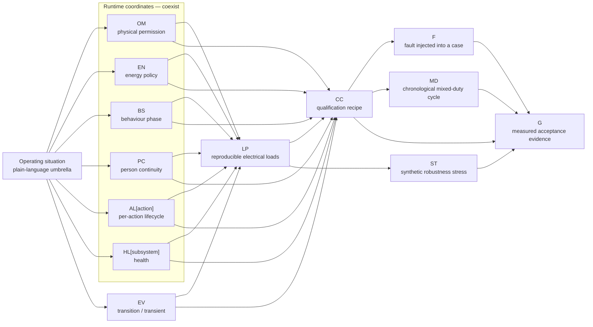

# RP-02 Operating Situations — Umbrella Map

| Field | Value |
|---|---|
| Status | **Registered reader map v0.2 — audited and builder-approved 2026-09-15 against every approved `00-foundation` document and the complete `01-system` operating/failure and risk-prototype situations** |
| Owner | Project builder |
| Created | 2026-09-15 |
| Sources | All `../../00-foundation/*.md`; `../../01-system/system-design-brief.md`; `../../01-system/risk-prototype-plan.md`; `state-register.md`; `load-model.md`; `state-coverage-matrix.md`; `fault-matrix.md`; `gates.md` |
| Purpose | Provide one human-readable view of each Makad operating situation and every engineering namespace attached to it |

“Operating situation” is plain language, not another ID namespace and not another controller variable. It is the umbrella under which the normalized engineering records are shown together:

`situation → OM permission + EN energy + BS behaviour + PC person continuity + AL[action] lifecycle + HL health + optional EV event → LP loads → CC qualification + F fault injection → G evidence`.

Unless a row states otherwise, `EN-01 Normal`, `HL-01 Available`, `PC-00/01` and `AL-00` apply. `HL` is maintained per subsystem and `AL` per long-running action. Profiles below are the dominant or explicitly-off profiles; `load-model.md` remains authoritative for full bindings.

## How the umbrella joins the namespaces

The diagram is a join, not a hierarchy of controller enums: a situation selects a meaningful set of runtime coordinates; events move it; profiles make its electrical demand reproducible; cases freeze what is tested; faults perturb a case; and gates score the resulting evidence.

## 1. Core operating situations

| Operating situation | Runtime coordinates | Events and transitions | Electrical manifestation (`LP`) | Qualification (`CC`) | Fault / health overlays | Evidence |
|---|---|---|---|---|---|---|
| **Power-up and supervised inhibit** | `OM-03 + EN-01 + BS-00`; `HL[*]=HL-01` after self-check | `EV-01` cold boot → `EV-02` handshake; stays inhibited until current mode, limits and fresh enable are accepted | `LP-01/02/05/10-BOOT`; `LP-03/04-OFF` | `CC-01` | `F-02` SBC loss/reboot; reset or missing readiness changes affected health to `HL-03/04` | Inrush and rail minima, reset reasons, boot/handshake timing, zero motor motion; G02/G04/G05 |
| **Quiet sleep — Floor** | `OM-01 + BS-01 + PC-01 + AL-00`; normal or permitted low-energy overlay | `LP-03-SLEEP` lowers the head on entry; `EV-03` wakes; `EV-14` shuts down | `LP-01-IDLE`, `LP-02-IDLE`, `LP-03/04-OFF`, `LP-05-DIM`, `LP-06-OFF`, `LP-07-LISTEN`, `LP-08-IDLE`, `LP-10-IDLE` | `CC-02F`; negative invocation `CC-03N` | Camera and head motion are unavailable by policy, not faulty; `F-16/21` may overlay | Sustained current/energy/temperature, false-wake state stability, camera-off, torque-off and passive-rest safety; G02/G03, RP05-G01 |
| **Quiet sleep — Table** | `OM-02 + BS-01`; base permission inhibited | Same sleep entry/exit as Floor | Same as Floor sleep, with independent `LP-04-OFF` evidence | `CC-02T` | Any drive request remains inhibited; mode ambiguity resolves to `OM-03` | Floor/Table mode evidence, drive-enable/rail zero, sleep load and passive rest; G01/G02/G04 |
| **Wake performance** | `OM-01/02`; `BS-01 + PC-01/02 + AL[wake]=AL-02 → BS-02/03/04` | `EV-03`; display/audio/light may lead, camera starts from off, search waits for completion; wake ends `AL-05/06` | `LP-01-PERCEPTION`, `LP-02-TRAJ`, `LP-03-WAKE`, `LP-05-WAKE`, `LP-06-TRACK`, `LP-07-LISTEN`, `LP-08-CHIRP` | `CC-03`; non-wake `CC-03N` | `F-02`, `F-07`, `F-21` | Alias/false-wake matrix, camera-start-to-track latency, coordinated onset, rail transient, reset/CRC; G02/G04/G05, RP05-G01/05 |
| **Idle aliveness** | `OM-01/02 + BS-02`; no user action; `PC-00/01`; `AL-00` | Sparse internally scheduled micro-expression with full settled intervals; any request or safety event interrupts | `LP-01-IDLE`, `LP-02-IDLE/TRAJ`, sparse `LP-03-HOLD/MICRO`, `LP-05-DIM/ACTIVE`, `LP-06-STREAM`, `LP-07-LISTEN`, `LP-08-IDLE`, `LP-10-IDLE` | `CC-17` | One denied expressive channel leads to `CC-18`; no failure is fabricated | Timed dwell, event frequency, settled fraction, energy/thermal duty and behaviour log; G02/G03, RP04-G03/04 |
| **Attentive social expression** | `OM-01/02 + BS-02/04`; `PC-03` when attending to a selected person; performance `AL-02/03` | `EV-06` gesture; `EV-07` startle; `EV-17` interrupt/settle; `EV-09` alarm may pre-empt | `LP-01-IDLE/PERCEPTION`, `LP-02-IDLE/TRAJ`, `LP-03-HOLD/GESTURE/MICRO/STARTLE`, `LP-05-ACTIVE/UTILITY`, `LP-06-STREAM/TRACK`, `LP-07-LISTEN`, `LP-08-IDLE/CHIRP/ALARM` | `CC-05/06`; cancellation `CC-07E`; degraded channel `CC-18` | `F-01/04/06/08/11/12/13/14`; affected health `HL-02…04` | Gesture/startle/cancel timing, coherent onset, limits, link integrity, thermal block and bounded terminal state; G02/G04/G05, RP04 |
| **Person search and acquisition** | `OM-01/02 + BS-03 + PC-01/02 + AL[search]=AL-03`; terminal `PC-03` or `PC-06` | `EV-04`; selection/acquisition cancels sectors and triggers `EV-05`; timeout/cancel uses `EV-17` | `LP-01-PERCEPTION`, `LP-02-TRAJ`, `LP-03-SEARCH/ORIENT`, `LP-05-ACTIVE`, `LP-06-TRACK`, `LP-07-LISTEN` | `CC-04` | `F-03/09`; absent/stale evidence cannot become selection | Search/acquire latency, candidate/selection identity, cancellation, per-axis current and link health; G02/G04/G05, RP07-G01/02 |
| **Person tracking / attention** | `OM-01/02 + BS-04 + PC-03`; selected-person evidence remains fresh | Small corrections dwell; request enters `BS-05`; `EV-18` begins temporary loss | `LP-01-PERCEPTION`, `LP-02-TRAJ`, `LP-03-TRACK`, `LP-05-ACTIVE`, `LP-06-TRACK`, `LP-07-LISTEN`, `LP-08-IDLE` | Baseline in `CC-03/04/05/06/07A`; continuity in `CC-09R`; Table `CC-12A` | `F-05/09`; perception/camera becomes `HL-02/03` | Tracking/freshness, stale-goal rejection, identity continuity, hold/stop on evidence loss; G02/G04/G05, RP07-G02 |
| **Selected person temporarily lost / reacquiring** | `PC-03 → PC-04 → PC-05`; `BS-04/09 → BS-03`; active base action starts cancelling | `EV-18` loss forces brake; `EV-19` accepts only same-person reacquisition; expiry gives `PC-06` | Active tracking/drive → `LP-04-BRAKE`; perception plus stopped `LP-03-SEARCH/ORIENT` | `CC-09R` | `F-05/09`; distractor is a stimulus, never an automatic replacement selection | Loss-to-stop, reacquisition time, identity switches=0, expiry/failure and fresh resume authorization; G04/G05, RP07-G02/05 |
| **Spoken request capture** | `OM-01/02 + BS-05`; `AL[request]=AL-01 → AL-02` | End-of-utterance advances; `EV-17` cancels; timeout fails; `EV-22` rejects/clarifies | `LP-01-AUDIO`, `LP-02-IDLE/TRAJ`, `LP-03-HOLD/TRACK`, `LP-05-ACTIVE`, `LP-06-TRACK`, `LP-07-CAPTURE`, `LP-08-IDLE` | `CC-07A`; ambiguity `CC-07D`; cancellation `CC-07E` | `F-01/03/09/21` as applicable | Capture/accept/reject timing, explicit action ID, ambiguity, cancellation and terminal lifecycle; G02/G04/G05, RP05-G02/03 |
| **Ambiguous or unsupported request** | `BS-05/06 + AL-01/02`; no new physical authority | `EV-22`; terminal `AL-06 + BS-10/02/04` | `LP-01-AUDIO/SERVICE`, `LP-05-FAILURE`, optional `LP-08-CHIRP`; motor loads unchanged/off as required | `CC-07D` | `F-10/20` service variants | Clarification correctness, no false success, physical commands=0 and bounded return; G04, RP05-G02/04 |
| **External-service wait** | `OM-01/02 + BS-06 + AL[action]=AL-03` | Response, `EV-17` cancellation or bounded timeout to `AL-06` | `LP-01-SERVICE`, `LP-02-IDLE`, `LP-03-HOLD`, `LP-05-ACTIVE`, `LP-06-TRACK`, `LP-07-LISTEN`, `LP-08-IDLE` | `CC-07B`; lifecycle stress `CC-07E` | `F-10/15/20`; interaction `HL-02/03`, physical safety unaffected | Timeout/auth/late/duplicate logs, network-independent safety, sustained compute/network load; G02/G04/G05, RP05-G03/04 |
| **Response, utility, timer or alarm** | `OM-01/02 + BS-07`; each timer/alarm has its own `AL[action]` | `EV-08/09`; a timer may stay `AL-03` after face returns; cancel `EV-17`; fire/completion `AL-05` | `LP-01-IDLE`, `LP-02-IDLE/TRAJ`, optional `LP-03-GESTURE`, `LP-05-UTILITY`, `LP-08-CHIRP/ALARM` | `CC-07C/E` | `F-07/15/20` | Timing tolerance, simultaneous-event handling, once-only completion, cancellation and return-to-face; G02/G04, RP05-G03 |
| **Action cancellation / higher-priority interruption** | Any utility, Spotify, come/follow or performance at `AL-02/03`; terminal `AL-04 → AL-05/06` | `EV-17`; suppress output, brake/settle, then inject late/duplicate result | `LP-01-CANCEL`, applicable `LP-03/04-BRAKE`, bounded face/audio return | `CC-07E`; motion-specific cases retain their base `CC` | `F-10/15/20`; controller/link faults may be the interruption cause | Cancel latency, old action executions=0, action-ID change on retry and settled terminal state; G04/G05, RP04-G02/RP05-G03 |
| **Music playback / vibe** | `OM-01/02 + BS-08 + AL[Spotify]=AL-03`; base motion not implied | `EV-06` micro-gesture; `EV-17` stop; track end `AL-05`; service/auth failure `AL-06` | `LP-01-AUDIO`, `LP-02-IDLE/TRAJ`, optional `LP-03-MICRO`, `LP-05-MUSIC`, `LP-07-CAPTURE`, `LP-08-MUSIC` with `LP-08-CREST` | `CC-08`, cancellation `CC-07E`, gesture/startle `CC-05/06`, Table `CC-12A` | `F-10/20`; audio/display channel denial feeds `CC-18` | Three-minute RMS energy/temperature, crest, auth/failure/cancel and coordinated exit; G02/G03/G04, RP05-G03/04 |
| **Come here** | `OM-01 + BS-09 + PC-03 + AL[come]=AL-03` | Search/orient if needed; `EV-10` launch; `EV-12` stop; completion at stopping band | Search/track + `LP-04-STEADY/LAUNCH/BRAKE`, head correction, face/audio acknowledgement and `LP-10-MOTION` | `CC-09C`, `CC-10A/B/C`; low energy `CC-13D` | `F-05/09/12/13/17/19/22` | Start 1–2 m, approach safely, stop/settle at 0.6–0.9 m, identity and no stale recovery; G01–G05, RP07-G03 |
| **Follow me** | `OM-01 + BS-09 + PC-03 + AL[follow]=AL-03` | `EV-10/11/12`; `EV-18/19` loss/reacquire; `EV-20` obstacle; stop/completion `EV-17` | Perception, head track, `LP-04-STEADY/LAUNCH/REV/BRAKE`, face/audio, camera and `LP-10-MOTION/OBSTACLE` | `CC-09`, `CC-09R`, `CC-10A/B/C`; `CC-13D`; `CC-PEAK-01` | `F-05/09/12/13/17/19/22` | Route/speed/distance, signed current, stop/obstacle/loss response, identity continuity and no stale recovery; G01–G05, RP07-G02/04/05/06 |
| **Obstacle stop or redirect** | Active base situation; local safety evidence valid | `EV-20`; local clamp precedes behaviour/network response | Active drive/perception + `LP-10-OBSTACLE` + `LP-04-BRAKE` or separately registered redirect | `CC-10C` | `F-19` | Detection and stop/redirect latency, clearance/contact policy, no blind continuation; G04, RP03-G03/RP07-G05/06 |
| **Excited spin** | `OM-01 + BS-02/04`; forbidden in `OM-02` | `EV-13`; finite action includes complete settle | `LP-01-PERCEPTION`, `LP-02-IDLE/TRAJ`, `LP-03-HOLD`, `LP-04-SPIN`, `LP-05-ACTIVE`, optional `LP-08-CHIRP`, `LP-10-MOTION` | `CC-11`; rejection in `CC-12B` | `F-12/13`; unsafe input immediately removes motor authority | Peak/action current, stability, settle time and tabletop rejection; G01/G02/G04 |
| **Tabletop stationary demonstration** | `OM-02 + permitted BS`; ordinary base action forbidden | Normal non-drive events only; come/follow/spin proposal is rejected | Relevant non-drive profiles + verified `LP-04-OFF`; `LP-10-EDGE` remains available when motion could occur | `CC-12A/B` | `F-17`; contradictory/missing mode evidence returns `OM-03` | Permitted head/interaction operation, rejected base requests and drive-off evidence; G01/G02/G04, RP03-G04 |
| **Tabletop calibration motion / edge intervention** | `OM-02`; separate local test authorization; caught fixture | Minimum-speed motion only; `EV-21` on edge or invalid coverage | `LP-10-EDGE`, minimum-speed drive and `LP-04-BRAKE` | `CC-12C` | `F-19`; lost edge evidence inhibits motion | Edge coverage, stop distance, circular-footprint containment and zero ordinary-autonomy permission; G01/G04, RP03-G04 |
| **Degraded coordinated performance** | Any registered performance with one eligible channel `HL-03` or mode-inhibited | Composer reshapes/denies only the unavailable contribution; safety intervention may interrupt | Baseline performance with one display/light/audio/head/base profile off/inhibited; remaining profiles stay coordinated | `CC-18` | `F-07/08/09/12/19/21` as applicable | Honest completion/failure, onset/interruption/settle and no whole-system deadlock; G04/G05, RP04-G02/04 |
| **Bounded failure indication** | Legal non-hazardous mode + `BS-10`; affected subsystem `HL-02/03/04`; failed action `AL-06` | Entered after hazardous output is already inhibited or action failure is known; retry uses a new action ID | `LP-02-FAULT`, `LP-05-FAILURE`, optional `LP-08-CHIRP`; affected motor/load brakes or is off | Terminal/sub-run outcome of applicable `CC + F`; explicit semantic failures also `CC-07D` | `F-01…22` as applicable; health names subsystem and severity | Inhibit, reject, expose and recover; zero false success, stale action or silent health loss; G04 |
| **Low-energy operation** | `EN-02` overlays an otherwise legal `OM + BS` | Crossing threshold rejects new locomotion/peak gestures and brakes active motion; recovery does not replay | Starting profiles followed by appropriate `LP-03-BRAKE` or `LP-04-BRAKE`; bounded display/audio remains | `CC-13H`, `CC-13D` | `F-16`; energy health/state changes are logged | Loaded threshold, reserve, rejection, brake timing and terminal state; G02/G04 |
| **Critical-energy shutdown** | `EN-03`; enters `OM-03` before power removal | Stop/settle only if margin permits, then `EV-14`; terminal off | Starting case → `LP-03/04-BRAKE` as applicable → `LP-01-SHUTDOWN` → all `LP-*-OFF` | `CC-14` followed by `CC-16` | `F-16`; unsafe energy condition must be exposed before rail collapse | Margin to UVLO, reset count, stop/shutdown order and persisted reason; G02/G04 |
| **Normal orderly shutdown** | Any safe non-hard-stop condition → off | `EV-14`: cancel → brake/settle → inhibit → persist → sign-off → logic off | Optional `LP-03-SLEEP`, `LP-01-SHUTDOWN`, then `LP-01/02/03/04/05/06/07/08/10-OFF` | `CC-16` | Exploratory power removal at registered phases; no automatic recovery | Shutdown ordering, complete log, rail fall and final zero current; G02/G04/G05 |
| **Charging with status display** | `OM-06 + EN-04 + BS-11`; motors forbidden | Charge accepted; removal/completion/fault exits charging without restoring an old mode | Part-2 charger/power-path profile; `LP-01-OFF`, `LP-02-IDLE`, `LP-03/04-OFF`, `LP-05-CHARGE`, `LP-06/07/08-OFF`, `LP-10-OFF` | `CC-15` | `F-18`; charge/BMS/temperature faults added when interfaces are selected; charge health becomes `HL-02/03/04` as warranted | Charge/pack current and temperature, motor-rail zero, visible status, removal/recovery; G01/G02/G04/G06 |
| **Hard stop and release** | Any motion → `OM-04`; logic remains powered; motion authority unsafe/unavailable | `EV-15` asserts E-stop; `EV-16` releases to `OM-03 + BS-00`, never directly to motion | Motor profiles collapse to `LP-03/04-OFF`; logic `LP-02-FAULT`; on restoration `LP-03/04-PWRRESTORE` while inhibited | Protection sub-runs on `CC-06`, `CC-10A` and `CC-11` | `F-12` assertion, `F-13` release; motor domain `HL-04` then inhibited until fresh enable | Hardware rail removal, logic continuity, zero motion after release, stale-goal rejection; G01/G04 |
| **Bench / service operation** | `OM-05`; one explicitly armed channel and a declared emulated target situation | Fixture/E-stop check precedes test; only the registered test event runs | Case profiles plus reference-only `LP-02-LINKSTRESS`, `LP-03-THERMAL/STALLREF`, `LP-04-BLOCKEDREF`, `LP-05-FULLREF`, `LP-08-SINEREF`, `LP-10-EDGE/FAULT` as needed | Any `CC`, `CC-PEAK-01` or `ST-01` under a registered rig configuration | Any `F-01…22` using its stated injection method | Protection review, equivalence record, measurement points and repeatable configuration; G01/G04/G05/G06 |

## 2. Cross-situation qualification umbrellas

These are not additional human behaviours. They combine or sequence operating situations for architecture evidence.

| Qualification umbrella | Draws from | Profiles / namespaces encompassed | What it proves |
|---|---|---|---|
| **Maximum credible concurrency** — `CC-PEAK-01` | `OM-01 + BS-09 + EV-11/12`; tracking, face, safety and one audio crest | `LP-01-COEXIST`, `LP-02-TRAJ`, ordinary `LP-03-TRACK`, `LP-04-REV/BRAKE`, `LP-05-ACTIVE`, `LP-06-TRACK`, `LP-08-CREST`, `LP-10-MOTION`; baseline `HL-01` | Highest currently believable whole-robot rail transient; G01/G02/G05 |
| **Synthetic robustness stress** — `ST-01` | Deliberately aligns otherwise forbidden head startle, drive reversal, display transition, perception peak and audio crest | Stress combination of `LP-01-COEXIST`, `LP-03-STARTLE`, `LP-04-REV`, `LP-05-WAKE`, `LP-08-CREST`, `LP-10-MOTION` | Coupling, brownout order and fuse margin only; it does not prove representative operation |
| **Representative endurance cycle** — `MD-01` | Chronological twenty-minute path through boot, sleep, wake, search, idle aliveness, interaction lifecycle, music, come, follow, loss/reacquisition, obstacle intervention, spin and shutdown | Scheduled `CC` cases; applicable `OM/EN/BS/PC/AL/EV/LP/HL` revisions freeze with the cycle | RP-02 battery/thermal rehearsal and load-energy attribution; G02/G03, while integrated SC-14 closes later |
| **Fault campaign** — `F-01…22` | Each fault is injected into its named primary `CC` and additional meaningful situations | Changes affected `HL` and possibly `PC/AL` while preserving the underlying case load; observes inhibit, reject, expose and recover | Bounded faults, diagnostic health and fresh-intent-only recovery; G04 |

## 3. Namespace completeness check

| Namespace | Included here |
|---|---|
| `OM-01…06` | Floor, Table, inhibited, hard stop, bench/service and charging situations |
| `EN-01…04` | Default normal; low-energy; critical-energy; charging situations |
| `BS-00…11` | Power-up/inhibit through charging display across the Core situation rows |
| `PC-00…06` | Not applicable/no candidate, candidate, selected, temporarily lost, reacquiring and lost/expired |
| `AL-00…06` | Per-action none, proposed, accepted, active, cancelling, completed and failed |
| `HL-01…04` | Default availability plus degraded, unavailable and unsafe fault overlays |
| `EV-01…22` | Original events plus cancel/return, person loss/reacquisition, obstacle/edge intervention and semantic rejection/clarification |
| `LP-01…08`, `LP-10` | Dominant operating, off and reference profiles attached to situations; `LG-09` conversion/loss remains derived in the ledger |
| `CC-01…18`, `CC-PEAK-01` | Normal, transition, lifecycle, continuity, protection, energy, charging, shutdown and degraded-composition cases including lettered variants |
| `ST-01` | Synthetic cross-situation robustness stress |
| `MD-01` | Chronological endurance-duty composition |
| `F-01…22` | Fault-to-situation overlays and health consequences |
| `G01…G06` | Evidence consumers shown in the last column; authoritative thresholds remain in `gates.md` |

## 4. Foundation/system audit record

| Authoritative source situation | Umbrella coverage | Result after audit |
|---|---|---|
| Powered/head-down idle, named aliases, false wake and retry | Quiet sleep; Wake; `CC-02F/T`, `CC-03/03N` | Explicit |
| Idle aliveness without constant motion | Idle aliveness; `CC-17` | Added; previously only implicit in attentive social state |
| Acquire/select/retain/temporarily lose/reacquire/lose one person; reject distractor switch | Search; Track; Temporarily lost/reacquiring; `PC-01…06`, `CC-04/09R` | Added as independent continuity overlay; previously incomplete |
| Greeting/social expression, coherent display/light/audio/head/base timing, settle and interruption | Attentive social; Degraded performance; `AL`, `EV-17`, `CC-05/18` | Explicit, including denied-channel variant |
| Time, timer and alarm lifecycle, simultaneous event and cancellation | Request; Service wait; Utility; Cancellation; `AL`, `CC-07A…E` | Expanded; timer can remain active while face/behaviour changes |
| Spotify request, authentication, playback/vibe, stop, failure, late/duplicate response | Service wait; Music; Cancellation; `CC-07B/E`, `CC-08`, `F-20` | Expanded |
| Come from 1–2 m, stop/settle at 0.6–0.9 m | Come here; `CC-09C/10A/B/C` | Added as distinct from sustained Follow |
| Follow ≤0.5 m/s over ≤3 m with loss/reacquisition, obstacle and distractor cases | Follow; continuity; obstacle; `CC-09/09R/10C` | Expanded |
| Obstacle stop or redirect under local authority | Obstacle intervention; `EV-20`, `LP-10-OBSTACLE`, `CC-10C`, `F-19` | Added; previously buried in generic brake wording |
| Tabletop stationary permission, drive/spin denial and caught low-speed edge trial | Tabletop stationary; calibration/edge; `CC-12A/B/C`, `EV-21`, `F-19` | Expanded; edge trial was previously absent |
| RP-01 attention, wake, bob, tilt, reversal, tracking-correction, interruption, settle and safe-rest storyboard | Sleep; Wake; Attentive social; Tracking; Cancellation; `EV-03/05/06/07/17`; `CC-03…06/18` | Explicit as authored `LP-03-*` motion variants; their exact trajectories remain RP-01 inputs rather than new umbrella states |
| Cross-scenario coherent eyes/display, status light, astromech audio, head and base timing; named wake must not launch the base | Wake; Social; Come/Follow; Degraded performance; `CC-03/05/09C/09/18` | Explicit; `LP-05` includes display + status light, and wake has no base profile |
| Stop request, unsafe continuation or destination reached → acknowledge, stop and attentive idle | Cancellation; Follow/Come completion; `EV-12/17`; `AL-04/05/06`; `CC-07E/09C/09R/10B/C` | Explicit; no old action may resume after recovery |
| Low/critical battery, charging, physical stop, controller/sensor/link/network failures and fresh-intent recovery | Low/critical energy; Charging; Hard stop; Failure; `F-01…22` | Explicit; added base-safety sensor, base-controller, auth/provider and microphone absence rows |
| Cold start, normal shutdown, serviceability, endurance and reproducibility | Power-up; Shutdown; Bench/service; `CC-01/16`, `MD-01` | Explicit |
| Spatial/directional hearing Candidate | Not a Core operating situation; visual-search baseline remains valid and `LG-07` leaves the input boundary open | Correctly excluded from Core cases; inclusion still requires its separate Candidate gate |

This audit claims coverage of the approved **situations and safety boundaries**, not closure of every implementation parameter. Phrase grammar, exact wake thresholds, authored sound/face language, person-selection thresholds, stopping tolerances, tabletop radius/speed, component choices and numeric gates remain deliberately deferred in their source documents. They must bind to these rows later; they do not require inventing new umbrella situations unless the approved behaviour itself changes.

## 5. Registration record

| Registration | Date | Approved scope | Boundary |
|---|---|---|---|
| `RP02-P1-REG-01` | 2026-09-15 | Every operating-situation, cross-situation umbrella, namespace attachment and audit disposition in v0.2; explicit builder approval in the project conversation | This freezes situation coverage, not deferred numeric parameters or evidence of passing |
