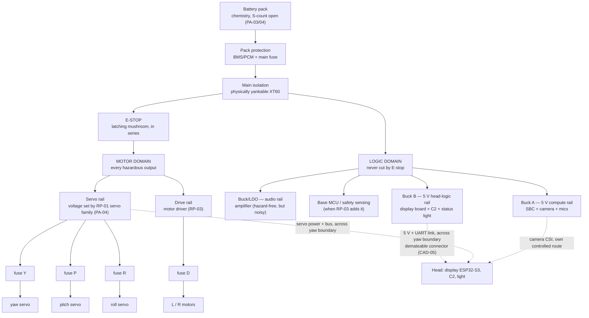

# RP-02 Power Architecture — Candidate Rail, Protection and Energy Topology

| Field | Value |
|---|---|
| Status | **Candidate design, evidence class `E`.** Nothing here is selected, sized or purchased. It is the ADR-06 *architecture* input; ADR-06 *sizing* waits on the ledger |
| Owner | Project builder |
| Created | 2026-09-08 |
| Revised | 2026-09-15 |
| Inputs | `../../01-system/power-energy-ledger.md` (planning envelopes); `../../01-system/workbench.md` (E-stop, PSU, battery rules); `../../01-system/dimensional-baseline.md` (battery low and forward of axle; body-mounted SBC); `../../01-system/head-harness-routing-study.md` (branch partition; yaw boundary); `state-register.md` |
| Feeds | ADR-06; `gates.md` G01 and G06; `rig.md`; sourcing matrix power rows |
| Method | `../../intuition.md` §5.1 step 3 electrical toolkit; each numbered choice below is a `PA-xx` proposal with its reason and its reopen condition |

This document answers *what shape* the electrical tree has, so that G01 has something to review and the rig has something to build. It does not answer *how big* — conductor gauge, regulator rating and pack capacity are the ledger's outputs and arrive as `W` rows accumulate.

## 1. Two-domain topology

### PA-01 — Logic and motor domains are electrically distinct, and only the motor domain passes through the E-stop

**Choice.** The E-stop is in series with everything that can move or push: servo rail and drive rail. Compute, controllers, display, camera, audio and sensing stay powered through a stop.

**Why.** `workbench.md`: killing the MCU mid-motion while servos hold torque is a worse failure than the one being prevented. A stopped robot that can still report health, show a face and log the event is diagnosable (AD-11) and recoverable from current intent (SDB failure priority 6). CON-P02 asks for a cutoff of *hazardous outputs*, not of the robot.

**Consequence.** C2 must detect the motor-domain loss (a sense line or servo-bus silence) and treat it as `unsafe`/`inhibited`, never as "servos will reappear so keep the trajectory queued." That is fault case F-12/F-13.

**Reopen if.** A hazardous output is ever found on the logic domain (a heater, a high-current LED, an actuator added later) — it moves to the motor domain or gets its own switched branch.

### PA-02 — Protection is layered: pack, main, per-branch

| Layer | Protects against | Candidate device class |
|---|---|---|
| Pack BMS/PCM | Cell over-discharge, over-charge, cell-level short | Integral to pack choice (PA-03); protected 18650s carry their own PCM |
| Main fuse at the pack | Wiring short between pack and distribution | Device/curve coordinated against `CC-PEAK-01`, registered `ST-01`, conductor rating and branch protection — value from ledger, not a current multiplier alone |
| Per-branch fuse/polyfuse | One load's fault taking the tree down; the specific case is a servo branch fault during `CC-06` while other axes are mid-slew | Polyfuse per servo branch and per drive channel; fast fuse on the compute buck input |
| Regulator current limit and thermal shutdown | Sustained overload on a rail | Module-native; verify it exists and what it does on trip (latch versus hiccup) |

**Why per-servo.** The three head axes are listed as *separately observable* load groups in the plan for a reason: a fault on one must be attributable and containable. Shared servo fusing turns a roll-servo short into a three-axis inhibit with no diagnosis.

**Reopen if.** The selected servo family's own protection (Dynamixel-class units report overcurrent and shut down) proves sufficient and per-branch polyfuses add drop that costs servo performance at peak — measured on the rig, not assumed.

### PA-03 — Chemistry: protected Li-ion 18650 in a holder is the working assumption; LiPo pouch is the alternative

**Choice.** Not made. This records the comparison so the decision can be taken from evidence rather than habit.

| Criterion | Protected 18650 in holder | LiPo pouch |
|---|---|---|
| Peak current | 2S2P of ordinary 2.5 Ah cells gives ~10–20 A continuous — ample against the ledger's `E` composite peak of 5.5–9.5 A at 7.4 V | Effectively unlimited for this scale |
| Solo-builder handling risk | Cells swap, holders are non-destructive, cylindrical cells tolerate abuse better; PCM per cell | Puncture/swelling risk; bag and balance-charger discipline mandatory (`workbench.md`) |
| Mass (ledger row 150–500 g) | ~45–50 g per cell + holder; 2S2P ≈ 220–260 g | Lower for the same Wh, typically 60–70 % |
| Volume and placement | Cylinders pack awkwardly but a 4-cell holder is flat enough for "low and forward of the axle" | Flexible shape |
| Charging path (G06) | External certified AC/DC adapter → keyed DC input → onboard Li-ion charger/power path | External certified AC/DC adapter → keyed DC input → onboard balance charger/power path; implementation burden is higher |
| Service (SC-17) | Cell replacement without tools if the holder is accessible | Pack replacement requires connector access and care |
| Cost / sourcing (India) | Common; genuine-cell risk is real (reject unbranded "9800 mAh" cells) | Common |

`workbench.md` already notes that Makad's draw does not need LiPo discharge rates and that 18650s are meaningfully more forgiving. **Working assumption for rig design: 2S protected 18650, cell count P decided by the ledger.** This is not a purchase.

**Reopen if.** The ledger's composite peak or the servo family's rail voltage forces 3S/4S (see PA-04) and the resulting holder no longer fits low-and-forward; or the mass row cannot absorb the holder penalty after the head grows.

### PA-04 — Pack voltage is coupled to the RP-01 servo selection, and the rig must accommodate both outcomes

| Servo class (examples, none selected) | Rail | Pack implication |
|---|---|---|
| **5 V class — C01 leading working assumption** (XC330-M288-T: 3.7–6.0 V, recommended 5.0 V) | Servo rail = regulated 5–6 V | 2S pack + high-current buck on the motor domain; buck must survive `CC-06`; **direct 2S is out of the servo's window**. C01 yaw fails the rapid envelope at the 3.7 V endpoint, so the loaded sag floor is a named RP-01 paper-gate P02 input this rail must supply |
| 6–7.4 V class (many bus servos) | Servo rail = 2S direct | 2S pack, no conversion loss on the largest load; rail sags with cell voltage — trajectory feel changes over discharge unless the servo compensates |
| 12 V class (XL430/XM-class) | Servo rail = 3S direct | 3S pack; compute buck sees 12.6 V in; more headroom, more mass |

**Choice.** Design the rig with a servo-rail regulator socket so both "regulated from 2S" and "direct from pack" can be measured. Do not pre-empt RP-01's actuator selection from the power side — the same error `control-topology-options.md` §6.3 avoided when it rejected controller boards that "silently decide the actuator family." C01 makes the 5 V / regulated-from-2S row the *leading* working assumption; it does not collapse this table.

**Reopen if.** RP-01 selects; then this collapses to one row and the ledger's servo rail gets a voltage.

### PA-05 — The compute rail has its own converter and never shares one with anything that moves

**Choice.** Buck A feeds the SBC (and, through the SBC, the camera) alone, rated for the SBC candidate's published supply requirement — 5 V at 3 A (Pi 4 class) to 5 A (Pi 5 class) — with the ledger deciding.

**Why.** The failure G02 is hunting is a motion-induced dip resetting compute. An SBC's undervoltage detector trips in the tens-of-milliseconds range; a servo launch transient is exactly that length. Sharing a converter between compute and anything on the motor domain guarantees coupling through the converter's output impedance. Separate converters share only the pack, whose impedance is low.

**Consequence.** Bulk capacitance sits at the servo rail, where the transient originates. The rig measures compute-rail behaviour during `CC-06` and `ST-01`, with and without servo-rail bulk.

### PA-06 — The head is fed by three separately owned branches across the yaw boundary

Per the harness study's partition, and preserved here because conductor sizing differs per branch:

| Branch | Carries | Sized for | Owner |
|---|---|---|---|
| Servo power + servo bus | Servo rail at composite three-axis peak; half-duplex TTL or RS-485 pair | `CC-06` transient with registered drop limit; noise separation from CSI | Motor domain |
| Head-logic power + semantic link | 5 V for display board, C2, status light; UART TX/RX (+ optional USB) | Display board peak + C2 peak; link signal integrity across flex | Logic domain (Buck B) |
| Camera CSI | 2-lane MIPI, 3.3 V from SBC connector | Signal integrity, not current | Logic domain via SBC |

All three cross the **demateable boundary at yaw** required by CAD-05 so M020 and M900 can be weighed. The connector choice is a G06 item (service) and a G01 item (a connector that can mate reversed is an unbounded energy path).

**Candidate drop limit (not registered):** ≤3% of servo rail during registered `CC-06`, measured at the servo connector, not at the distribution board.

### PA-07 — Brownout ordering is designed, not discovered

Under a deep pack sag the order in which rails give up matters:

1. **Servo and drive rails may sag first** — the consequence is weak motion, which the C2 sees as tracking error and reports;
2. **Head-logic rail** must outlast the servo rail — C2 must be alive to command `BRAKE` and report;
3. **Compute rail** must outlast both, or must at least *restart cleanly* into an inhibited state (fault case F-02).

Implementation is buck-input undervoltage-lockout plus bulk-capacitance placement; the rig verifies order under `CC-PEAK-01` and the largest admissible `ST-01`. `EN-02 → EN-03` must trigger **above** uncontrolled rail sag, including end-of-life pack resistance; use loaded voltage or coulomb state, not open-circuit voltage alone.

### PA-08 — Measurement points are part of the architecture

Every branch in §1 has a series measurement point on the rig (shunt or INA-class monitor) and a voltage test point at the load end, not only at the distribution board. On the robot these collapse to what health telemetry needs — pack voltage, pack current, servo rail voltage, and per-servo current from the servos' own telemetry — but the *positions* are decided now so G06 can show a credible measurement path and G02 can attribute an excursion.

### PA-09 — Charging input: external mains conversion, onboard chemistry-specific charge/power path

**Builder requirement (SD-04):** the display remains on while charging, while camera, ordinary interaction compute/audio and every motor remain off. Normal Makad operation is still untethered and battery-powered.

AC mains does **not** enter Makad. A certified external wall adapter converts mains to safety-extra-low-voltage DC. That DC enters a keyed charge port and feeds a chemistry/S-count-specific charger with power-path or load-sharing behaviour. Its restricted output powers only the display/head-logic branch and minimum charge/pack supervision during `OM-06`; the motor domain is hardware-inhibited. The local display renders `LP-05-CHARGE` without requiring the body SBC.

This rules out a removable-pack-only workflow as the sole V1 charge path, because Makad could not show charge status with its battery absent. It does **not** select adapter voltage, connector, charger, BMS, chemistry or 2S/3S configuration; Part 2 closes those after PA-04 and the ledger envelope. G06 must prove charge connection/removal and G02 must include charger, logic and display thermal load.

**Power-path caution.** A simple charger connected directly to a battery while a display draws current may mis-detect charge termination or exceed its thermal design. Candidate hardware must explicitly support load sharing/power-path operation, or isolate/schedule the display load by a documented supported method.

### PA-10 — Low-energy policy hooks are electrical requirements

SDB §6 needs `normal · low · critical · charging`. That requires pack telemetry to reach health and a threshold policy under SC-TBD-10. The architecture reserves a pack monitor, health-message fields, and `EN-02/03/04` behaviours. Values remain open.

## 2. Paper physics — the calculations the ledger must be able to run

From `intuition.md` §5.1 step 3, restated so every ledger row has a consumer.

| Calculation | Inputs | Output | Where used |
|---|---|---|---|
| **Brownout** — `V_load = V_pack(SoC, I) − I_peak · R_path` per rail | Composite peak current per state (ledger §4), pack internal resistance (`D` then `W`), conductor and connector resistance | Minimum rail voltage per state; margin to each component's undervoltage limit | G02 invariant; PA-06 drop limit; conductor gauge |
| **Energy** — `E_MD01 = ∫P_input(t)dt`, then size against usable DoD, conversion and reserve | Registered `MD-01` profile timeline, conversion efficiency, reserve | Required pack Wh; margin | G03 rehearsal; ADR-06 sizing |
| **Regulator thermal** — `P_loss = P_out · (1/η − 1)` steady state; linear stages `(V_in − V_out) · I` | Efficiency at the operating point (`D` then `W`), state duration | Case temperature trajectory; margin to SC-TBD-12 | G02 thermal term; enclosure airflow input to RP-06 |
| **Conductor thermal** — `I²R` over `CC-08/09` sustained duty and `CC-PEAK-01/ST-01` transients | Gauge, length, ambient inside the head/neck | Temperature rise; flex-harness derating | Harness selection; CON-P05 |
| **Fuse coordination** — branch clears before main/pack protection under branch fault; no nuisance trip in registered cases | Per-profile waveforms and time-current/I²t curves | Fuse values | G01 |

## 3. What this document will look like when it closes

ADR-06 architecture closes when every `PA-xx` above is either confirmed by a G01 review plus rig measurement or replaced by a superseding `PA-xx.v2` with its reason. ADR-06 sizing closes later, in `decision.md`'s ladder, when the ledger's `W` rows cover every load group and the trip-wire has been evaluated against a candidate pack.

## 4. Open items

- [ ] Servo family (RP-01) → collapse PA-04 to one row; give the ledger a servo-rail voltage. Until then, C01 / 5 V regulated-from-2S is the leading working assumption, not the freeze.
- [ ] Register the loaded servo-terminal sag floor that RP-01 paper gate P02 needs (C01 3.7 V is a manufacturer endpoint, not a predicted sag).
- [ ] SBC candidate → Buck A rating; camera current on the same rail. *2026-09-14 suggestion (undecided):* Raspberry Pi 5 2 GB lead candidate → Buck A 5 V / ≥ 5 A fed through the header pins (no USB-PD negotiation on a robot rail), plus the `LG-07` front end's draw if a USB array is chosen. Register the Pi 5 undervoltage warning threshold from its documentation as the T-4 `D` value.
- [ ] Pack internal resistance `D` value for the working-assumption cells; replace with `W` on the rig.
- [ ] Register the rail-excursion definition (PA-06 candidate ≤3 %) and the undervoltage limits per component before any scored G02 rehearsal.
- [ ] Decide whether per-servo polyfuses stay after measuring drop during `CC-06` and branch-fault coordination.
- [ ] G06 paths: pack removal, charge connector position, main XT60 reach, E-stop reach — coordinate with the body layout in RP-06.
