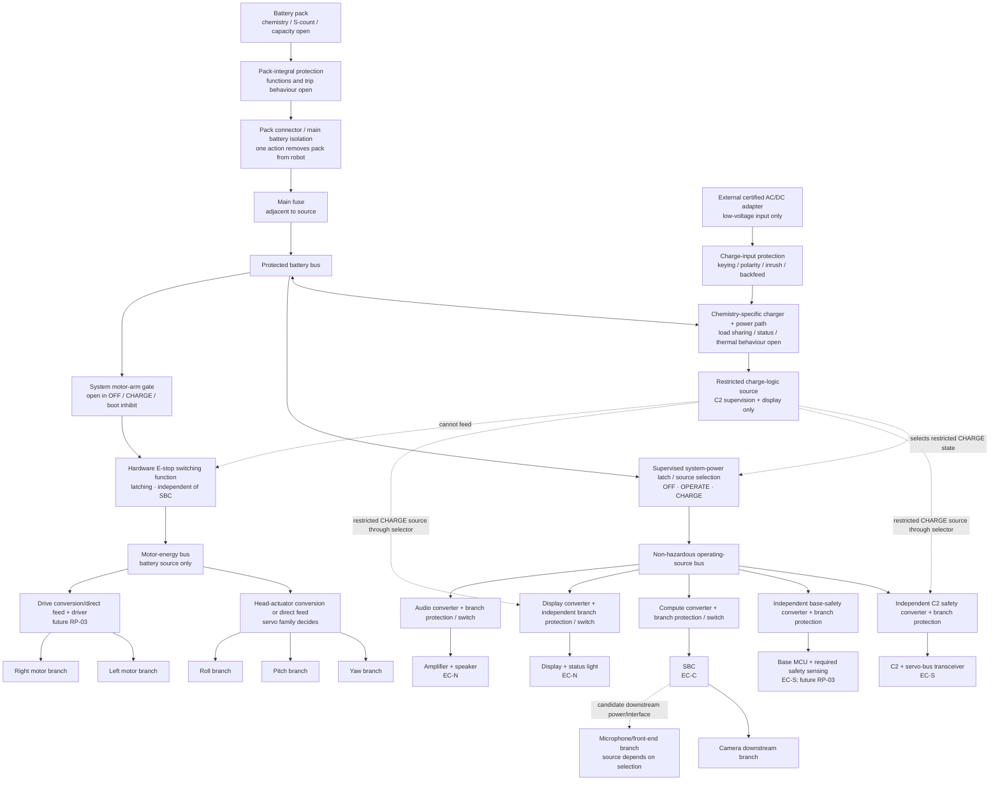

# RP-02 Power Architecture — Registered Domain and Branch Baseline

| Field | Value |
|---|---|
| Status | **Registered Part-2 domain/rail baseline v0.2 — builder-approved 2026-09-16 as `RP02-P2-REG-01`.** Defines functional power paths and physical independence, but selects no converter, protection device, conductor, connector, charger, chemistry or pack capacity. Brownout calculations and numeric margins remain later work. |
| Owner | Project builder |
| Created | 2026-09-08 |
| Revised | 2026-09-16 |
| Authority | Approved `electrical-design-basis.md`; registered Part-1 baseline `RP02-P1-REG-01`; `../../01-system/power-energy-ledger.md`; `../../01-system/workbench.md`; `../../01-system/head-harness-routing-study.md` |
| Feeds | ADR-06 architecture; branch-side `EDB-03` contracts; `rig.md`; sourcing requirements; G01/G02/G06 |
| Numeric boundary | Current, voltage, power, energy, temperature, margin and part ratings remain in the ledger/gates; every unresolved numeric field here is `U/E/D/W` as recorded there |

The architecture is organized by **failure consequence**, not merely by voltage. All operating branches may share a protected battery source, but a shared source is not permission to share a converter, fuse, return conductor or fault path.

## 1. Registered functional topology

The diagram shows functional source permission. It does not imply that the final charger supports battery-absent operation, seamless source switchover or any particular converter count. Those are explicit candidate requirements below and must be supported by selected hardware.

## 2. Domain decisions

### `PA-01` — Four failure-consequence domains

| Domain | Function | Energized by E-stop release? | Permitted while charging? | Failure rule |
|---|---|---|---|---|
| Safety supervision | C2, later base local safety as applicable, E-stop/rail/pack sensing | No; supervision is independent of the E-stop actuator-energy path | C2/minimum pack supervision only; base branch off | Must remain valid while hazardous energy is present or being removed |
| Application | SBC, camera, microphones, display, audio and other non-hazardous loads | No | Display only through the restricted charge path | Failure may remove capability but cannot energize or destabilize hazardous output |
| Hazardous motor energy | Head servos, drive power stage and motors | **Yes:** must pass the hardware E-stop switching function | Never | Removal dominates software; restoration enters inhibited state |
| Charge/power path | Charge input, charger/load sharing, pack and charge-status path | Not applicable; it cannot feed the motor bus | Yes | Charge faults cannot restore operation or bypass isolation |

These are functional domains, not a claim of galvanic isolation. The baseline is a common battery-referenced 0 V with explicit current-path separation under `PA-15`.

### `PA-02` — Layered protection without a preselected device class

| Layer | Required purpose | Selection rule |
|---|---|---|
| Pack-integral protection | Cell/pack overcharge, over-discharge, overcurrent and other functions actually documented by the selected pack | Functions, trip delay, recovery and interaction with regeneration must be enumerated |
| Main fuse | Limits fault energy in wiring between the pack connection and downstream branch protection | Located adjacent to the battery source; rating/curve follows conductor and coordination analysis |
| Branch protection | Prevents one converter/load short from taking down safety supervision or exposing an undersized conductor | Fuse, e-fuse, current limiter or other device chosen from clearing time, voltage drop, retry behavior and thermal evidence |
| Converter/driver protection | Contains overload and thermal faults within the selected module | Current limit, foldback/hiccup/latch behavior and restart state must be documented and tested |
| Load-native protection | Adds diagnosis/containment but does not silently replace upstream conductor protection | Credit only for verified behavior under the relevant fault |

Per-axis and per-drive-channel observation remains mandatory. Per-axis resettable fuses are no longer presumed; they remain one candidate only after voltage-drop and clearing analysis.

### `PA-03` — Pack construction is open; architecture does not assume loose-cell holders

The rail architecture accepts an admissible pack envelope rather than selecting protected 18650 cells, a holder or a LiPo pouch. Pack candidates must be evaluated as complete assemblies: cells, interconnect, protection, balancing/charging, connector, enclosure, vibration behavior, service method, fault current, regeneration acceptance, mass and volume.

The previous 2S protected-18650 holder is retained only as an `E` planning case in the ledger. It is not the preferred or selected construction. A keyed, protected, mechanically retained pack module is the architectural expectation unless evidence supports another service model.

### `PA-04` — Pack and head-servo voltage remain coupled

| Servo family outcome | Head-actuator source consequence | Pack consequence |
|---|---|---|
| Regulated low-voltage servo | Dedicated high-current motor-domain conversion | Pack voltage may remain above servo maximum; conversion transient/thermal/stored-energy behavior must close |
| Servo compatible with pack range | Direct protected feed may be possible | Performance must remain within the entire loaded pack range; regeneration and conductor drop still apply |
| Higher-voltage servo | Higher-series pack or separate conversion | Every application/safety converter input range and charge path must be reevaluated |

RP-01 servo selection collapses this table. C01/5 V remains a leading paper case, not a rail freeze.

### `PA-05` — Compute has its own converter and failure branch

The SBC receives a dedicated converter, branch protection and controllable operating-power path. It does not share a converter or downstream protection with C2, base safety, head servos, drive motors, display or audio output. Camera and a selected USB microphone front end may remain downstream electrical dependencies of the SBC, but their loads remain separately attributable.

Separate conversion reduces direct load coupling; it does not make the pack or return impedance disappear. `CC-06`, `CC-PEAK-01` and `ST-01` therefore still evaluate the SBC terminal during actuator/audio/display transients. The compute branch is off during `CHARGE` and after final shutdown, and its data ports may not back-power it.

### `PA-06` — Head crossing retains three functional harness paths

| Moving path | Carries | Return/reference rule |
|---|---|---|
| Head actuator | Servo power plus selected bus | Paired high-current feed/return; bus reference must carry no actuator return current |
| Head application/safety | Independent C2 safety feed, display feed and semantic-control conductors | Safety and display feeds remain separately protected; signal reference accompanies each interface as required |
| Camera | Controlled-impedance CSI route | Shield/ground implementation follows the selected SBC/camera interface and is not used as a power return |

All cross the registered demateable yaw service boundary. Whether the two low-power feeds share a multiway connector is a connector decision; they cannot share protection contacts or pins in a way that defeats branch independence.

The existing unregistered G02 candidate remains a servo-terminal drop of no more than 3% during `CC-06`, measured after the moving conductors and connectors. It is retained only so current `gates.md`, `rig.md` and ledger references to `PA-06` remain meaningful; the value is approved or replaced in the later margin-registration step.

### `PA-07` — Brownout safety outcome is registered; its derived contract owns the detail

This subpart does not select thresholds, capacitance or collapse timing. It freezes only the required outcome:

1. C2 and the applicable base-safety controller remain within their valid terminal ranges while hazardous energy is present or being removed.
2. Local safety inhibits or removes actuator authority before voltage falls below reliable control/driver operation.
3. A weak, stalled or repeatedly resetting actuator is not accepted as the intended safe response.
4. SBC or application-branch collapse cannot energize motors; any restart enters motion inhibit.
5. `brownout-restart-contract.md` v1.0, registered as `RP02-P2-REG-03`, defines the slow-depletion/fast-collapse order, threshold ownership, fail-inactive motor-permission terms, reset defaults, fresh-intent recovery and calculation method. Its numeric thresholds, capacitance and discharge time remain evidence-gated.

### `PA-08` — Measurement points are part of the architecture

Every source and `PB-*` branch has an attributable source-end current path and a voltage observation at the relevant load terminal. The rig retains per-axis head observation and the RP-03-required drive-channel observation. The robot retains the minimum telemetry needed for pack/energy state, safety-rail health, motor-domain presence and fault diagnosis.

Measurement circuitry must not create a hidden supply, defeat isolation or insert an unanalyzed ground offset. A low-side shunt is not presumed; its ground shift must be included if used. Transient claims use an instrument capable of resolving the applicable `TB-*` class.

### `PA-09` — Restricted charging source cannot power ordinary operation

1. AC mains remains outside Makad; only a certified external low-voltage adapter connects to the robot.
2. The charge input feeds a chemistry/S-count-specific charger with documented load sharing or power-path behavior.
3. During `OM-06`, the restricted charge source may feed only C2/minimum pack supervision and the display/status branch.
4. There is no electrical route from the restricted charge source to the motor-energy bus.
5. Compute, base safety, camera, microphones and ordinary audio branches are switched off in charging mode.
6. Charge presence prevents motor-domain re-energization independently of the control app. Charge insertion while motion is active must reach a bounded terminal condition; `brownout-restart-contract.md` fixes the fresh-intent/no-resume policy, while exact timing and thresholds remain later preregistered values.
7. Loss/corruption of charger status cannot restore a previous operating mode or enable motors.
8. Pack-present and pack-absent behavior must be stated by the selected charger; battery-absent display operation is not assumed by this topology.

### `PA-10` — Low-energy policy has an independent electrical observation path

Pack voltage and the rail-present information needed for `EN-02/03` reach C2/minimum safety supervision without depending solely on a healthy SBC. Loaded voltage is required; open-circuit voltage alone cannot define the transition. Coulomb/energy estimation may supplement it but cannot mask an immediate loaded-voltage fault.

Exact low/critical thresholds, debounce, hysteresis, shutdown reserve and behavior under end-of-life source resistance remain later preregistered values. The threshold must precede loss of reliable safety control and the brownout condition bounded by `PA-07`.

### `PA-11` — C2 and base safety receive independent safety branches

1. C2 receives its own converter, branch protection and paired return. The display is not downstream of that protection or converter.
2. C3 and motion-critical base safety sensing receive a separate converter and branch protection from C2; Part 3 selects the prototype controller identity without changing this registered power rule.
3. The two safety branches may share the protected source bus and central 0 V node, but neither may be daisy-chained through the other.
4. A short, foldback, reset or noisy transient on either safety branch must not reset the other.
5. C2 remains the minimum powered controller during charging; the base-safety branch is off because drive is forbidden.
6. Signal crossings into unpowered motor/application domains must be high-impedance or otherwise bounded so that they cannot back-power those domains.

Separate base and head safety branches cost another low-power converter/protection path but avoid coupling two independent motion authorities through one regulator. This separation is part of the registered baseline.

### `PA-12` — Application loads receive separately containable branches

| Branch | Required independence | Notes |
|---|---|---|
| Compute | Own converter/protection under `PA-05`; failure cannot reset C2/base safety | Camera and some microphone candidates may remain downstream dependencies |
| Display/status | Own converter/protection; independent of C2 | Dual permitted source: operating source or restricted charging source |
| Audio output | Independently switchable/protected and noise-contained | Exact source may be pack-derived or regulated after measurement |
| Camera | Downstream of the selected SBC interface, separately attributable in the ledger | Off during sleep/charging; power sequence follows vendor interface |
| Microphone/front end | Separately attributable; supply location follows RP-05 choice | USB-powered candidates require explicit no-back-power behavior |

This is functional independence, not necessarily one converter per small sensor. Combining application loads later requires a recorded fault/thermal/noise argument and does not permit combination with a safety converter.

### `PA-13` — Hazardous energy uses one E-stop authority and two downstream actuator paths

The battery source reaches the motor-energy bus only through two series permissions: a system motor-arm gate that is open in `OFF`, `CHARGE` and boot inhibit, followed by the dominant hardware E-stop switching function. The motor bus then divides into:

- a head-actuator conversion/direct path with separately observable yaw, pitch and roll branches;
- a drive conversion/direct path with left/right outputs as required by RP-03.

The system motor-arm gate prevents an installed battery and released E-stop from energizing the motor bus while the robot is otherwise off. It may require affirmative local safety readiness before closure. The E-stop action remains independent of SBC software, is electrically dominant over the motor-arm request and removes every hazardous actuator-energy path. The exact implementation may be a suitably DC-rated direct contact, relay/contactor or de-energize-to-open solid-state arrangement; selection follows fault current, DC interruption, contact welding/failure behavior, voltage drop and stored-energy analysis.

Opening the upstream feed is not enough by itself. Downstream capacitance, motor regeneration, servo data-line back-power and driver logic supplies remain part of the stop analysis. E-stop release restores power only into locally inhibited controllers/drivers with zero stored goals.

### `PA-14` — Supervised system-power latch provides true OFF, OPERATE and CHARGE paths

The architecture requires a power-control function with three terminal configurations:

| Configuration | Permitted source/routes | Required behavior |
|---|---|---|
| `OFF` | Pack protection/BMS quiescent path only; no RP-02 logic/application/motor rail | No back-power from data/programming ports; user can isolate/remove pack |
| `OPERATE` | Battery supplies safety, application and E-stop-gated motor paths | Boot begins motion-inhibited; orderly shutdown lets C2/compute finish before the latch releases |
| `CHARGE` | Charge/power path supplies only C2 minimum supervision and display; battery charges as supported | Motor path physically unavailable; ordinary application/base branches off |

This may be implemented by load switches, ideal-diode/source-mux functions, relay/contactor logic or a combination. The architecture does not yet select the mechanism. A C2-controlled hold signal may participate in orderly shutdown, but C2 software cannot override E-stop or the charge-present motor inhibit.

The power-control function also holds the system motor-arm gate open in `OFF`, `CHARGE` and initial boot inhibit. `OPERATE` makes motor arming possible; it does not itself authorize head or drive motion.

### `PA-15` — Common-reference star return with current-path separation

The candidate baseline is non-isolated and battery-referenced:

1. Establish one central 0 V distribution node close to the protected source/power-path entry.
2. Route every converter/branch with a paired positive and return conductor back to its distribution point.
3. Return head and drive actuator currents directly to the central high-current return; never through a safety, display, SBC, shield or signal-reference conductor.
4. Give C2 and base safety separate paired returns to the central node.
5. Join application returns through their own branches; do not daisy-chain compute through audio/display or vice versa.
6. Provide the signal reference required by each non-isolated interface, connected so it carries only interface/common-mode current.
7. Do not use structure, shield, bearings or mechanical fasteners as a power return.
8. Prefer source/branch measurement that does not insert an unanalyzed offset into the safety-controller ground. Any low-side shunt must include its ground shift in the terminal-margin and signal-integrity analysis.
9. External USB/programming/charger grounds connect only through documented, bounded paths and cannot defeat `OFF`, E-stop or pack isolation.

Galvanic isolation is not the baseline because the current servo/control candidates require common-reference interfaces. It becomes mandatory for a path if common-mode range, ground-current or fault-injection evidence cannot satisfy G02/G04/G05 without it.

### `PA-16` — Back-power and partial-power states are explicit architecture cases

The topology must analyze at least:

- pack removed, charge input absent;
- pack installed, system `OFF`;
- pack installed, `OPERATE`;
- charge input inserted during `OFF`;
- charge input inserted during operation;
- charging with pack present;
- charging with pack absent if selected hardware permits it;
- E-stop asserted with all control links connected;
- motor power absent while C2/base outputs remain connected;
- SBC off while USB/UART/camera/audio interfaces remain connected;
- display off while C2/SBC UART remains connected;
- one safety converter off while the other remains alive;
- pack connector partially mated or removed;
- charger/status connector lost per F-18.

For each condition, the branch matrix must state the only intentional energy paths and bound leakage or phantom powering. “The device should be off” is not sufficient evidence.

## 3. Registered physical branch identifiers

One `PB-*` namespace is used for physical power branches. These IDs are registered under `RP02-P2-REG-01` and are the stable keys for branch-side `EDB-03` records.

| ID | Branch | Source | Loads / destination | Required state |
|---|---|---|---|---|
| `PB-MAIN` | Protected battery operating source | Pack connector + main fuse | System latch and E-stop input | Present with installed connected pack |
| `PB-CHARGE-IN` | Protected charge input | External low-voltage adapter | Charger/power path | Present only with valid charge source |
| `PB-CHARGE-LOGIC` | Restricted charging logic source | Charger/power-path output | C2 source selector + display source selector | `CHARGE` only; cannot feed motors/ordinary application |
| `PB-SAFE-C2` | Head safety supervision | Operating or restricted charge source through own converter/protection | `LG-02` and required pack/E-stop sensing | `OPERATE` and `CHARGE`; off after final shutdown |
| `PB-SAFE-BASE` | Base safety supervision | Operating source through own converter/protection | `LG-10` | Operate/table calibration as required; off in `CHARGE` |
| `PB-COMPUTE` | Mission compute | Operating source through own converter/protection/switch | `LG-01`; downstream dependencies as selected | Operate states; off in `CHARGE` and final `OFF` |
| `PB-DISPLAY` | Display/status | Operating or restricted charge source through own converter/protection/switch | `LG-05` | Ordinary display profiles and `LP-05-CHARGE` |
| `PB-AUDIO-OUT` | Audio output | Operating source through own converter/protection/switch | `LG-08` | Registered audio profiles; off in `CHARGE` |
| `PB-CAMERA` | Camera downstream | Selected SBC camera interface | `LG-06` | Stream cases only; off in quiet sleep/charge |
| `PB-AUDIO-IN` | Microphone/front end | Source determined by RP-05 selection | `LG-07` | Listen/capture cases; off in charge |
| `PB-MOTOR` | System-armed, E-stop-gated motor-energy bus | Battery source through system motor-arm gate and hardware E-stop function | Head and drive upstream actuator paths | Absent in off/boot inhibit/hard stop/charging; restoration inhibited |
| `PB-HEAD` | Head-actuator upstream | `PB-MOTOR` through direct feed or conversion | Yaw/pitch/roll branches | Authorized head-motion states only |
| `PB-HEAD-Y` | Yaw servo | `PB-HEAD` | `LG-03Y` | Separately observable/protectable |
| `PB-HEAD-P` | Pitch servo | `PB-HEAD` | `LG-03P` | Separately observable/protectable |
| `PB-HEAD-R` | Roll servo | `PB-HEAD` | `LG-03R` | Separately observable/protectable |
| `PB-DRIVE` | Drive-stage upstream | `PB-MOTOR` through direct feed or conversion | Driver and L/R motor branches | Floor/armed calibration only |
| `PB-DRIVE-L` | Left drive output | Driver | Left motor | Separately observable as required by RP-03 |
| `PB-DRIVE-R` | Right drive output | Driver | Right motor | Separately observable as required by RP-03 |

Pack/rail sensing attaches to the branch it observes rather than creating a hidden supply. If it needs power, that power is assigned to `PB-SAFE-C2` or `PB-SAFE-BASE` and included in the relevant `LG`/loss accounting.

## 4. Power-state matrix

`ACTIVE`, `IDLE`, `INHIBITED`, `SETTLE`, `SHED`, `OFF` and `U` follow `glossary.md`. A slash names allowed alternatives selected by the exact case; it is not permission for arbitrary firmware choice.

| State/case | `PB-SAFE-C2` | `PB-SAFE-BASE` | `PB-COMPUTE` | `PB-DISPLAY` | Audio/camera/mics | `PB-MOTOR` | Head/drive result |
|---|---|---|---|---|---|---|---|
| Final `OFF` | `OFF` | `OFF` | `OFF` | `OFF` | `OFF` | `OFF` | No phantom power |
| `CC-01` boot/inhibit | `ACTIVE` | `ACTIVE` as configured | `ACTIVE` | `ACTIVE` | Boot bindings | `OFF` | Both actuator paths off |
| `CC-02F/T` quiet sleep | `IDLE` | `IDLE` | `IDLE` | `ACTIVE` dim | Mics listen; camera/audio idle per profile | Present only if architecture needs it; outputs `OFF` | Head torque unavailable; drive off |
| Awake non-drive cases | `ACTIVE` | `IDLE/ACTIVE` | `ACTIVE` | `ACTIVE` | By exact `LP` | Present when motion enabled | Authorized head only; drive inhibited outside Floor action |
| `CC-09…11` Floor drive | `ACTIVE` | `ACTIVE` | `ACTIVE` | `ACTIVE` | By exact `LP` | `ACTIVE` | Head/drive only under current authorization |
| `OM-02` ordinary tabletop | `ACTIVE` | `ACTIVE` for edge/safety readiness | `ACTIVE` | `ACTIVE` | By exact `LP` | May be present, but drive path `INHIBITED` | Head authorized; drive off/inhibited |
| `CC-12C` calibration | `ACTIVE` | `ACTIVE` | As registered | As registered | Safety sensing active | `ACTIVE` | Only armed minimum-speed drive channel |
| `OM-03` motion inhibited | `ACTIVE` | `ACTIVE` if base energy/readiness present | Diagnosis as configured | Diagnosis as configured | By terminal case | `SETTLE` only when explicitly permitted, then `OFF`; otherwise `OFF` | No new or stored head goal; no drive |
| `OM-04` hard stop | `ACTIVE` | `ACTIVE` | May remain | May remain | Legal diagnosis may remain | `OFF` | No actuator energy; faults exposed |
| `EN-02` low | `ACTIVE` | `ACTIVE` while stopping | `ACTIVE/SHED` by policy | Bounded indication | Shed/bounded by policy | Active only through braking | No new peak/locomotion; no auto-resume |
| `EN-03` critical | `ACTIVE` until terminal sign-off | `ACTIVE` while braking | `ACTIVE` only through shutdown | Bounded indication then off | `SHED/OFF` | `SETTLE` then `OFF` | Controlled terminal state before collapse |
| `CC-15` charging | `IDLE` | `OFF` | `OFF` | `ACTIVE` charge display | `OFF` | `OFF` and not sourceable | No actuator path |
| `EV-16` E-stop release | `ACTIVE` | `ACTIVE` | May remain | May remain | Legal diagnosis may remain | Power may return | Head and drive remain `INHIBITED` |

The quiet-sleep `PB-MOTOR` source state is deliberately not frozen here: Part 1 requires the actuator outputs to be `LP-03/04-OFF`, but the later switching/protection design decides whether that means removal at `PB-MOTOR`, at each downstream branch or a verified driver/servo power state. The chosen implementation must still prevent back-power and meet the idle-energy model.

## 5. Branch-side `EDB-03` contract requirements

Each registered `PB-*` row has a branch-side `EDB-03` record in `power-branch-contracts.md`. Every record includes or explicitly leaves `U` for:

- input source(s) and source-selection behavior;
- nominal and permitted voltage envelope;
- attached loads and applicable `CC/LP` aggregations;
- continuous/RMS demand and transient waveforms;
- signed reverse/regenerative demand;
- branch protection and upstream/downstream coordination;
- switch/default state and power-restoration behavior;
- positive/return conductor geometry and terminal-drop budget;
- connector mating/back-power behavior;
- load-end and source-end measurement points;
- thermal boundary and environment;
- evidence class, owner, uncertainty and reopen triggers.

Numeric population waits for the later calculation and evidence steps; `RP02-P2-REG-01` stabilizes the physical keys and allowed energy routes only.

## 6. Approved decision package

| Decision | Approved baseline | Main consequence |
|---|---|---|
| Domain structure | Registered: `PA-01` four failure-consequence domains | Replaces the ambiguous two-domain wording while retaining motor versus non-motor separation |
| Compute supply | Registered: `PA-05` dedicated compute converter/fault branch | Motion/application transients still tested at SBC terminals; separation is not treated as ideal isolation |
| C2 supply | Registered: `PA-11` and independent `PB-SAFE-C2` | Display faults cannot reset motion supervision |
| Base safety supply | Registered: `PA-11` and separate `PB-SAFE-BASE`, not the C2 converter | Head and base motion authorities do not share a regulator fault |
| Return strategy | Registered: `PA-15` common-reference star with paired returns | Avoids premature galvanic isolation while keeping actuator current out of signal/safety returns |
| Charging source | Registered: restricted dual-source access only for C2 + display | Makes `CC-15` possible without energizing ordinary operation |
| System power | Registered: `PA-14` `OFF/OPERATE/CHARGE` latch/source-selection function | Enables true shutdown and bounded charge entry without selecting a circuit yet |
| Motor authority | Registered: `PA-13` battery-only, system-armed, E-stop-gated motor bus split into head and drive | One physical hazardous-energy authority; no charger-to-motor path and no powered motor bus in system `OFF` |
| Application branches | Registered: `PA-12` separate compute, display and audio fault branches | Keeps noisy/fault-prone loads away from safety supplies |
| Branch keys | Registered: the listed `PB-*` branch-contract namespace | Enables calculations and sourcing requirements without adding multiple rail namespaces |

## 7. Deliberately deferred from this subpart

- numeric brownout/load-shed thresholds, debounce/dwell, hold-up capacitance and discharge time (the policy and calculation method now live in `brownout-restart-contract.md` v0.1);
- exact battery chemistry, S/P count, capacity and internal resistance;
- converter topology/SKU/rating and efficiency;
- fuse/e-fuse/current-limiter type, value and time-current coordination;
- wire gauge, connector series and pin assignment;
- E-stop switching component and stored-energy discharge time;
- grounding component values, filters, shielding and galvanic isolation triggers;
- charger/adapter selection and pack-present behavior;
- numeric voltage-drop, ripple, thermal and energy margins;
- measured qualification evidence.

## 8. Registration record

| Field | Registered value |
|---|---|
| Registration | `RP02-P2-REG-01` |
| Date | 2026-09-16 |
| Builder approval | Explicit approval in the project conversation: “yes to all” |
| Registered architecture | `PA-01…16`, candidate topology diagram, `OFF/OPERATE/CHARGE` configurations, motor-arm + E-stop authority, common-reference return strategy and power-state matrix |
| Registered branch keys | `PB-MAIN`, `PB-CHARGE-IN`, `PB-CHARGE-LOGIC`, `PB-SAFE-C2`, `PB-SAFE-BASE`, `PB-COMPUTE`, `PB-DISPLAY`, `PB-AUDIO-OUT`, `PB-CAMERA`, `PB-AUDIO-IN`, `PB-MOTOR`, `PB-HEAD`, `PB-HEAD-Y/P/R`, `PB-DRIVE`, `PB-DRIVE-L/R` |
| Explicitly not selected | Battery/charger construction, converter and switch implementations, protection devices/values, conductors, connectors, pin assignments, numeric margins and measured evidence |
| Reopen rule | A new energy route, merged safety/application failure branch, changed charging permission, changed E-stop/motor-arm authority or changed return topology requires explicit supersession and downstream ledger/rig/gate review |

## 9. Change log

| Date | Revision | Change |
|---|---|---|
| 2026-09-08 | v0.1 | Initial two-domain candidate with `PA-01…10`; protected-18650 holder working assumption; C2 and display shared one proposed head-logic converter. |
| 2026-09-16 | v0.2 | Rebuilt from approved `EDB-01…08` and `EDB-03`: retained the established meanings of `PA-01…10`, added `PA-11…16` for independent safety branches, application containment, hazardous-energy gating, system-power control, return topology and partial-power analysis; registered the `PB-*` branch keys under `RP02-P2-REG-01`. Removed the presumption that C2 shares the display converter and demoted the loose-cell holder to a planning case. No component or numeric threshold selected. |
