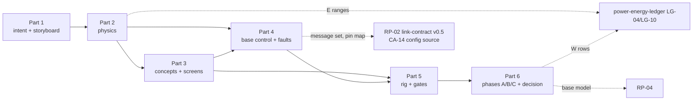

# RP-03 — Drive and Local Motion-Safety Rig: Folder Plan

| Field | Value |
|---|---|
| Status | **Construction record.** Parts 1–5 populated 2026-09-17. **Superseded for front-support type by BD-08 / `dimensional-baseline.md` v1.12:** V1 front support is the ball transfer; this file's caster wording is historical. Not the start-here index — that is `README.md`. No purchase, no gate registered, no run executed |
| Created | 2026-09-17 |
| Owner | Project builder |
| Governing plan | `../../01-system/risk-prototype-plan.md` v1.13 §RP-03 (stage 3) |
| Purpose | Close **ADR-04** (wheeled-drive and passive-support geometry) and **ADR-07** (obstacle and tabletop-edge sensing arrangement) provisionally; supply the drive `W` rows that ADR-06 *sizing* waits on; freeze the C3 pin map, motor-driver/sensor interface and base message set that RP-02 left explicitly open; deliver the measured base model RP-04 composes against |
| Method | `../../intuition.md` §5.1 — intent before numbers, numbers before physics, physics before concepts, concepts before rig, rig before decision. RP-03's toolkit is the safety toolkit: `d_available > v·t_latency + v²/(2·a_brake) + d_margin` |
| Relationship to siblings | RP-01 is an object, RP-02 is a set of states and interfaces. **RP-03 is a vehicle plus a safety authority.** It is the first prototype that can destroy itself (a desk edge), the first with real inductive/regenerative load on the motor bus, and the first with a sensor inside the stop path |

## 0. Why the folder is planned before it is written

RP-01 grew organically and needed a closure audit to find what it had not written down. RP-02 was planned in Parts and closed each Part with a registration record. RP-03 follows the RP-02 pattern because its two closures are different kinds of object: ADR-04 closes into *geometry* (a chassis envelope that integrated CAD transcribes), while ADR-07 closes into *architecture* (a sensing arrangement, a controller priority order and a message set that `subsystem-interfaces.md` inherits). A folder that mixes the two produces a chassis document that quietly decides sensor placement, or a sensor study that quietly fixes the wheelbase. The plan keeps them in separate files with separate registration records.

The three failure modes this plan is written against, all already seen once in this repository:

1. **An `E` value becomes a target.** The 250 g head did this. RP-03's equivalents are `a_tip ≈ 2.0 m/s²`, the 200–600 g drive mass row and the 1.5–3 A per-motor class. Every one is recomputed as a range in `physics.md` before any candidate is screened against it.
2. **A component decides the architecture from the wrong end.** The Waveshare servo-driver boards would have chosen the head servo family; a motor-driver HAT with built-in cliff inputs would choose RP-03's sensing arrangement. Driver and sensors are screened *after* the control architecture names what it needs.
3. **A threshold moves after data.** Tabletop edge trials are the gate most tempting to soften. The catch fixture and the footprint registration are frozen before the first pilot.

## 1. Inputs already fixed — cite, do not re-derive

Everything below is inherited. RP-03 measures against these values; it does not restate them as its own numbers, and a departure is a baseline revision, not an RP-03 finding.

| Input | Value | Source |
|---|---|---|
| Drive topology | Two independently powered encoder wheels + front caster + **mandatory** rear anti-tip skid; holonomic and self-balancing rejected | `dimensional-baseline.md` v1.10; `v1-scope.md` SCOPE-09; MEM-20260813-20 |
| Wheels | Ø84 mm nominal (Ø80–85 acceptable), ~21 mm tread, moderate-grip rubber/TPU | dimensional baseline §Drive targets |
| Track / wheelbase | ~170 mm centre-to-centre; drive axle to caster contact 105–115 mm, 110 mm target | same |
| Caster / skid | Caster Ø25–32 mm (~30 mm); skid ~70 mm behind axle, ≤14 mm above floor, generalized as `h/d < x_CoM/h_CoM ≈ 0.20` | same; MEM-20260825-02 |
| Whole-robot CoM target | `x_CoM = +25 mm` forward of axle, `h_CoM = 124 mm`; **flagged for recalculation under the heavier Layout 03 head** | dimensional baseline v1.8/v1.10 |
| Caster-lift threshold | `a_tip = g·x_CoM/h_CoM ≈ 1.98 m/s²`; +10 mm forward ≈ +0.8 m/s²; commanded forward acceleration stays below this with a registered margin until RP-03 measures lift onset | dimensional baseline §Drive targets |
| Speed bands | Normal 0.15–0.40 m/s; fast expressive 0.40–0.60 m/s; maximum target 0.65–0.70 m/s; **follow ≤ 0.5 m/s cannot be weakened**; ~160–200 RPM unloaded design point | dimensional baseline; CON-19; plan §Threshold registration |
| Yaw rates | Normal/fast 120–220°/s; 300°/s+ is drivetrain-dependent headroom, not a commanded rate | dimensional baseline |
| Household envelope | Single room; come from 1–2 m stopping 0.6–0.9 m from the person; follow ≤ ~3 m route with one gentle turn; tabletop stationary by default | CON-09, CON-19; `core-interaction-scenarios.md` Scenario 2 |
| Tabletop permission | Ordinary locomotion, come/follow and spin inhibited in `OM-02`; only an explicitly armed, minimum-speed, caught-fixture calibration motion inside a marked validated circular footprint (`CC-12C`); footprint geometry is CON-TBD-14 | `v1-scope.md` operating modes; RP-02 `state-register.md` `OM-02`; CON-TBD-14 |
| Mode selection | V1 floor/table mode is selected manually in the control app; session-scoped; boot/reset/app-link loss returns to `OM-03` | RP-02 SD-03; `F-17` |
| Base controller | **C3 = ESP32-S3-DevKitC-1-N8** (prototype board); later WROOM-1-N8 carrier only by controlled equivalence; N8R8 is not a silent substitute | `RP02-P3-REG-01/02`; `compute-control-architecture.md` CA-03 |
| C3 I/O budget | 27–37 signals gross; 28 assignable header GPIO (27 with RGB LED); **pin map is a hard pre-carrier gate and must retain ≥ 2 unassigned safe GPIO**; no safety input behind a GPIO expander; strapping GPIO0/3/45/46 excluded from safety outputs | `compute-control-architecture.md` §3 |
| C3 rates and priority | 500 Hz wheel loop target, 200 Hz hazard scan target, 100 Hz state / 20 Hz heartbeat; ≤ 50 ms detection-to-deceleration invariant; `CA-11` priority order (E-stop > energy/readiness > cliff/tip/encoder/driver/obstacle > expiry > inhibit > valid command > micro-motion) | `CA-11`, `CA-12`; MEM-20260812-01 |
| C3 ownership | Wheel velocity loops, encoder capture, base IMU, cliff/bump/proximity, local stop/reflexes, acceleration/velocity envelope, odometry capture, command expiry, readiness. Never person choice or path intent | `CA-03` |
| Motor energy path | `PB-MOTOR` (system motor-arm + dominant hardware E-stop) → `PB-DRIVE` → `PB-DRIVE-L/R`, **separately observable**; signed regenerative current required; absent in off/boot/hard-stop/charging | `RP02-P2-REG-01` `PA-13`; `power-architecture.md` §branch table |
| Base safety supply | `PB-SAFE-BASE` independent of C2's converter; off in charging | `PA-11` |
| Load profiles owed | `LP-04-OFF/PWRRESTORE/STEADY/LAUNCH/REV/BRAKE/SPIN/BLOCKEDREF`; `LP-10-OFF/BOOT/IDLE/MOTION/OBSTACLE/EDGE/FAULT` — vocabulary registered, waveforms open | RP-02 `load-model.md` §`LG-04`/`LG-10` |
| Qualification cases owed | `CC-09`, `CC-09C`, `CC-09R`, `CC-10A/B/C`, `CC-11`, `CC-12C`, `CC-13D`, drive share of `CC-PEAK-01`/`ST-01` | `RP02-P1-REG-01`; `state-register.md` |
| Fault rows owed | `F-19` sensor absent/stale/implausible; `F-22` C3 restart during motion; `F-26` C3 external-watchdog violation; `F-12/F-13` E-stop scored under `CC-10A` when drive exists | RP-02 `fault-matrix.md` |
| Ledger rows owed | `LG-04` drive 3–8 W moving, 20–40 W both at stall/reversal, 1.5–3 A per motor class (`E`); `LG-10` base MCU + sensing ≤ 1 W (`U`) | `power-energy-ledger.md` v0.13 §3 |
| Mass rows owed | Drive 200–600 g; battery 150–500 g low and forward; whole-robot analytical minimum ≈ 1.65 kg, other-subsystem high rows ≈ 3.10 kg before the head | `mass-envelope-ledger.md` v0.14 |
| Base performances carried | Curious approach; dramatic turn-toward-caller; excited spin; small side-to-side; startle. **Side-to-side is highest risk** (reversal quality) and its acceptance is gated on real drivetrain testing | MEM-20260813-08 |
| Zero-velocity hold | Drive must resist head reaction torque at zero commanded velocity; free coasting reads as slop. RP-01 paper yaw peak is 0.1099 N·m at 90.5°/s | MEM-20260812-08; `fullproofmath.md` |
| Base IMU | Rigid base mount, SPI + interrupt preferred; promoted toward required for slip/lift/tip/odometry-failure detection; head mounting excluded | MEM-20260812-02; `CA` I/O budget; sourcing matrix |
| Bench rules | E-stop on every motion rig, cutting the motor bus, verified each session; Korad KA3005D **5 A ceiling** with current limit set before first power-up; logic analyzer never on the motor rail; fall from desk is the #1 hardware-loss risk | `workbench.md` |
| Run identity | `RP03-<scope>-<class>-<UTC>-<seq>` under `run-record-convention.md`; template at `../_templates/run-record.md` | run-record convention v1.0 |
| Timebase | Scored runs need the implemented `timebase.md` and the RP-02 logging schema; not yet implemented | `timebase.md`; RP-02 Phase A |

## 2. The two questions

Same discipline as RP-02: the design question is the deliverable, the gate question is the falsifier, and they stay in separate sentences.

### 2.1 Design question — the deliverable

> What drive/support geometry, drivetrain class and local sensing arrangement lets a representative-mass Makad move expressively at low speed, reverse, turn, spin and stop stably on household floors — and what is the measured margin of that design against caster lift, stopping distance, minimum controllable speed, reversal quality and obstacle/edge coverage?

The answer is a geometry (chassis envelope with caster/skid/wheel positions and the tested CoM range), a drivetrain class with a named candidate, a sensing arrangement with coverage geometry, and a base control definition with a pin map and message set. "Margin" is a number per gate per load/floor case.

### 2.2 Gate question — the falsifier

> Can a candidate wheeled base with representative total mass move expressively at low speed, reverse, turn, spin and stop stably while local obstacle/edge sensing and controller limits prevent harmful or uncontrolled motion in the approved floor and tabletop permissions?

Verbatim from the plan. `Reject` is reachable from it. The 0.5 m/s follow ceiling, the tabletop-stationary default and CON-TBD-14 cannot be weakened; a miss forces a geometry, drivetrain or sensing change, never a threshold change. `Defer` is unavailable: floor locomotion, come/follow, obstacle handling, tabletop protection and the excited spin are all Core.

### 2.3 Which gates are which

| Character | Gates | What closes them |
|---|---|---|
| **Measurement** — the number and its headroom are the deliverable | G01 floor control, G02 speed boundary (regulation half), G06 expressive feasibility | Registered metric, frozen threshold, recorded margin across the floor/load matrix |
| **Verification** — a property holds or it does not | G02 (cannot-exceed half), G03 obstacle safety, G04 tabletop safety, G05 fault containment | Every registered case meets its preregistered policy with zero harmful contact, zero uncaught departures, zero unbounded fault outcomes |

G06 is the only gate with a judgement component ("sufficiently smooth onset and settling to proceed to coordination testing"). It is scored against a preregistered profile-quality metric plus a recorded builder judgement, and it hands RP-04 a measured base response model, not an adjective.

## 3. Folder layout

Phase is a status field per document, not a directory. Each row names what the file owns, which existing file it mirrors so the shape is not reinvented, and what it may not contain.

```text
docs/02-prototypes/RP-03-locomotion/
├── plan.md                          this file; retired into README.md once the folder is populated
├── README.md                        start-here index — written LAST, after intent/storyboard/physics exist
├── intent.md                        character intent, two questions, traceability, non-goals, phase ladder
├── storyboard.md                    numeric base-motion panels BM-00…BM-12 and wheel-velocity profile export
├── physics.md                       tip/stability, traction, drivetrain demand, stopping, footprint, coverage geometry
├── concepts/
│   ├── README.md                    ≥2 competing geometry/support/sensing concepts and the comparison matrix
│   └── <concept>.md                 one file per concept; napkin geometry, load path, cable route, service story
├── drivetrain-screen-01.md          named gearmotor/wheel/caster/skid candidates D01… screened against physics.md
├── sensing-screen-01.md             named cliff/obstacle/bump/IMU candidates S01… screened against coverage/latency need
├── base-control-architecture.md     BC-01…: C3 loops, hazard fusion, mode enforcement, arming, expiry, pin map, base message set
├── fault-matrix.md                  F-31… RP-03 injections in the RP-02 schema; cross-lists F-19/F-22/F-26
├── rig.md                           the ugly chassis: ballast, adjustable support geometry, instruments, catch fixture, course
├── gates.md                         paper P01… and physical G01…G06 candidate registrations; registered section
├── decision.md                      ADR-04/ADR-07 ladder, ADR-06 sizing and ADR-03/05 inputs, candidate register, outcomes
├── research.md                      constraints, inventory, filled envelopes, print-vs-buy; not a sourcing matrix
├── cad/                             only after a concept is selected: base/ blockout mirroring RP-01 cad/head/
└── runs/                            one directory per run ID
```

| Document | Owns | Mirrors | Must not contain |
|---|---|---|---|
| `intent.md` | Why RP-03 exists; §2 questions; ADR table (ADR-04, ADR-07 close; ADR-06 sizing, ADR-03, ADR-05 informed); traceability to SC-11/12/13/15/16/25, SC-TBD-07/08/09, CON-TBD-14, CON-09/14/19/P02/P05; inherited inputs table (§1 above, condensed); scope/non-goals; phase ladder; evidence rules; relationship to RP-01/RP-02/RP-04/RP-07 | RP-02 `intent.md` §1–8; RP-01 `intent.md` §1–2 for the character pass | Numbers that belong in `storyboard.md`; any candidate SKU |
| `storyboard.md` | Authored base-motion panels with the same panel grammar as RP-01 `HM-xx`: audience read, keyframes, amplitude, duration, time-to-peak, settle, interruption rule, what must never happen; a wheel-velocity profile library (launch, cruise, decel-through-zero, pivot, arc, spin, wiggle, brake); per-panel kinematic export `v_peak, a_peak, ω_peak, α_peak, t_settle`; minimum-viable and best-case envelopes | RP-01 `storyboard.md` §1–4 | Pass/fail thresholds (those freeze in `gates.md`); actuator feasibility claims |
| `physics.md` | §5 below | RP-01 `physics.md` + `fullproofmath.md` in spirit; assumption register with `W/D/E/U` on every input | A selected motor; a point value where the input is a range |
| `concepts/` | ≥ 2 concepts differing on at least one first-order axis (support type, motor/wheel placement, sensing arrangement) with a filled comparison of the `physics.md` quantities | RP-01 `concepts/` + `comparison.md` | CAD; a "winner" before the comparison is filled |
| `drivetrain-screen-01.md` | Candidate gearmotor/encoder/wheel/caster/skid rows `D01…` with manufacturer `D` data, India sourcing snapshot, paper gates P0x pass/hold/fail; explicit "not a selection, not a purchase" | RP-01 `actuator-screen-01.md`; RP-02 `power-component-candidate-screen.md` | A freeze; a mass row promoted past `D` |
| `sensing-screen-01.md` | Candidate cliff/obstacle/bump/IMU rows `S01…` with FoV, range, sample rate, interface, latency, ambient/surface rejection, emitter power; screened against `physics.md` coverage and latency need and the C3 I/O budget | RP-02 `compute-control-component-screen.md` | A sensor chosen because a driver board happens to have the input |
| `base-control-architecture.md` | `BC-01…`: wheel-loop structure and rates; odometry; hazard fusion and per-sensor age bounds; `CA-11` priority as implemented; `OM-01/02/03` enforcement and `CC-12C` calibration arming; command expiry; readiness/watchdog feed; **C3 pin map v0.x** against the I/O budget; **base message set draft** (`BASE_LIMITS_SET`, `BASE_ENABLE`, `BASE_GOAL`, `BASE_STATE`, `BASE_FAULT`, hazard telemetry) in the `link-contract.md` framing | RP-02 `compute-control-architecture.md` §2 `CA-*` rows and `link-contract.md` message tables | A second framing; a Linux thread in the stop path; a numeric timeout registered before measurement |
| `fault-matrix.md` | `F-31…` rows: per-sensor loss/stale/implausible, encoder disagreement, driver fault/overcurrent, stall, pickup/tip (IMU), mode-evidence loss, app-link loss mid-follow, C0 loss mid-follow, E-stop mid-spin, `EN-02/03` mid-launch, calibration-arm expiry on the table; inhibit / reject / expose / recover columns; campaign ordering that puts caught-tabletop rows last | RP-02 `fault-matrix.md` schema and §3 candidate metrics | Renumbering `F-19/F-22/F-26`; a numeric G05 threshold before registration |
| `rig.md` | §6 below | RP-01 `rig.md`; RP-02 `rig.md` §1 bench constraints table | A pretty chassis; a scored run before the readiness checklist |
| `gates.md` | Paper gates `RP03-P01…` (physics/screens) and physical candidate registrations for `RP03-G01…G06` using the plan's eight fields; registered section starts empty | RP-01 `gates.md` (paper + physical); RP-02 `gates.md` §3–4 | A threshold edited after data; a registration without a freeze record |
| `decision.md` | Inherited locked decisions; builder decisions `BD-01…`; Part registrations `RP03-P<n>-REG-<nn>`; gate outcome table; ADR closure ladder; candidate register; conclusion | RP-02 `decision.md` | A pass claimed from a pilot; a purchase authorization |
| `research.md` | Constraints, RP-03 part inventory, filled envelopes, CAD datums, print-vs-buy for catalog gaps | — | A buy list; a second sourcing matrix; a SKU freeze; a printed motor/ball/FDM tyre as scored `D10` |
| `README.md` | Start-here index, "owned elsewhere — link, do not copy", relationship notes, what-to-do-next, organization record | RP-02 `README.md` | Anything canonical; it points |

**Owned elsewhere — link, do not copy.** Drive geometry targets (`dimensional-baseline.md`); drive/battery mass rows (`mass-envelope-ledger.md`); `LG-04`/`LG-10` and the G02 invariant (`power-energy-ledger.md`); `OM/BS/EV/CC/LP` vocabulary and `MD-01` (RP-02 `state-register.md`, `load-model.md`); C0↔MCU framing, expiry, heartbeat, arm nonce (RP-02 `link-contract.md`); `PA-13` motor authority and `PB-DRIVE*` branches (RP-02 `power-architecture.md`); `F-19/22/26` (RP-02 `fault-matrix.md`); sourcing rows (`candidate-sourcing-matrix.md` §Drive & base); bench, PSU and E-stop rules (`workbench.md`); run identity; timebase. RP-03 *populates* the ledgers and *extends* the RP-02 registers; it never carries a second copy.

**No glossary.** RP-02 needed one because it holds seven namespaces. RP-03 holds `BM-`, `D`, `S`, `BC-`, `F-3x`, `BD-`, `RP03-P/G`; the README index carries them. Add a glossary only if that count grows.

## 4. Authoring sequence

Six Parts. Each Part ends with a review and, where it fixes something downstream depends on, a registration record `RP03-P<n>-REG-<nn>` in `decision.md` and a MEMORY entry. Parts 1–4 are paper and on-hand hardware; nothing is purchased. Order matters: a screen written before the physics screens against invented numbers; a pin map written before the sensing screen reserves the wrong pins.



### Part 1 — Intent and storyboard (paper)

**Writes** `intent.md`, `storyboard.md`.

**Intent pass (no numbers).** Author each base behaviour in character terms first, one paragraph each, then the primitives underneath them:

| Panel | Character read | Primitive it exercises | Owed case |
|---|---|---|---|
| `BM-00` | Off / inhibited rest: nothing moves, nothing rolls when nudged, nothing rolls when the head moves | Passive holding, backdrivability | `LP-04-OFF`, `CC-02F/T` |
| `BM-01` | Zero-velocity hold while the head performs: the body does not twitch against a yaw snap | Reaction-torque rejection at v=0 | MEM-20260812-08; `CC-05` with drive armed |
| `BM-02` | Creep: the slowest deliberate motion that still reads as intent, not as a stall | Minimum controllable speed, encoder resolution | `LP-04-STEADY` low end |
| `BM-03` | Curious / hesitant approach (come): advance, pause, advance, settle in the 0.6–0.9 m band | Launch, low-speed cruise, decel to rest, repeat | `CC-09C`, `CC-10A` |
| `BM-04` | Follow: steady walk-pace tracking with one gentle arc, no hunting | Speed regulation ≤ 0.5 m/s, arc geometry, straight-line drift | `CC-09` |
| `BM-05` | Dramatic turn-toward-caller: one decisive pivot that lands on heading | In-place rotation, yaw-rate profile, settle | `EV-04` base analogue |
| `BM-06` | Excited spin: full rotations that end crisply, upright, on the spot | High yaw rate, skid/caster behaviour during spin, settle | `CC-11`, SC-25 |
| `BM-07` | Small side-to-side wiggle: quick reversals of a few centimetres, symmetric, no lurch | Reversal deadband, decel-through-zero | MEM-20260813-08 highest risk; `LP-04-REV` |
| `BM-08` | Startle retreat: sharp reverse then freeze | Reverse launch, caster loading in reverse, hard settle | `EV-07` after `EV-12`; `LP-04-REV` |
| `BM-09` | Controlled brake from each speed band: stops as if it meant to | Stopping distance/time, overshoot/rollback | `EV-12`, `LP-04-BRAKE` |
| `BM-10` | Obstacle intervention: stops short of the thing, visibly, without slewing | Detection-to-decel, stopping clearance, false-inhibit | `CC-10C`, `EV-20` |
| `BM-11` | Tabletop calibration creep and edge stop: moves only when armed, stops well inside the marked circle | Edge detection coverage, calibration speed, footprint | `CC-12C`, `EV-21` |
| `BM-12` | Controlled cancel from any of the above: settles, never coasts | Online jerk-limited brake from arbitrary state | `EV-17`; RP-01 `HM-18` analogue |

**Quantify pass (separate).** Per panel: amplitude (m or °), duration, time-to-peak, peak and settle; derive `v_peak, a_peak, ω_peak, α_peak`. Sources when the robot does not exist: reference footage scrubbed frame-by-frame for amplitude/timing hypotheses only (never copied performances), human walk-pace data for follow, acted mock-ups on 240 fps phone video pushing a weighted box on casters for the wiggle and approach. Export a normalized wheel-velocity profile library the way RP-01 exports `MJ5/MS7/BRAKE`; keep a "controlling case" table naming which panel sets `a_peak` (expected: `BM-07` or `BM-08`) and which sets `ω_peak` (`BM-06`).

**Must not.** Assign a pass threshold, name a motor, or set the tabletop footprint radius. Every number is an authored hypothesis until `gates.md` freezes it.

### Part 2 — Physics and envelope (paper)

**Writes** `physics.md`; updates `LG-04`/`LG-10` in `power-energy-ledger.md` as revised `E` ranges with a change-log row; updates the drive row of `mass-envelope-ledger.md` only if the analysis moves its bounds.

Work items, each with an assumption register row (`W/D/E/U`, never a zero):

1. **Stability recomputed as a range.** `a_tip = g·x_CoM/h_CoM` and the skid inequality `h/d < x_CoM/h_CoM` re-evaluated across the mass ledger's low/high roll-up with the Layout 03 head tree (~499–524 g complete, `E`) sitting at the 304 mm stack. Report `a_tip` low/nominal/high and the CoM sensitivity per +10 mm and per +10 mm height. State explicitly whether the 2.0 m/s² planning value survives; if not, the dimensional baseline is revised, not RP-03's margin. Separate the four cases because they load different supports: forward launch (caster lift, rear skid catches), forward brake (nose-down onto the caster), reverse launch (caster loads, nothing catches a forward tip except geometry), spin (lateral, centripetal on a 170 mm track).
2. **Traction and scrub.** Available friction over the tested surface set; differential-turn scrub torque at 170 mm track and 21 mm tread; caster swivel/trail effects on reversal and on the `BM-07` wiggle. This is where ball-versus-swivel support becomes a comparable number.
3. **Drivetrain demand.** From the storyboard export: wheel torque and speed for each controlling panel at the mass range, including `a_peak` against `a_tip` margin; RMS over a representative follow minute for thermal class; gear ratio versus 160–200 RPM; **reflected inertia and backdrivability** for `BM-00/01` — whether the zero-velocity hold comes from ratio, from active hold current, or needs a brake, and what each costs in idle energy and noise. Reaction torque input is RP-01's 0.1099 N·m yaw peak.
4. **Electrical demand for the ledger.** Per-motor stall/launch/reversal current class from the demand above, signed regenerative current on `LP-04-REV/BRAKE`, and the composite for `CC-PEAK-01`. Record the **Korad 5 A ceiling consequence**: two motors in the 1.5–3 A class at stall can exceed 5 A on a 2S-class bus, so Phase B stall/reversal characterization is per-motor or needs a second source; both-motor transients close in Phase C on a candidate pack.
5. **Stopping inequality per speed band.** `d_available > v·t_latency + v²/(2·a_brake) + d_margin` with `t_latency` built up from sensor sample age, C3 hazard scan period, wheel-loop period and driver response, and `a_brake` bounded by the nose-down stability case. Tabulate for 0.15, 0.40, 0.50, 0.70 m/s and for the calibration creep speed. This table is what the sensing screen and the tabletop footprint are screened against.
6. **Obstacle and edge coverage geometry.** Required look-ahead distance per band from item 5; required lateral coverage from the 205 mm stance plus turn sweep; blind-region tolerance; for cliff sensing, the look-ahead needed *at the leading contact* (caster forward, wheels lateral, skid rearward during reverse) at the calibration speed. This fixes how many downward sensors and where, before any part is named.
7. **Tabletop footprint proposal for CON-TBD-14.** Radius, calibration speed ceiling, stopping margin and edge-test geometry derived from items 5–6 with the catch-fixture geometry; proposed, not registered.
8. **Acoustic and vibration note.** Drivetrain vibration reaches all body mics coherently (MEM-20260812-04); record the measurement obligation, not a design.

**Must not.** Select a motor, a sensor or a caster; state a single `a_tip`.

### Part 3 — Concepts and candidate screens (paper + sourcing snapshot)

**Writes** `concepts/`, `drivetrain-screen-01.md`, `sensing-screen-01.md`; updates `candidate-sourcing-matrix.md` §Drive & base rows in place with dated India snapshots (the matrix stays the programme-wide home).

**Concepts (≥ 2).** Differ on first-order axes the physics made comparable: front swivel caster versus ball transfer support; motor/wheel placement relative to the battery bay and the 110 mm wheelbase; cliff-sensor count and placement (leading-contact coverage versus perimeter ring); forward obstacle sensing class (ToF versus IR versus bump-only for V1). Each concept carries a load path, an actuator class with a sourcing path, a cable route to the body, a service story, and the `physics.md` quantities cleared with margin. A concept without a filled comparison row is a sketch, not a concept.

**Drivetrain screen.** Named gearmotor candidates `D01…` in the classes the ledger already cites (N20-class, GA25/JGA25-class, 37D-class as an upper bound) with encoder type and CPR, `D`-cited stall current/torque/no-load RPM, mass, shaft, mounting; wheel/tire, caster and skid rows; paper gates `RP03-P01…` for torque margin, speed at the design point, current class against `PB-DRIVE` and the 5 A bench ceiling, encoder resolution against `BM-02` creep, backdrivability against `BM-01`, mass against the 200–600 g row. Same discipline as RP-01's C01: a candidate may become a *reference unit* for bench work without becoming a freeze.

**Sensing screen.** Named candidates `S01…` per function (downward cliff, forward proximity, bump, base IMU) with `D`-cited FoV, range, sample rate, interface, latency, ambient-light/surface-colour behaviour, emitter current; screened against Part 2 items 5–6 and against the C3 I/O budget (bus sharing is allowed for telemetry, never for a stop-path input). Note explicitly that dark or glossy tabletop surfaces are the cliff-sensor failure mode to test, not an afterthought.

**Motor driver.** Screened here as a class (brushed H-bridge with hardware fault output and current sense per channel, logic-level enable that fails safe), because it sets `PB-DRIVE-L/R` observability and the C3 pin count. Exact part is a Part 4 lead, not a Part 3 selection.

**Must not.** Buy; declare a winner before the comparison matrix and both screens are complete; let a driver board's feature list pick the sensors.

### Part 4 — Base control and interface definition (paper + C3 on the bench)

**Writes** `base-control-architecture.md`, `fault-matrix.md`; proposes `link-contract.md` v0.5 (base message set) and a `CA-14` config-source extension in RP-02, registered there, defined here.

Rules `BC-01…` to fix: wheel-loop structure (velocity loop per wheel, feed-forward from the profile library, encoder capture on PCNT, IMU-assisted slip/lift detection); odometry publication; hazard fusion with a registered age bound per sensor and an "unknown is inhibit" default; `CA-11` priority as concrete state; `OM-01/02/03` enforcement local to C3 with `SD-03` selection as an input, not an interlock; `CC-12C` calibration arming as a separate nonce with its own expiry and speed clamp; command expiry and latest-wins queues; readiness = ANDed watchdog-good + driver-present + sensors-valid + mode-valid; fresh-arm after any inhibit.

**Pin map v0.1** against the I/O budget table, with the ≥ 2 spare safe GPIO rule checked and the strapping/USB reservations honoured. Failing the map moves to a WROOM-1-N8 carrier or changes the interface through change control; it never falls back to N8R8.

**Base message set draft** in the registered COBS/CRC/session/time/expiry envelope: limits/enable/goal/state/fault plus hazard telemetry, mirroring `HEAD_GOAL`/`HEAD_STATE` shapes so RP-04 composes head and base through one grammar. Byte layouts and timing stay open until Phase A measures them.

**Fault rows `F-31…`** in the RP-02 schema, cross-listing `F-19/F-22/F-26` rather than restating them. Campaign order: bench-only rows first (sensor mask, encoder disagreement, driver fault on a stand), then guarded floor rows, then caught-tabletop rows last.

**Bench work admissible now:** C3 DevKitC-1-N8 with the RP-02 twin firmware skeleton, a candidate driver evaluation board and one reference motor on a stand — loop-rate and jitter capture for the RP02-G05 C3 row, encoder capture validation, watchdog feed timing. None of it is a scored RP-03 run and none of it needs a chassis.

**Registration** `RP03-P4-REG-01` when the builder approves `BC-*`, the pin map and the message-set draft. That record is what unblocks the RP-02 C3 items marked "waits on RP-03".

### Part 5 — Rig and gate registrations

**Writes** `rig.md`, `gates.md` (candidate registrations complete, registered section still empty until the freeze).

Rig requirements are in §6. Gate candidate registrations use the plan's eight fields per gate and reference storyboard panels, `CC` cases and fault rows by ID. Every instrument row records sampling rate, check method and uncertainty; a gate whose threshold the bench cannot resolve is marked exploratory-only until it can (`workbench.md` item 6).

**Builder decisions `BD-01…`** that Part 5 needs answered, recorded in `decision.md` the way RP-02 recorded `SD-01…04`:

| ID | Decision needed | Why RP-03 cannot decide it alone |
|---|---|---|
| BD-01 | Is the armed tabletop calibration motion (`CC-12C`) in V1 at all, or is V1 tabletop fully stationary with edge sensing proven only against unintended activation? | Changes whether G04 needs a moving edge trial or only an inhibit/activation trial; CON-09 permits either |
| BD-02 | Obstacle policy for V1: stop-only, or stop with a proven redirect? | `EV-20` allows "stop or proven redirect"; redirect doubles the G03 matrix |
| BD-03 | Is the base IMU installed runtime hardware or a bench instrument for RP-03? | MEM-20260812-02 promoted it toward required; `CA` reserves the interface; runtime installation changes `LG-10`, the pin map and pickup/tip detection ownership |
| BD-04 | Floor surface set: which household surfaces in the builder's room are representative (tile, wood/laminate, thin rug, threshold strip)? | SC-TBD-07 needs named surfaces; only the builder knows the demo room |
| BD-05 | Ballast range to score: ledger low (~1.65 kg) and high (~3.1 kg + head) at both CoM extremes, or a narrower band once RP-01 M900 exists? | Four-corner testing is the honest default; cost is rig time |
| BD-06 | Registered test speed limit above the 0.5 m/s follow ceiling for expressive bands (0.60? 0.70?) | G02 needs a "cannot exceed" number; the dimensional baseline gives a range, not a limit |
| BD-07 | Catch fixture form: raised lip/rail around the table, or tether from above? | Both satisfy the plan; lip can mask cliff sensing if it sits in the sensor's view |

### Part 6 — Phases, evidence, decision

Phase is a status field per document.

| Phase | Needs | Can produce | Cannot produce |
|---|---|---|---|
| **A — paper and on-hand hardware** | Parts 1–5 written; C3 DevKitC-1-N8; a driver evaluation board; one reference motor; Korad; logic analyzer | Registered `BC-*`, pin map, message-set draft; ledger `E` ranges; RP02-G05 C3 loop/jitter exploratory capture; encoder/watchdog bench validation; every gate registration candidate | Any `W` row; any stability, stopping or edge claim; anything on a chassis |
| **B — open chassis on the floor** | Workbench scored-test gate satisfied for this rig; implemented timebase and logging; E-stop on the motor bus; two candidate motors + wheels + caster + skid on the ballasted frame; marked course and surface set; external top-down video with a timing cue | G01, G02, G06 scored across the floor/load matrix; G03 for the registered obstacle set; G05 floor rows; per-motor `W` profiles for `LP-04-*` and `LP-10-*` within the 5 A ceiling; measured lift onset, skid contact and CoM sensitivity | Both-motor stall/reversal composites above 5 A; tabletop rows; `CC-PEAK-01` closure |
| **C — caught tabletop and onboard energy** | Catch fixture built and verified; battery gate satisfied and a candidate pack (shared with RP-02 Phase C); sensing candidates installed | G04 edge trials inside the caught footprint; G05 tabletop rows; both-motor transients and `CC-10A/B` regenerative `W` rows; CON-TBD-14 registration input; ADR-06 sizing input | SC-14; any come/follow with a real person (RP-07); composed performances (RP-04) |

**Decision.** `decision.md` records per gate pass/iterate/reject citing run IDs, then the ladder: ADR-04 closes provisionally on G01/G02/G06 plus measured stability; ADR-07 on G03/G04/G05 plus coverage evidence; ADR-06 sizing receives the drive `W` rows and the G02-invariant re-run obligation is raised in the ledger; ADR-03 receives the C3 half of RP02-G05; ADR-05 receives the measured base response model (onset latency, decel-through-zero behaviour, settle) for RP-04. Budgets updated with measured value, uncertainty and margin: mass (drive row → `W`), motion, stopping, stability, power, acoustic, tabletop footprint.

## 5. What `physics.md` must answer before any candidate is named

Condensed checklist for the file's table of contents, so Part 2 is reviewable against something:

- [ ] `a_tip` low/nominal/high with the Layout 03 head and the ledger mass range; skid inequality re-evaluated; four loading cases separated
- [ ] CoM sensitivity per +10 mm forward and per +10 mm up; battery placement as the lever that recovers margin
- [ ] Friction/traction and turn scrub over the BD-04 surface set; caster trail/swivel effect on `BM-07`
- [ ] Per-panel wheel torque, speed, `a_peak` vs `a_tip` margin, RMS over a follow minute; gear-ratio window against 160–200 RPM
- [ ] Reflected inertia and backdrivability; how `BM-00/01` hold is achieved and what it costs at idle
- [ ] Per-motor and composite current classes with signed regeneration; Korad 5 A consequence stated
- [ ] Stopping inequality table by speed band with the latency budget decomposed
- [ ] Obstacle look-ahead and lateral coverage; cliff look-ahead at each leading contact at calibration speed; blind-region tolerance
- [ ] Proposed CON-TBD-14 footprint geometry (radius, speed, margin, edge-test geometry)
- [ ] Drivetrain noise/vibration measurement obligation toward the body mic array

## 6. What `rig.md` must provide

The rig is a decision instrument, deliberately ugly.

- **Chassis:** open frame reproducing Ø84 wheels at 170 mm track, an adjustable axle-to-caster mount spanning 105–115 mm, an interchangeable front support (swivel caster / ball transfer), an adjustable rear skid (reach 60–80 mm, height 8–16 mm) and **ballast that sets total mass and both CoM coordinates independently** across the BD-05 range. Changing ballast must not change frame stiffness or support geometry.
- **Motor domain:** `PB-MOTOR` → `PB-DRIVE` → `PB-DRIVE-L/R` with per-channel INA-class monitors and a scope point at the driver, behind the workbench E-stop and a normally-off motor-arm fixture; driver fault and enable lines brought to test points.
- **Controller:** C3 DevKitC-1-N8 on the frame with the RP-02 differential-link breakout or bench TTL, the external window-watchdog fixture, and a header for the sensing candidates; a **sensor interposer** that can mask, freeze or corrupt one sensor for `F-19`-class injections without touching wiring.
- **Instruments:** encoder capture logged on the common timebase; base IMU logged (bench instrument until BD-03); rail/branch current and voltage; motor and driver temperature; sound level at a fixed position; **external top-down video** of a floor-marked course with a status-light timing cue (`LIGHT_STATE` analogue on C3); a tape/laser distance reference for stopping-distance scoring; a tilt indicator or IMU-derived pitch for caster-lift onset.
- **Course and props:** marked test area on each BD-04 surface; representative obstacles (person-leg proxy, furniture leg, cardboard box, cable/flat obstacle); a threshold strip; start/stop marks for each speed band.
- **Tabletop fixture (Phase C):** a large tabletop with a marked circular footprint and a **catch that prevents an actual fall without sitting in the cliff sensors' view** (BD-07); edge-approach lanes at several angles; a dark and a glossy surface sample.
- **Readiness checklist:** mirror of the workbench scored-test gate for this rig, plus "catch fixture verified this session" for any tabletop row.

## 7. Gate mapping

| Plan gate | Registered in | Scored from | Owed cases / rows | Closes toward |
|---|---|---|---|---|
| **RP03-G01 Floor control** | `gates.md` G01 | `BM-02/03/04/05/08/09/12` across BD-04 surfaces × BD-05 load corners; lift onset vs `a_tip` margin | `CC-09/09C`, `CC-10A/B`, `LP-04-STEADY/LAUNCH/REV/BRAKE` | ADR-04; stability, motion and stopping budgets |
| **RP03-G02 Speed boundary** | `gates.md` G02 | Regulation error in the ≤ 0.5 m/s band; hard clamp at the BD-06 limit under a deliberately excessive goal | `CC-09`; `F-14`-style flood on `BASE_GOAL` | ADR-04; SC-TBD-07 |
| **RP03-G03 Obstacle safety** | `gates.md` G03 | `BM-10` per obstacle × approach speed; detection latency, stopping clearance, false-inhibit rate | `CC-10C`, `EV-20`, `LP-10-OBSTACLE` | ADR-07; SC-TBD-08 |
| **RP03-G04 Tabletop safety** | `gates.md` G04 | Inhibit-by-default and rejected-request proof; `BM-11` edge trials inside the caught footprint (per BD-01) | `CC-02T`, `CC-12A/B/C`, `EV-21`, `LP-10-EDGE` | ADR-07; CON-TBD-14; SC-TBD-09 |
| **RP03-G05 Fault containment** | `gates.md` G05 | `F-19`, `F-22`, `F-26`, `F-31…` campaign; time-to-brake, zero stale resumption, fresh-arm required | `CC-13D`, `F-12/13` under `CC-10A` | ADR-07, ADR-03 (C3 half) |
| **RP03-G06 Expressive feasibility** | `gates.md` G06 | `BM-05/06/07` onset/settle metrics plus recorded judgement; at least one stable turn/spin/reversal profile | `CC-11`, `LP-04-SPIN` | ADR-05 input (base model for RP-04) |

## 8. Dependencies and circularities — named, not stalled

| Loop | What can proceed now | What must wait |
|---|---|---|
| RP-03 message set ↔ RP-02 link contract | RP-03 defines the base messages in the registered envelope (Part 4) | RP-02 registers them as `link-contract.md` v0.5; byte layouts wait on Phase A measurement |
| RP-03 pin map ↔ RP-02 C3 carrier and `CA-14` config | Pin map v0.1 against the DevKitC header (Part 4) | Carrier PCB and generated config source wait on the frozen map |
| RP-03 drive `W` ↔ RP-02 ADR-06 sizing and G02 invariant | `E` ranges from Part 2 refresh `LG-04/LG-10`; RP-02 Phase B keeps its electronic-load substitute | Sizing and the drive-dependent `CC` re-run wait on Phase B/C `W` rows |
| RP-03 stability ↔ RP-01 head mass | Range analysis with the Layout 03 `E` tree | A point `a_tip` waits on M900; RP-03 scores at BD-05 corners instead |
| RP-03 scored runs ↔ RP-02 timebase/logging | Exploratory bench capture on C3 now | Scored G01–G06 need implemented `timebase.md` and the RP-02 log schema |
| RP-03 G06 ↔ RP-04 | RP-03 records the base response model | Composition, onset offsets and observer coherence are RP-04's |
| RP-03 G03/G04 ↔ RP-07 | Obstacle/edge policy with props and a person-leg proxy | Real-person come/follow, loss/reacquire and identity are RP-07's |
| Phase C battery ↔ workbench battery gate | Both-motor transients above 5 A are deferred with a stated reason | Written procedure, bag and balance charger; shared with RP-02 Phase C |

## 9. Evidence rules carried in

1. **Evidence classes** are the ledgers': `W` measured in the recorded state with a run ID; `D` manufacturer; `E` calculation, analogy or characterized substitute; `U` unknown, never zero.
2. **A substitute needs an equivalence record.** An electronic load reproduces a current-time trace, not inductive kick or regeneration; a bare motor on a stand reproduces torque/current, not traction, scrub or lift. No stability, stopping or edge claim from either.
3. **Thresholds freeze before data.** SC-TBD-07/08/09 and CON-TBD-14 get gate-registration records with a dated builder approval before any scored run; a change after results is a new gate version with a fresh test set.
4. **Transient claims need a transient instrument.** Detection-to-decel at 50 ms and reversal current spikes are not INA-at-10-Hz measurements; the run is exploratory until the bench resolves the threshold.
5. **No uncaught tabletop trial, ever.** Pilot or scored, a tabletop row without a verified catch fixture is invalid and is recorded as such.
6. **IDs are append-only.** `BM-`, `D`, `S`, `BC-`, `F-3x`, `BD-`, `RP03-P/G` and `RP03-P<n>-REG-<nn>` are never reused or renumbered.
7. **Failed and aborted runs stay cited.** A candidate rejected on the floor is a result, not an embarrassment.

## 10. What RP-03 does not do

- select the battery chemistry or pack (ADR-06 architecture is RP-02's; sizing follows RP-03's `W` rows);
- implement person perception, target continuity or following policy (RP-07);
- compose head–base performances or judge coherence (RP-04);
- close SC-14 or any integrated-droid requirement;
- produce final chassis CAD — `cad/base/` is a blockout for the selected concept only, and root `cad/` stays reserved for integrated CAD;
- authorize any purchase; a reference motor bought for Phase A is bench equipment until a freeze says otherwise;
- weaken the 0.5 m/s follow ceiling, the tabletop-stationary default or the caster-lift margin rule.

## 11. First actions, in order

1. Create the folder skeleton (`concepts/`, `runs/.gitkeep`) and open `intent.md` with §1–2 of this plan condensed; add the RP-03 section to `../openitems.md`.
2. Author the twelve `BM-` panels in `intent.md` prose first, then quantify them in `storyboard.md`; run the acted-mock-up pass before any physics.
3. Write `physics.md` against the §5 checklist; refresh `LG-04/LG-10` as `E` ranges with a ledger change-log row.
4. Put BD-01…BD-07 in front of the builder with the Part 2 results attached; record answers in `decision.md`.
5. Concepts and both screens; sourcing snapshot into the matrix; paper gates `RP03-P01…`.
6. Base control architecture, pin map v0.1, message-set draft, `F-31…`; propose `link-contract.md` v0.5; register `RP03-P4-REG-01`.
7. Rig and gate candidate registrations; then Phase A bench work on C3 the day the driver evaluation board and reference motor are on the bench.

When items 1–7 are done at design-definition level, retire this plan into `README.md`'s organization record and mark the folder "Parts 1–5 defined, Phase A live" in the README status table.
