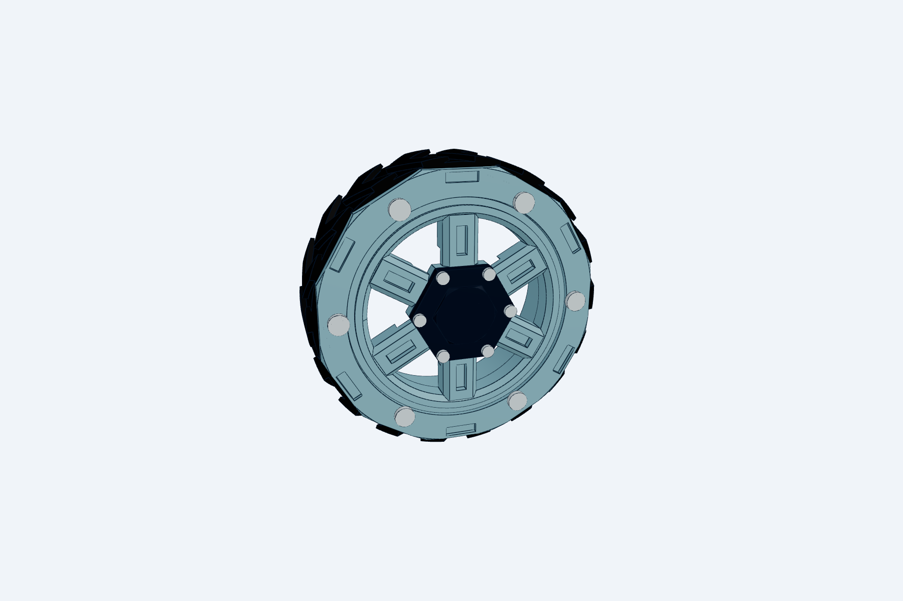
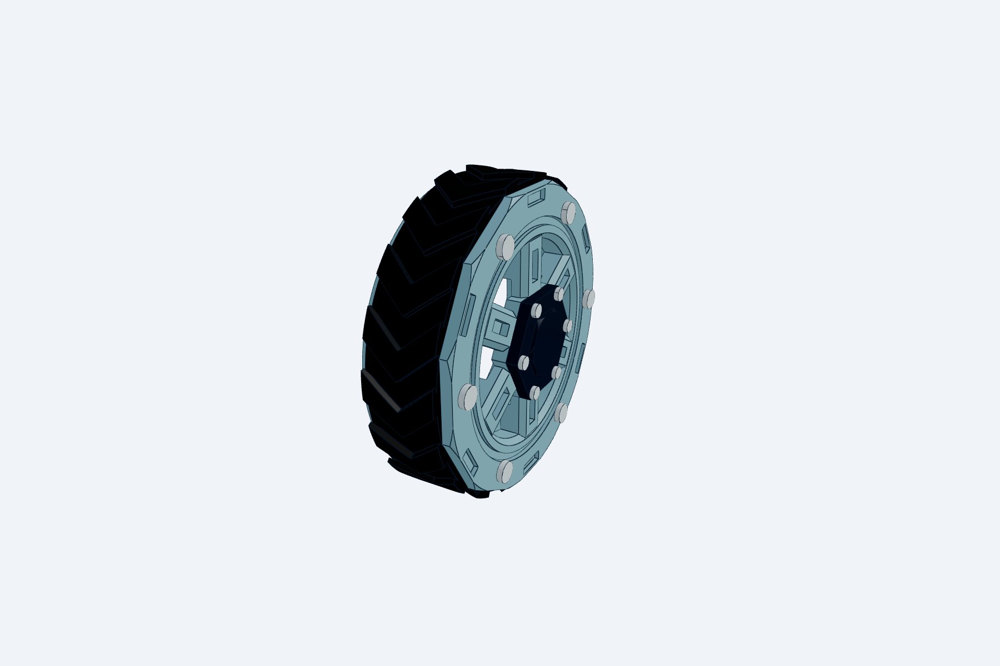

# Chassis v1 drive wheel — rim, TPU tyre and clamp ring

Wheel CAD for joint **J14** and BOM rows CH-004/005/058/059, per [D-005](../../../../decisions.md#d-005) (tyre), [D-008](../../../../decisions.md#d-008) (face and hub) and [D-009](../../../../decisions.md#d-009) (handed tyres, merged into the chassis). This file is the **single source** for the wheel. [`../body_chassis_model.py`](../body_chassis_model.py) imports it: `wheel_assembly()` places `mounted_leaves(side, …)` and adds the D-007 stub. `_check_wheel_interface()` stops the chassis build if the hub interface here drifts from the D-007 constants. The wheel matches the [D-007](../../../../decisions.md#d-007) hub interface: an R18 pocket to |Y| 93 over the bearing housing, a 4 mm web, a Ø10 bore on the stub spigot, and 3 × M3 × 6 into the stub flange.

**Open:**

- [wheel.step.py](http://127.0.0.1:3245/Users/avinier/robotics/makad/docs/03-build/01-chassis/v1/cad/wheel?file=wheel.step.py): the left wheel standing on the floor.
- [wheel-pair.step.py](http://127.0.0.1:3245/Users/avinier/robotics/makad/docs/03-build/01-chassis/v1/cad/wheel?file=wheel-pair.step.py): both wheels as mounted, 170 mm track.
- [chassis-v1.step.py](http://127.0.0.1:3245/Users/avinier/robotics/makad/docs/03-build/01-chassis/v1/cad?file=chassis-v1.step.py): on the chassis.

 

## Design

**Outboard face, after the builder's reference image ([D-008](../../../../decisions.md#d-008)).** It stays within the droid's shell language from the [vision](../../../../../00-foundation/vision.md#character-and-visual-direction): rugged and visibly assembled, with screws, panels and seams on show.

- **Spokes:** six framed spokes, 10 mm at the root, chamfered 1.5 mm to a 7 mm face. Each has a recessed slot 3 mm wide and 2 mm deep, and runs from the hex hub to an inner ring (R26–R30.5) with a 45° inner bevel. The spokes are 7 mm deep outside the housing pocket and 4 mm (the D-007 web) inside it. A 1 mm shadow groove separates the inner ring from the clamp ring.
- **Hub (D-007):**
  - a 26 mm hex over a Ø10 bore on the stub spigot;
  - three Ø3.4 holes at PCD 16 for the M3 × 6 button heads (CH-056) into the stub flange;
  - a 1.3 mm wall between the bore and each screw hole.
- **Hub cap (CH-058):** a dark hex cap, 26 mm across flats, standing 3 mm proud, with a faceted 16 mm boss. A 1.9 mm-deep recess underneath covers the three wheel screws. It is held by 6 × M2 × 6 thread-forming screws (CH-059) with 3 mm engagement. **Wheel removal:** cap off, three M3 screws out, pull the wheel off the spigot.
- **Clamp ring:** 12 sides, alternating six M3 screw flats with six recessed vent slots (9 × 2.7 × 1.2 mm). The corners are chamfered and the flats are not.
- **Two-tone:** rim and clamp ring in light PETG, hub cap in dark PETG.

**Tyre: printed TPU 95A, handed.** There are two tyres: the right one is the left one mirrored, so on the robot both chevrons lead forward (+X). A right tyre that is just the left one turned round would lead backward; the check `both_tyres_lead_forward_when_mounted` catches that (+7.0 mm on each side; −7.0 for an un-mirrored tyre). Rim, clamp ring, hub cap and hardware are symmetric and identical on both sides.


- **Tread:** 18 chevrons 1.5 mm tall on a 3.5 mm carcass, bars at 40° to the axle, apexes on the centre line. The apex leads at the top when driving forward (tractor convention). The angle is chosen so each V overlaps the next along the contact line: 72 of 72 probe angles land on a lug, so the ride is smooth on hard floors.
- **Retention:**
  - 12 ribs on the Ø74 rim seat (3 × 0.8 mm) key into slots inside the tyre bore.
  - The tyre is 19 mm wide and clamped between a 2 mm integral inboard lip and a 3 mm outboard ring. Both overlap its side by 2 mm.
  - 6 × ISO 7380 M3 × 8 screws go into M3 heat-set inserts (Ø4 hole, 4 mm long, 6 mm deep) on a Ø68 bolt circle, between the spokes.
- **Service:** remove six screws and the tyre slides off. The wheel stays on the stub.
- **Width:** the hub cap and its screw heads stand 4.3 mm proud (the ring screws 1.65 mm), so the robot is 202.6 mm wide, within the 205 mm target.

**Print notes (not modelled):**

- **Tyre:** print one left and one right (`tyre("L")`, `tyre("R")`); they are not interchangeable. Print on the side face, axis vertical; the chevrons and slots are vertical walls. Print the bore at Ø73.6 (about 0.5% stretch onto the seat) and the width at 19.3 mm (0.3 mm axial clamp). Confirm both on a coupon.
- **Rim:** print outer face down. The spoke chamfers and ring bevel then print as 45° walls, and the spoke slots as floors.
- **Clamp ring:** print flat, face up.
- **Hub cap:** print face down, so the recess prints as an open pocket.
- **M2 pilots:** Ø1.6, 3.3 mm deep, leaving 0.7 mm to the pocket. Tune to the screw on a coupon.

**Fallback (not modelled):** if the lab can't print TPU 95A, use three 70 × 5 mm NBR 70A O-rings in grooves on a one-piece rim. The design is recorded in [D-005](../../../../decisions.md#d-005).

## Checks

`check_wheel.py` measures the built solids and writes [generated/checks.md](generated/checks.md). **24/24 pass (2026-09-29):**

- both mounted tyres lead forward (the right is the left mirrored)

- OD 84.0; rim, tyre and ring stay within 24 mm, and only the cap and heads are proud (4.3 mm)
- the clamp ring reaches only R39.0, below the tread
- **D-007 interface:** the pocket is clear to |Y| 93, the stub flange turns free, and the spigot bore is open
  - the wall from bore to screw hole is 1.3 mm
  - the wheel screws seat on the web and end at the flange face
- **cap:** covers the bore and screws, M2 engagement 3.0 mm, heads 100% seated, 0.6 mm wall to the recess
- the spokes are solid, with ≥ 2 mm under the slot inside the pocket
- no part overlaps
- the tyre is trapped on both sides and keyed against rotation, and the contact line is always on a chevron
- the insert-hole wall is ≥ 1.0 mm

**Mass at solid density:** 94.6 g per wheel. That is 92.5 g without the D-007 wheel screws, which are counted with the axle; the chassis register now carries 92.5 g (was 87.3).

## Open (physical, not closable in CAD)

- **Can the lab print TPU 95A?** This decides between this design and the O-ring fallback.
- **Loaded radius under about 1 kg per wheel.** The chassis check `loaded_radius_matches_axle_height` still assumes zero squash.
- **Grip on S-TILE, S-LAM and S-RUG.** Measure μ against the RP-03 bands (0.35–0.80). Chevrons reduce contact area on smooth tile.
- **Tyre creep at motor stall, and runout.** Match left/right OD within about 0.3 mm.
- **Hub joint (D-007).** The spigot fit, and the torque carried by 2 mm of thread in the stub flange, are proven on D-007's axle rig, not here.

## Build

From the repo root, with the legacy text-to-cad 0.4.28 runtime:

```bash
S=~/.codex/plugins/cache/text-to-cad/cad/0.4.28/skills/cad/scripts
PY=~/.venvs/text-to-cad/bin/python
for f in wheel wheel-pair; do $PY $S/gen docs/03-build/01-chassis/v1/cad/wheel/$f.step.py --write; done
$PY $S/gen docs/03-build/01-chassis/v1/cad/chassis-v1.step.py --write   # the chassis imports this wheel
$PY $S/snapshot --job docs/03-build/01-chassis/v1/cad/wheel/snapshots/snapshot-job.json   # then copy the timestamped PNGs over the plain names
cd docs/03-build/01-chassis/v1/cad/wheel && PYTHONPATH=~/.codex/plugins/cache/text-to-cad/cad/0.4.28/skills/cad/scripts/packages/cadgen/src $PY check_wheel.py
```
