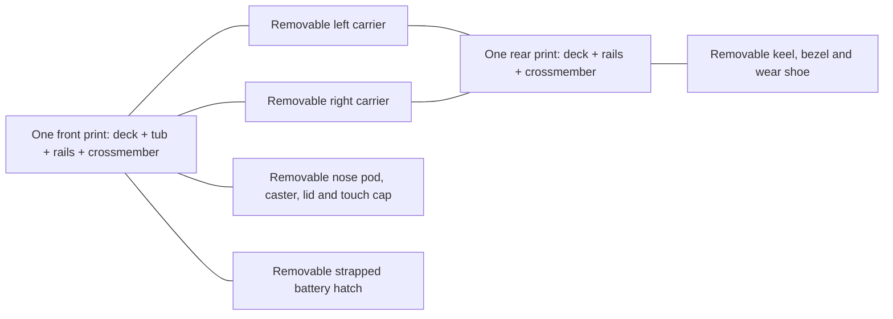
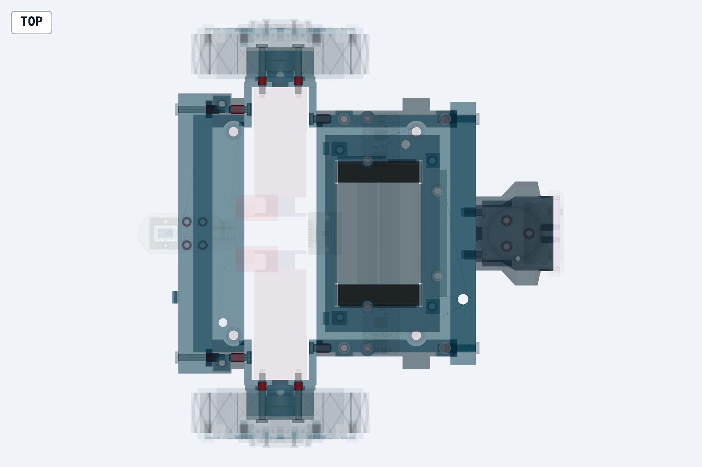
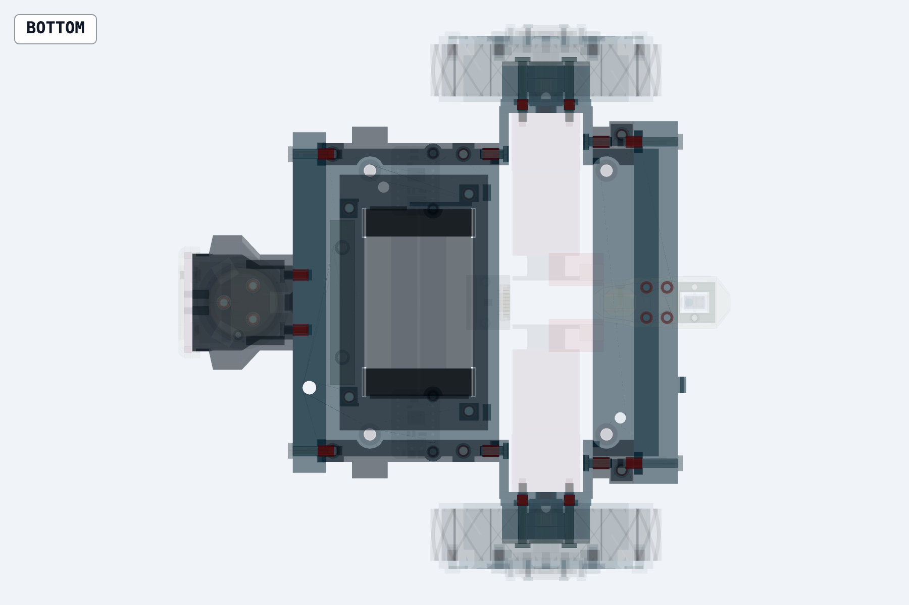

# Chassis v1 fastener and print-split review

Reviewed 2026-10-02. Analysis only: the production CAD, BOM, joint register and decisions were not changed. Recommendations below are design proposals, not released substitutions.

**Implementation status (2026-10-02):** [D-033](../../../decisions.md#d-033) adopts the two recommended changes: the front and rear frame modules (J05, J06 and J16 removed, which also fixes the detached rear-deck pads) and one central M3 × 10 per hub cap into a tapped stub end. That takes the count to 70 screws and 45 inserts. The optional items (screwless lid, carrier integration, stretch-fit tyres or fewer ring screws, two-screw keel, hinged hatch) are not adopted. The analysis below describes the model before D-033.

## Answer

**No: this chassis does not need all of its current screw joints.** Print each deck, its two rails and its crossmember as one structural module. This removes **10 screws and 10 inserts** at J05, J06 and J16, while retaining replaceable axle carriers. Repair the disconnected rear-deck screw pads regardless of whether consolidation proceeds.

The next conspicuous excess is **six screws on each 26 mm wheel hub cap**. Replace them with one central screw per cap into a revised steel stub, or qualify removable snap caps. Keep the caps removable: they cover the three wheel-to-stub screws needed to remove the wheel. Three evenly spaced peripheral screws per cap remain a fallback if the stub is unchanged.

The nose-lid screw is **optional for nominal geometric capture with the bumper fitted**. It still clamps the lid and limits movement of the sensor retainer. A screwless lid needs checks for sensor movement, vibration, bumper travel and handling with the cap/body removed.

For this prototype, retain two removable axle carriers, separate bearing housings/caps and the nose/keel/battery service interfaces. Frame consolidation alone targets **80 screws and 45 inserts**, down from **90 and 55**. Central-screw hub caps reduce the target to **70**, or **69** with a qualified screwless lid. Qualified snap caps plus a screwless lid target **67**. A later carrier-integrated frame and qualified stretch-fit tyres could reach **47**, but those additional reductions require motor measurements, a complete service route and physical retention trials.

## Evidence and scope

I read the latest chassis history, especially `364b7ea` (D-030) and `2d6085a` (D-031), the current working source, the wheel source, frame-split study, joint register, BOM, axle plan and existing check reports. The current working source also includes an uncommitted D-032 fuse bracket; this is included in source measurements. The exported STEP still has the older low fuse-holder envelope: its maximum Z is 84 mm, whereas the current holder reaches Z 99 mm. The snapshots therefore illustrate the exported assembly; current-source measurements govern the recommendations.

Source geometry was constructed directly in memory without regenerating any project CAD exports. The reconciled count is **90 screws/set screws, 55 heat-set inserts, four body nuts and two body locating pins**. The BOM also specifies three cable ties and two pack straps. Heads and shanks represented as separate CAD leaves were counted as one screw. The four proposed C3-board screw/insert sets are excluded: they belong to the full system and are absent from the scoped chassis export. Vendor-internal hardware is outside this count.

The individual screw register at the end identifies all 90 physical screws by CAD label, location and verdict. The consolidated [audit evidence](fastener-review-evidence/audit.json) retains source hashes, geometry measurements, exported-STEP checks, lid-capture results and sampled motor-service results. Top and underside snapshots are included below.

## A defect in the current rear deck

`frame_deck("REAR")` returns **three disconnected solids**. The main plate spans Y −56 to +56. Its left screw pad spans Y +57 to +65, and its right pad −65 to −57. Each pad is 8 × 8 × 4 mm, separated from the plate by **1.00 mm**. The J16 axes are at (−27.5, ±61). Even the Ø5.7 screw heads remain 2.15 mm from the main plate.

Consequently the two rear J16 screws currently clamp detached pads onto the rails, **not the main rear deck**. The deck rests on the rails, and its body bolts connect it to the body, but that is not the intended J16 deck-to-rail clamp. This is more than excess hardware: the intended joint does not exist geometrically. Integrating the rear deck and rails repairs that load path; if the separate deck is retained instead, connect each pad to the main plate with a real web before relying on those screws.

Solid-validity checks do not catch this assembly-intent error. The exported frame subtree passes topology/closure/positive-volume validation (118 occurrences, zero failures; self-intersection checks skipped). The three rear-deck solids themselves are valid. They still do not form one printed deck.

Source: [body_chassis_model.py](../cad/body_chassis_model.py), `frame_deck`, lines 2053–2114; the 8 mm ears are created around J16 points without reaching the main deck.

## Joint-by-joint decisions

| Joint / BOM hardware | Screws | Recommendation | What the hardware actually does |
|---|---:|---|---|
| J01 motor face, CH-030 | 4 | Keep both per motor | Clamps a purchased motor to its carrier and permits alignment before tightening. |
| J02 bearing housing/cap, CH-053 | 8 | Keep four per side initially | One shared screw set retains both the housing and the aluminium cap; it is not two duplicate joints. |
| J03 motor-to-stub set screws, CH-055 | 2 | Keep | Couples steel stub to purchased motor D-shaft. |
| J03 wheel-to-stub, CH-056 | 6 | Keep three per wheel | Transfers drive torque and permits wheel removal. |
| J03 hub-cover retention, CH-059 | 12 | Replace with one central screw per cap, or qualified snaps; three peripheral screws are a fallback | Retains a cosmetic/protective cover only. |
| J04 carrier-to-rails, CH-060 | 8 | Keep for this prototype; integrate later if service is redesigned | Replaceable motor-interface geometry and structural front/rear connection around the motor bay. |
| J05 front crossmember, CH-073 | 2 | Eliminate by integration | Clamps two provisional tongue/pocket splits. |
| J06 rear crossmember, CH-074 | 2 | Eliminate by integration | Same split at the rear. |
| J07A purchased caster, CH-031 | 3 | Keep all three | Attaches the vendor caster base to the printed seat, removable from below. |
| J07B nose pod, CH-032 | 2 | Keep now; optional integration with front module | Attaches a potentially damaged/revised nose module, not individual sensors. |
| J08C pod lid, CH-062 | 1 | Optional; qualify screwless retention | Captured by the fitted bumper and shell; screw supplies clamping and limits sensor-retainer movement. |
| J09A rear keel, CH-034 | 4 | Keep now; keyed two-screw redesign is optional | Clamps an impact-loaded removable keel. The sensor and shoe have independent service paths. |
| J09B/J10B bezel and guards, CH-069 | 1 | Keep | One screw plus a moulded pin retains sensor, shims and both guard lips. |
| J10A wear shoe, CH-070 | 1 | Keep | Prevents sliding out of its load-bearing dovetail. |
| J11A battery hatch, CH-076 | 4 | Keep on current geometry | The hatch carries the strapped battery, rather than only closing a cosmetic opening. |
| J12 ballast, CH-038 | 2 | Keep | Secures a steel mass and permits removal/revision. |
| J13 body, CH-035 | 4 | Keep | Clamps four body feet while allowing body lift-off. |
| J14 tyre clamp rings, CH-048 | 12 | Keep initially; test stretch-fit tyres or fewer ring screws separately | Provides distributed sidewall retention; tyre/rim keys carry circumferential torque. |
| J15A IMU, CH-039 | 2 | Keep | Holds a removable board flat and resists rotation. |
| J15B drivers, CH-081 | 4 | Keep both per board | Uses the boards' two holes and resists harness loads. |
| J16 decks, CH-075 | 6 | Eliminate by integration | Four front clamps and two defective rear-pad clamps. |
| **Total** | **90** | | |

### J05, J06 and J16: strongest case for a single printed part

The frame-split README explicitly says rails and crossmembers were kept separate so the joints could be reviewed, with fusion awaiting printer/orientation review. No actual printer limitation has been recorded. There is no routine service operation requiring an individual rail to detach from its deck or crossmember. These separations create insert installation, alignment, loosening and tool-access work in the structural load path.

The current front module envelope is **75 × 128 × 41 mm**, including the new fuse bracket; rear module **34 × 132 × 22 mm**, including the cable lug. These are assembled bounding boxes before orientation, brims and process clearances. They are small enough to make integration worth pursuing, but the actual usable printer volume remains unknown.

An in-memory boolean union of each deck, both rails and its crossmember produces **one valid solid per module**, including the rear screw pads through their rail contacts. Thus the consolidation is geometrically credible, not merely an aesthetic suggestion. The modules join front-to-rear through the two existing axle carriers; no new joint is needed.

The front deck underside is at Z 52 and crossmember top at Z 51: **1 mm apart**. The corresponding rear gap is **4 mm**, Z 52 versus Z 48. The existing rails connect those components, so these gaps do not prevent a single connected union. Nevertheless, a production redesign should remove obsolete screw bores, insert cavities and tongue/key clearances; replace the former joints with continuous, adequately sized material, and examine those deck-over-crossmember gaps for printing/support and stiffness. Do not release a naïve union with the obsolete hardware cavities intact.

A single-screw tongue joint is not automatically a hinge: its tongue, pocket and bearing faces can transmit moment and shear. Actual stiffness depends on fit, clamp, geometry and printed material. Consolidation avoids those joint/receiver risks, but no stiffness test established hinge behavior.

Support-free printing is also unverified. Driver posts and the new fuse bracket project above the front deck, while rails and tub project below it. Placing its deck top flat on the bed conflicts with those upper projections. Choose an orientation and review sliced supports and their removal before releasing the combined part. XY fit on a nominal 180 mm bed is plausible; usable volume, brims and orientation still need confirmation.

Preserve the body-nut socket passages unless their receiver is deliberately redesigned, along with the motor bay, pack disconnect window, downward hatch exit, nose cable bore and external service joints. Added ribs must be checked against the whole-body packaging, not just the scoped chassis.

### J04: possible to integrate, but the prototype has a real reason to keep it

Each side has four carrier screws: two at the front boundary X +17, Y ±54, Z 38/48; two at the rear boundary X −17, Y ±58.5, Z 38/48. Both height positions have a purpose in restraining the cheek/rail interface. Reducing this to one screw per end without changing the interface invites rocking and makes the small locating keys carry more of the load.

A full structural union including both carriers is **one valid solid**, **143 × 148 × 47.5 mm**. It retains the central motor relief; integrating the frame does not mean filling that bay with a plate. So all eight J04 screws can theoretically disappear in a mature frame.

For now, the motor pilot, face-hole spacing and thread depth are unmeasured assumptions, and the engineering spec explicitly calls for a motor interface that can change without reprinting the whole frame. The carriers satisfy that need. Separately printing them also allows orientation choices around the motor plate and its insert loads.

I sampled a candidate fixed-carrier motor-removal path: remove the serviced wheel/stub and face screws, move the motor 12.1 mm inward to clear the 12 mm output shaft, then 40 mm downward, leaving housing/cap and shell in place. **This candidate path fails on both sides.** Detailed left-side checks identify pigtail-reserve overlaps with the other pigtail (12 mm³) and rear deck (24 mm³), and the motor's encoder connector overlapping the shell (9.6 mm³). The first two are flexible/disconnectable cable reserves, not proof that rigid motor bodies collide. The connector/shell clash is a real modeled obstruction for that path.

I also sampled an upward route after removing the body/shell/electronics and excluding flexible pigtail reserves. The serviced wheel/stub and motor face screws were removed; the housing/cap and opposite rigid motor remained. After moving each motor 12.1 mm inward, its **encoder connector overlaps the rear deck at 4 mm upward displacement, 24 mm³**, on both sides. Thus the 25 mm gearbox fitting between 27 mm cheeks does not establish a complete drop-in or removal route.

Tilting, changing the sequence or altering the clearance may provide another route; neither sampled failure proves that all routes are impossible. Establish a complete assembly/service sequence before integrating the carriers. Their independent prototype justification is replaceable unmeasured motor-interface geometry, rather than a proven requirement for every motor-service operation.

### J02: housing can merge with carrier, but that does not remove cap screws

The four M3 × 18 screws per side pass through the 1.2 mm aluminium cap and printed housing into carrier inserts. They jointly retain the housing and bearing outer-ring cap. Fusing the housing to the carrier removes a printed-part boundary, **but the removable cap still needs retention** so the bearings/stub can be assembled and serviced.

That fusion could enable shorter cap screws into receivers near the housing's outer face. It does not justify claiming eight screws eliminated. Keep four per side until the thin cap, outer-ring contact, printed receivers and axial/radial loading have been checked. Three is a possible new cap design, not a deletion justified by the present CAD. Keeping the small housing separate also makes bearing-fit tuning and damaged-seat replacement inexpensive. It permits favorable bore orientation, but printing the axis vertically does not guarantee a round or correctly sized seat: coupons or finishing can still be necessary. Housing separation is useful for this prototype, not mandatory for every manufacturing approach.

### J01 and J03: these are functional purchased/metal interfaces

The four motor face screws transfer reaction torque and allow alignment; a motor cannot become part of a printed frame. The two set screws couple the motor D-shafts to the steel stubs. The six wheel screws attach PETG wheels to steel flanges and transfer torque. Their Ø10 spigots locate the wheels, but do not replace the torque clamp.

Retain the three wheel screws per wheel. The steel flange currently gives only **2 mm modeled thread engagement**, so arbitrary removal of a torque screw is a poor simplification. Retain both motor screws per side rather than creating a cantilevered single-screw motor mount. The faced 2.5 mm set-screw length is a tight-clearance coupling detail; a different coupling is a separate axle redesign.

### Hub caps: the clearest overfastened cover

The 26 mm-across-flats hex cap has six M2 screws, on radius 12.9 mm, around a recess covering the three wheel screws. They do not clamp the tyre, housing or hub torque interface. Six closely spaced screws are hard to justify for this cover, and repeatedly removing them wears the thin printed pilots.

**One central screw per cap is a credible preferred alternative.** The current steel stub's D-shaft bore ends at |Y| 82 and its solid outboard end reaches |Y| 96. A new axial tapped receiver can be considered without intersecting that bore, depending on final tapping depth. This replaces twelve peripheral screws with two central screws. Revise the stub drawing, cap hole/seat, registration and screw length/engagement; verify retention and removal access. Recess the head or revise the boss: a button head standing on the current outboard boss at |Y| 101 would increase the wheel envelope.

**Removable snap caps can eliminate all twelve cover screws.** Design an actual latch/retaining lip and release feature. Simply shrinking the current recess until it friction-fits is insufficient: that recess is clearance for screw heads, not a retention datum. Check vibration/rotation retention, removal access and repeated cycles.

If the stub is unchanged, a fallback is to retain **indices 1, 3 and 5** at 120° spacing and remove **2, 4 and 6**, on both wheels; revise both cap and hub pilots. Provide positive seating/registration. This is a proposed three-point cover mount, not a tested minimum.

All options must preserve access to the three M3 wheel screws and the two-tone appearance if wanted. Do not fuse the cap to the rim without redesigning service access.

### J14: distinguish tyre-retention screws from cap screws

The tyre has 12 keyed ribs, a fixed inboard lip and an outboard removable ring. The six ring screws per wheel distribute sidewall clamping around a **3 mm-thick ring on a Ø68 bolt circle**. These have substantially more mechanical purpose than the six cap screws.

Reducing each ring to indices 1, 3 and 5 is a sensible test candidate because the keys carry circumferential torque, but the remaining spans double. Local lifting/bending between screws, axial tyre movement, creep and retained balance need checking under loaded reversals and side loads. Keep six initially; do not include the possible six-screw reduction in the recommended count.

A one-piece rim with both retaining lips could eliminate the ring screws/inserts, but requires a different tyre installation strategy. The current inboard lip is Ø78 against a proposed Ø73.6 printed tyre bore, requiring roughly **6% diametral installation stretch**, rather than the approximately 0.5% seat stretch. TPU might permit that, but the carcass, keys and tread require a fit/removal trial; CAD has not proved it. The documented O-ring fallback is another wheel architecture, not a free substitution into the current ring design.

### J07/J08: optional pod integration and screwless lid

Keep the three screws in the purchased caster's three-hole base. The seat takes compression, while the screws retain the base during unloading/impact. Removal from below is already modeled. The two pod screws at Y ±10, Z 42 could disappear by integrating the pod with the front crossmember/module. The main obstacles are print orientation and replacement cost: the nose is an impact-exposed assembly with provisional sensor/spring fit, and the pod's documented seat-down orientation differs from the frame's unselected orientation.

A merged front module plus pod is a reasonable later variant. It still needs a removable lid and sliding cap. The touch cap's two snap fingers, springs and Hall-board slot already add no screw joint.

The lid currently uses **one screw and one rear tongue** and retains the range sensor. Fresh source-geometry checks show nominal capture by the fitted bumper:

| Lid motion | Nose cap at rest | Nose cap depressed 3 mm |
|---|---:|---:|
| Vertical lift of 0.5 mm | No positive-volume intersection | No positive-volume intersection |
| Vertical lift of 0.75 mm | 12.5654 mm³ cap intersection | 34.4246 mm³ cap intersection |
| Vertical lift of 1 mm | 27.1003 mm³ cap intersection | 72.9290 mm³ cap intersection |
| First forward intersection, sampled every 0.2 mm | At 3.2 mm | At 0.2 mm |

The lid needs its documented 11 mm forward slide before removal from the shell band. These results make the screw **optional for nominal geometric capture with the bumper fitted**, rather than essential to prevent lid removal. It still clamps the lid, limits movement of the range-sensor retainer and holds closure independently of the moving snap-on bumper.

A screwless lid is worth qualifying for sensor movement, vibration, bumper drag through its full travel, and handling with the cap/body removed. The current rear tongue is **1.5 mm long in X, 12 mm wide in Y and 2 mm tall**. Extending it must preserve a feasible removal path; a suggested 3.5 mm length has not been validated. Keep the lid removable for range-sensor/Hall-board access and do not fuse it over the sensor.

### J09/J10: retain replaceable floor-contact parts

The four keel screws form a short rectangular pattern at X −36.5/−44, Y ±5.5, transmitting skid impact and torsion into the rear crossmember. They are not needed to remove the TCRT or wear shoe: those are serviced independently. Thus keel/crossmember integration is possible, but a keel-root crack would then require reprinting the larger rear module. A two-screw keel with a substantial locating tongue/dovetail or broad keyed seat is another option. **Do not simply remove a pair from the current unkeyed seat** and claim equivalent restraint.

Keep the one bezel screw and locating pin: together they retain the TCRT, adjustable shims and both guards. There is no separate guard-screw set to eliminate. Keep the shoe's one transverse screw: its dovetail already carries the normal load, and the screw prevents withdrawal. Fusing the wear shoe to the keel sacrifices the purpose of a consumable floor-contact part to save one screw.

### J11: the battery hatch is not just a cover

Since D-030 the battery is strapped to the 1.5 mm hatch and removed with it. The four screws at (28, ±39.5) and (71.5, ±34.35) carry battery/hatch inertia into the tub. A permanently printed floor would obstruct the documented downward pack removal and access to the disconnect. Keep all four on current geometry.

A hatch with a load-bearing tongue/hinge at one end and two screws at the other could save two screws, but it needs a new battery-cartridge removal path, stiffness and shock retention check. The current hatch has no such feature. Retain the two pack straps and cell-end foam: deleting these is unrelated to structural-part consolidation and would remove pack restraint.

### J12/J13/J15 and the new fuse bracket

Keep two ballast screws: a single screw would allow the steel mass to rotate without another positive restraint. Printed encapsulation would complicate printing/assembly and remove ballast adjustability. Keep four body bolts/nuts and two locating pins for body removal and repeatable registration. Printed locating pegs could replace the separate pins later, with wear/fit checks; they do not eliminate the body clamp requirement. Captive nuts could improve handling, but are not themselves a reduction in fastener count. Four M4 heat-set inserts could replace the four nuts after frame integration; this still uses four body screws. Select receivers with sufficient surrounding material, insertion access and engagement, then check pull-out/clamp retention. Only that redesign justifies removing the socket cutouts/ribs. The older fuse-height restriction refers to previous packaging: the current working fuse holder has already moved above that channel.

Keep the IMU's two screws and the drivers' two screws each. One screw per PCB lets a board rotate or loads a connector as a restraint. Driver posts are already integral with the front deck; no stand-off attachment screws exist to eliminate. Replacing the four driver heat-set inserts with calibrated thread-forming receivers is possible for low-cycle service, but removes inserts rather than screws and reduces repeat-service durability. Board edge clips are another design, with harness retention and component clearance to resolve.

Retain all three cable ties: the two motor-lead ties and rear TCRT tie isolate electrical terminations from lead pull. Their printed bridges/lug are already integrated, so there is no bolted cable-bracket joint to combine.

The new fuse shelf and column are already integral with the deck, which is the right consolidation pattern. However, the current fuse holder is an envelope on that shelf; there is **no modeled positive holder retainer**. A clip or tie slots integrated into the shelf can address this without adding screws to attach a separate bracket. The 90-screw count does not imply this new holder-retention detail is complete.

## Insert and other-fastener disposition

| Receiver / item | Current quantity | Disposition |
|---|---:|---|
| J02 carrier M3 × 4 inserts, CH-054 | 8 | Keep with cap retention. |
| J04 rail M3 × 6 inserts, CH-061 | 8 | Keep for removable carriers; eliminate with carrier integration. |
| J05/J06 portion of CH-077 | 4 | Eliminate with crossmember integration. |
| J16 portion of CH-077 | 6 | Eliminate with deck integration. |
| J11A portion of CH-077 | 4 | Keep with four-screw hatch. |
| J07A caster seat inserts, CH-063 | 3 | Keep. |
| J07B crossmember inserts, CH-033 | 2 | Keep now; eliminate if pod is integrated. |
| J09A keel receiver inserts, CH-067 | 4 | Keep now; eliminate if keel is integrated. |
| J14 tyre ring inserts, CH-049 | 12 | Keep initially. |
| J15B driver inserts, CH-080 | 4 | Keep, or redesign thread-forming posts with suitable service-cycle assumptions. |
| **Heat-set inserts** | **55** | **45 after J05/J06/J16 integration.** |
| Body nuts CH-036 / locating pins CH-037 | 4 / 2 | Retain. |
| Rear cable tie CH-072 / motor ties CH-082 | 1 / 2 | Retain. |
| Pack straps CH-078 | 2 | Retain. |

The frame's ten eliminated inserts include awkward horizontal rail-end installation and thin tongue receivers. Their elimination removes entire local failure/assembly opportunities. Keep useful service threads instead of globally replacing inserts with printed threads.

## Print architecture and count targets

The initial frame set has **eleven prints**: two decks, four rails, two crossmembers, two carriers and one hatch. Consolidation reduces this to **five**: front module, rear module, two carriers and hatch. A fully integrated frame plus hatch has **two**. These counts exclude housings, nose/keel and wheel parts.

| Stage | Screw count | Insert count | Requirement |
|---|---:|---:|---|
| Current | 90 | 55 | Includes the defective rear-pad joint. |
| Two consolidated frame modules | **80** | **45** | Remove J05/J06/J16 geometry and hardware; review print/support and packaging. |
| Modules + three-screw hub caps | 74 | 45 | Fallback if stub is unchanged; revise cap seating/pilots and validate retention. |
| Modules + one central screw per hub cap | **70** | **45** | Revise stub tapping, cap registration and screw stacks. |
| Central-screw caps + qualified screwless lid | **69** | **45** | Qualify lid/sensor retention and full bumper travel. |
| Modules + qualified snap caps | **68** | **45** | Qualify latch retention, removal and cycles. |
| Snap caps + qualified screwless lid | **67** | **45** | Qualify both retention changes. |
| One frame including carriers + qualified snap caps | 60 | 37 | Measure motor interface, establish printer/orientation and prove service route. |
| Integrated carriers + snap caps + stretch-fit tyres + screwless lid | **47** | **25** | Additionally qualify tyre installation, axial retention, creep and removal. |

The 18 screws at J04/J05/J06/J16 are **20%** of the current 90; adding twelve hub-cover screws brings that candidate group to one-third. The 47-screw count is a conditional design target, not an already verified substitution. Four new M4 body inserts make its receiver count 29; replacing four driver inserts with thread-forming receivers reduces that count again.

Consolidate the front/rear frame modules first; retain carriers until motor dimensions and the complete service route are settled; pursue a central-screw or qualified snap cap; evaluate screwless lid retention; qualify stretch-fit tyres separately. Optional pod, keel and hatch reductions are excluded from the count targets.

Print orientation, support-removal access, layer direction and receiver installation can justify a split; an unspecified printer cannot justify every split by default. Prusa's [modeling guidance](https://help.prusa3d.com/article/modeling-with-3d-printing-in-mind_164135) explains orientation-dependent strength and support-surface effects. CNC Kitchen's [insert design guidance](https://www.cnckitchen.com/blog/tips-and-tricks-for-heat-set-inserts) calls for receiver depth and wall-thickness checks. These support the process considerations; the recommendations and measured counts above come from this chassis, not those articles.

## Verification and practical limits

- Constructed the current source frame and scoped assembly; reconciled all 90 screws and all 55 inserts with their physical roles.
- Measured structural bounding boxes, ten deck/rail/carrier contact pairs, rear-deck solid separation and screw-head clearance to the main rear plate.
- Checked front-module, rear-module and full structural boolean unions in memory: one valid solid each. These still contain obsolete joint cavities and are **not printable redesign exports**.
- Inspected exported STEP refs/facts/planes/positioning; validated its frame subtree (118 occurrences, no topology/closure/positive-volume failures, self-intersection skipped).
- Rendered and visually reviewed exported-STEP top and bottom snapshots, and reviewed the existing outboard wheel image. No production geometry was changed. The STEP is behind the current fuse-bracket source.
- Sampled 48 positions per side for each candidate motor-removal route: downward with the shell retained, and upward with the body removed and flexible cable reserves excluded. Distinguished reserve clashes from rigid encoder-connector obstructions. Sampling is not continuous collision proof or a complete service procedure.
- Measured lid/bumper intersections with the cap at rest and depressed 3 mm, including vertical lifts and forward steps of 0.2 mm. These support nominal capture, not a physical vibration/retention claim.
- Reviewed existing layout (119 checks), frame-fastener (9 checks), battery/ballast, rear-keel, nose-service and wheel reports. Those full suites were **not rerun** here and do not validate the proposed consolidations or all current uncommitted changes.

No FEA, print trial, fatigue, pull-out, drop or vibration testing was performed. Printer/material and received motor/insert dimensions remain unknown. Recommended fewer-screw designs require appropriate checks after CAD revision. The geometric findings, especially the detached rear pads, are directly measured rather than inferred from a passing check list.

## Individual screw register

Coordinates are in the chassis frame: +X forward, +Y left, +Z up, mm. `X: Y,Z` identifies an X-parallel screw axis; `Y: X,Z` a Y-parallel axis; `Z: X,Y` a vertical screw axis. Each row is one physical screw even when CAD gives its head and shank separate labels. Repeated screws were reviewed for their particular interface and pattern position; identical mirrored functions receive the same verdict.

The following table uses the inspected source geometry. Verdicts reflect the combined recommendations above. Every row identifies an existing screw; the proposed two central hub-cap screws are new replacement hardware. “Keep” refers to the recommended prototype architecture, not a demonstrated minimum fastener count.

| Screw | Joint / BOM | CAD label | Axis coordinates (mm) | Verdict | Individual role |
|---|---|---|---|---|---|
| S001 | J01 / CH-030 | `AXLE_MOTOR_SCREW_M3X6_L_1` | Y: -8.5,42 | Keep | Two face screws per motor: reaction-torque clamp and alignment. |
| S002 | J01 / CH-030 | `AXLE_MOTOR_SCREW_M3X6_L_2` | Y: 8.5,42 | Keep | Two face screws per motor: reaction-torque clamp and alignment. |
| S003 | J01 / CH-030 | `AXLE_MOTOR_SCREW_M3X6_R_1` | Y: -8.5,42 | Keep | Two face screws per motor: reaction-torque clamp and alignment. |
| S004 | J01 / CH-030 | `AXLE_MOTOR_SCREW_M3X6_R_2` | Y: 8.5,42 | Keep | Two face screws per motor: reaction-torque clamp and alignment. |
| S005 | J02 / CH-053 | `AXLE_CAP_SCREW_M3X18_L_1` | Y: 8.485,50.485 | Keep | One of four shared housing/cap clamps; retains bearing outer rings. |
| S006 | J02 / CH-053 | `AXLE_CAP_SCREW_M3X18_L_2` | Y: -8.485,50.485 | Keep | One of four shared housing/cap clamps; retains bearing outer rings. |
| S007 | J02 / CH-053 | `AXLE_CAP_SCREW_M3X18_L_3` | Y: -8.485,33.515 | Keep | One of four shared housing/cap clamps; retains bearing outer rings. |
| S008 | J02 / CH-053 | `AXLE_CAP_SCREW_M3X18_L_4` | Y: 8.485,33.515 | Keep | One of four shared housing/cap clamps; retains bearing outer rings. |
| S009 | J02 / CH-053 | `AXLE_CAP_SCREW_M3X18_R_1` | Y: 8.485,50.485 | Keep | One of four shared housing/cap clamps; retains bearing outer rings. |
| S010 | J02 / CH-053 | `AXLE_CAP_SCREW_M3X18_R_2` | Y: -8.485,50.485 | Keep | One of four shared housing/cap clamps; retains bearing outer rings. |
| S011 | J02 / CH-053 | `AXLE_CAP_SCREW_M3X18_R_3` | Y: -8.485,33.515 | Keep | One of four shared housing/cap clamps; retains bearing outer rings. |
| S012 | J02 / CH-053 | `AXLE_CAP_SCREW_M3X18_R_4` | Y: 8.485,33.515 | Keep | One of four shared housing/cap clamps; retains bearing outer rings. |
| S013 | J03 coupling / CH-055 | `WHEEL_L_SET_SCREW_M3X2_5` | Z: 0,74.8 | Keep | D-shaft to steel-stub torque coupling; not a printed-part split. |
| S014 | J03 coupling / CH-055 | `WHEEL_R_SET_SCREW_M3X2_5` | Z: 0,-74.8 | Keep | D-shaft to steel-stub torque coupling; not a printed-part split. |
| S015 | J03 wheel / CH-056 | `WHEEL_L_SCREW_M3X6_1` | Y: 6.928,46 | Keep | One of three wheel-to-steel-flange torque clamps. |
| S016 | J03 wheel / CH-056 | `WHEEL_L_SCREW_M3X6_2` | Y: -6.928,46 | Keep | One of three wheel-to-steel-flange torque clamps. |
| S017 | J03 wheel / CH-056 | `WHEEL_L_SCREW_M3X6_3` | Y: 0,34 | Keep | One of three wheel-to-steel-flange torque clamps. |
| S018 | J03 wheel / CH-056 | `WHEEL_R_SCREW_M3X6_1` | Y: 6.928,46 | Keep | One of three wheel-to-steel-flange torque clamps. |
| S019 | J03 wheel / CH-056 | `WHEEL_R_SCREW_M3X6_2` | Y: -6.928,46 | Keep | One of three wheel-to-steel-flange torque clamps. |
| S020 | J03 wheel / CH-056 | `WHEEL_R_SCREW_M3X6_3` | Y: 0,34 | Keep | One of three wheel-to-steel-flange torque clamps. |
| S021 | J03 cover / CH-059 | `WHEEL_L_CAP_SCREW_M2X6_1` | Y: 6.45,53.172 | Replace with central or snap retention | Cover-only peripheral screw; remove when adding one central screw per cap or qualifying snap retention. |
| S022 | J03 cover / CH-059 | `WHEEL_L_CAP_SCREW_M2X6_2` | Y: 12.9,42 | Replace with central or snap retention | Cover-only peripheral screw; remove when adding one central screw per cap or qualifying snap retention. |
| S023 | J03 cover / CH-059 | `WHEEL_L_CAP_SCREW_M2X6_3` | Y: 6.45,30.828 | Replace with central or snap retention | Cover-only peripheral screw; remove when adding one central screw per cap or qualifying snap retention. |
| S024 | J03 cover / CH-059 | `WHEEL_L_CAP_SCREW_M2X6_4` | Y: -6.45,30.828 | Replace with central or snap retention | Cover-only peripheral screw; remove when adding one central screw per cap or qualifying snap retention. |
| S025 | J03 cover / CH-059 | `WHEEL_L_CAP_SCREW_M2X6_5` | Y: -12.9,42 | Replace with central or snap retention | Cover-only peripheral screw; remove when adding one central screw per cap or qualifying snap retention. |
| S026 | J03 cover / CH-059 | `WHEEL_L_CAP_SCREW_M2X6_6` | Y: -6.45,53.172 | Replace with central or snap retention | Cover-only peripheral screw; remove when adding one central screw per cap or qualifying snap retention. |
| S027 | J03 cover / CH-059 | `WHEEL_R_CAP_SCREW_M2X6_1` | Y: 6.45,53.172 | Replace with central or snap retention | Cover-only peripheral screw; remove when adding one central screw per cap or qualifying snap retention. |
| S028 | J03 cover / CH-059 | `WHEEL_R_CAP_SCREW_M2X6_2` | Y: 12.9,42 | Replace with central or snap retention | Cover-only peripheral screw; remove when adding one central screw per cap or qualifying snap retention. |
| S029 | J03 cover / CH-059 | `WHEEL_R_CAP_SCREW_M2X6_3` | Y: 6.45,30.828 | Replace with central or snap retention | Cover-only peripheral screw; remove when adding one central screw per cap or qualifying snap retention. |
| S030 | J03 cover / CH-059 | `WHEEL_R_CAP_SCREW_M2X6_4` | Y: -6.45,30.828 | Replace with central or snap retention | Cover-only peripheral screw; remove when adding one central screw per cap or qualifying snap retention. |
| S031 | J03 cover / CH-059 | `WHEEL_R_CAP_SCREW_M2X6_5` | Y: -12.9,42 | Replace with central or snap retention | Cover-only peripheral screw; remove when adding one central screw per cap or qualifying snap retention. |
| S032 | J03 cover / CH-059 | `WHEEL_R_CAP_SCREW_M2X6_6` | Y: -6.45,53.172 | Replace with central or snap retention | Cover-only peripheral screw; remove when adding one central screw per cap or qualifying snap retention. |
| S033 | J04 / CH-060 | `J04_CARRIER_SCREW_M3X8_L_FRONT_38` | X: 54,38 | Keep | Upper/lower clamp of removable carrier at front/rear rail boundary. |
| S034 | J04 / CH-060 | `J04_CARRIER_SCREW_M3X8_L_FRONT_48` | X: 54,48 | Keep | Upper/lower clamp of removable carrier at front/rear rail boundary. |
| S035 | J04 / CH-060 | `J04_CARRIER_SCREW_M3X8_L_REAR_38` | X: 58.5,38 | Keep | Upper/lower clamp of removable carrier at front/rear rail boundary. |
| S036 | J04 / CH-060 | `J04_CARRIER_SCREW_M3X8_L_REAR_48` | X: 58.5,48 | Keep | Upper/lower clamp of removable carrier at front/rear rail boundary. |
| S037 | J04 / CH-060 | `J04_CARRIER_SCREW_M3X8_R_FRONT_38` | X: -54,38 | Keep | Upper/lower clamp of removable carrier at front/rear rail boundary. |
| S038 | J04 / CH-060 | `J04_CARRIER_SCREW_M3X8_R_FRONT_48` | X: -54,48 | Keep | Upper/lower clamp of removable carrier at front/rear rail boundary. |
| S039 | J04 / CH-060 | `J04_CARRIER_SCREW_M3X8_R_REAR_38` | X: -58.5,38 | Keep | Upper/lower clamp of removable carrier at front/rear rail boundary. |
| S040 | J04 / CH-060 | `J04_CARRIER_SCREW_M3X8_R_REAR_48` | X: -58.5,48 | Keep | Upper/lower clamp of removable carrier at front/rear rail boundary. |
| S041 | J05 / CH-073 | `J05_SCREW_M3X16_L` | X: 54,41 | Eliminate | Integrate this front rail tongue and crossmember into the front print. |
| S042 | J05 / CH-073 | `J05_SCREW_M3X16_R` | X: -54,41 | Eliminate | Integrate this front rail tongue and crossmember into the front print. |
| S043 | J06 / CH-074 | `J06_SCREW_M3X20_L` | X: 58.5,41 | Eliminate | Integrate this rear rail tongue and crossmember into the rear print. |
| S044 | J06 / CH-074 | `J06_SCREW_M3X20_R` | X: -58.5,41 | Eliminate | Integrate this rear rail tongue and crossmember into the rear print. |
| S045 | J07A / CH-031 | `BALL_M3_SHANK_1` | Z: 117.044,0 | Keep | One of three clamps on the purchased caster base; retains service access. |
| S046 | J07A / CH-031 | `BALL_M3_SHANK_2` | Z: 106.478,6.1 | Keep | One of three clamps on the purchased caster base; retains service access. |
| S047 | J07A / CH-031 | `BALL_M3_SHANK_3` | Z: 106.478,-6.1 | Keep | One of three clamps on the purchased caster base; retains service access. |
| S048 | J07B / CH-032 | `BALL_POD_M3_SHANK_1` | X: 10,42 | Keep | Retains replaceable impact-exposed pod; integrate only with print/service review. |
| S049 | J07B / CH-032 | `BALL_POD_M3_SHANK_2` | X: -10,42 | Keep | Retains replaceable impact-exposed pod; integrate only with print/service review. |
| S050 | J08C / CH-062 | `BALL_POD_LID_M2X8_CSK_SCREW` | Z: 111.8,-11.8 | Optional; qualify screwless lid | Bumper/shell capture the lid nominally; screw clamps lid and limits sensor-retainer movement. |
| S051 | J09A / CH-034 | `REAR_KEEL_M3X30_SCREW_1` | Z: -36.5,5.5 | Keep | One corner of the impact/torsion-loaded removable keel seat. |
| S052 | J09A / CH-034 | `REAR_KEEL_M3X30_SCREW_2` | Z: -36.5,-5.5 | Keep | One corner of the impact/torsion-loaded removable keel seat. |
| S053 | J09A / CH-034 | `REAR_KEEL_M3X30_SCREW_3` | Z: -44,5.5 | Keep | One corner of the impact/torsion-loaded removable keel seat. |
| S054 | J09A / CH-034 | `REAR_KEEL_M3X30_SCREW_4` | Z: -44,-5.5 | Keep | One corner of the impact/torsion-loaded removable keel seat. |
| S055 | J09B/J10B / CH-069 | `REAR_TCRT_BEZEL_M2X10_SCREW` | Z: -54,-5.6 | Keep | Single screw with moulded pin retains sensor, shims and both guards. |
| S056 | J10A / CH-070 | `REAR_KEEL_SHOE_M2X6_SCREW` | Y: -27,7.25 | Keep | Cross-tongue screw prevents replaceable dovetail shoe withdrawal. |
| S057 | J11A / CH-076 | `J11A_HATCH_SCREW_M3X6_1` | Z: 28,-39.5 | Keep | One battery-carrying hatch corner; current hatch has no alternative load-bearing latch. |
| S058 | J11A / CH-076 | `J11A_HATCH_SCREW_M3X6_2` | Z: 28,39.5 | Keep | One battery-carrying hatch corner; current hatch has no alternative load-bearing latch. |
| S059 | J11A / CH-076 | `J11A_HATCH_SCREW_M3X6_3` | Z: 71.5,-34.35 | Keep | One battery-carrying hatch corner; current hatch has no alternative load-bearing latch. |
| S060 | J11A / CH-076 | `J11A_HATCH_SCREW_M3X6_4` | Z: 71.5,34.35 | Keep | One battery-carrying hatch corner; current hatch has no alternative load-bearing latch. |
| S061 | J12 / CH-038 | `BALLAST_M3_SHANK_L` | Z: 74,-20 | Keep | Retains steel ballast; paired clamps prevent rotation and allow mass revision. |
| S062 | J12 / CH-038 | `BALLAST_M3_SHANK_R` | Z: 74,20 | Keep | Retains steel ballast; paired clamps prevent rotation and allow mass revision. |
| S063 | J13 / CH-035 | `BODY_CHASSIS_M4_SHANK_1` | Z: -22,-48 | Keep | One body-foot clamp; locating pins complement it rather than replace it. |
| S064 | J13 / CH-035 | `BODY_CHASSIS_M4_SHANK_2` | Z: -22,48 | Keep | One body-foot clamp; locating pins complement it rather than replace it. |
| S065 | J13 / CH-035 | `BODY_CHASSIS_M4_SHANK_3` | Z: 64,-48 | Keep | One body-foot clamp; locating pins complement it rather than replace it. |
| S066 | J13 / CH-035 | `BODY_CHASSIS_M4_SHANK_4` | Z: 64,48 | Keep | One body-foot clamp; locating pins complement it rather than replace it. |
| S067 | J14 / CH-048 | `WHEEL_L_RING_SCREW_M3X8_1` | Y: 17,71.445 | Keep | Distributed tyre sidewall clamp; three-per-ring reduction needs bending/creep test. |
| S068 | J14 / CH-048 | `WHEEL_L_RING_SCREW_M3X8_2` | Y: 34,42 | Keep | Distributed tyre sidewall clamp; three-per-ring reduction needs bending/creep test. |
| S069 | J14 / CH-048 | `WHEEL_L_RING_SCREW_M3X8_3` | Y: 17,12.555 | Keep | Distributed tyre sidewall clamp; three-per-ring reduction needs bending/creep test. |
| S070 | J14 / CH-048 | `WHEEL_L_RING_SCREW_M3X8_4` | Y: -17,12.555 | Keep | Distributed tyre sidewall clamp; three-per-ring reduction needs bending/creep test. |
| S071 | J14 / CH-048 | `WHEEL_L_RING_SCREW_M3X8_5` | Y: -34,42 | Keep | Distributed tyre sidewall clamp; three-per-ring reduction needs bending/creep test. |
| S072 | J14 / CH-048 | `WHEEL_L_RING_SCREW_M3X8_6` | Y: -17,71.445 | Keep | Distributed tyre sidewall clamp; three-per-ring reduction needs bending/creep test. |
| S073 | J14 / CH-048 | `WHEEL_R_RING_SCREW_M3X8_1` | Y: 17,71.445 | Keep | Distributed tyre sidewall clamp; three-per-ring reduction needs bending/creep test. |
| S074 | J14 / CH-048 | `WHEEL_R_RING_SCREW_M3X8_2` | Y: 34,42 | Keep | Distributed tyre sidewall clamp; three-per-ring reduction needs bending/creep test. |
| S075 | J14 / CH-048 | `WHEEL_R_RING_SCREW_M3X8_3` | Y: 17,12.555 | Keep | Distributed tyre sidewall clamp; three-per-ring reduction needs bending/creep test. |
| S076 | J14 / CH-048 | `WHEEL_R_RING_SCREW_M3X8_4` | Y: -17,12.555 | Keep | Distributed tyre sidewall clamp; three-per-ring reduction needs bending/creep test. |
| S077 | J14 / CH-048 | `WHEEL_R_RING_SCREW_M3X8_5` | Y: -34,42 | Keep | Distributed tyre sidewall clamp; three-per-ring reduction needs bending/creep test. |
| S078 | J14 / CH-048 | `WHEEL_R_RING_SCREW_M3X8_6` | Y: -17,71.445 | Keep | Distributed tyre sidewall clamp; three-per-ring reduction needs bending/creep test. |
| S079 | J15A / CH-039 | `IMU_M2_SCREW_SHANK_L` | Z: 22,7.5 | Keep | Paired board screws prevent rotation and hold the IMU flat. |
| S080 | J15A / CH-039 | `IMU_M2_SCREW_SHANK_R` | Z: 22,-7.5 | Keep | Paired board screws prevent rotation and hold the IMU flat. |
| S081 | J15B / CH-081 | `DRIVER_SCREW_M25X6_1` | Z: 41.05,34.04 | Keep | One of the two board-hole clamps; resists harness loads with integral post. |
| S082 | J15B / CH-081 | `DRIVER_SCREW_M25X6_2` | Z: 41.05,54.36 | Keep | One of the two board-hole clamps; resists harness loads with integral post. |
| S083 | J15B / CH-081 | `DRIVER_SCREW_M25X6_3` | Z: 41.05,-34.04 | Keep | One of the two board-hole clamps; resists harness loads with integral post. |
| S084 | J15B / CH-081 | `DRIVER_SCREW_M25X6_4` | Z: 41.05,-54.36 | Keep | One of the two board-hole clamps; resists harness loads with integral post. |
| S085 | J16 / CH-075 | `J16_SCREW_M3X10_1_L` | Z: 30,54 | Eliminate | Integrate deck and rail; remove obsolete screw and insert bores. |
| S086 | J16 / CH-075 | `J16_SCREW_M3X10_1_R` | Z: 30,-54 | Eliminate | Integrate deck and rail; remove obsolete screw and insert bores. |
| S087 | J16 / CH-075 | `J16_SCREW_M3X10_2_L` | Z: 77.5,54 | Eliminate | Integrate deck and rail; remove obsolete screw and insert bores. |
| S088 | J16 / CH-075 | `J16_SCREW_M3X10_2_R` | Z: 77.5,-54 | Eliminate | Integrate deck and rail; remove obsolete screw and insert bores. |
| S089 | J16 / CH-075 | `J16_SCREW_M3X10_3_L` | Z: -27.5,61 | Eliminate | This screw clamps a detached rear pad, 1 mm from the main deck; integrate rear deck/rail. |
| S090 | J16 / CH-075 | `J16_SCREW_M3X10_3_R` | Z: -27.5,-61 | Eliminate | This screw clamps a detached rear pad, 1 mm from the main deck; integrate rear deck/rail. |
